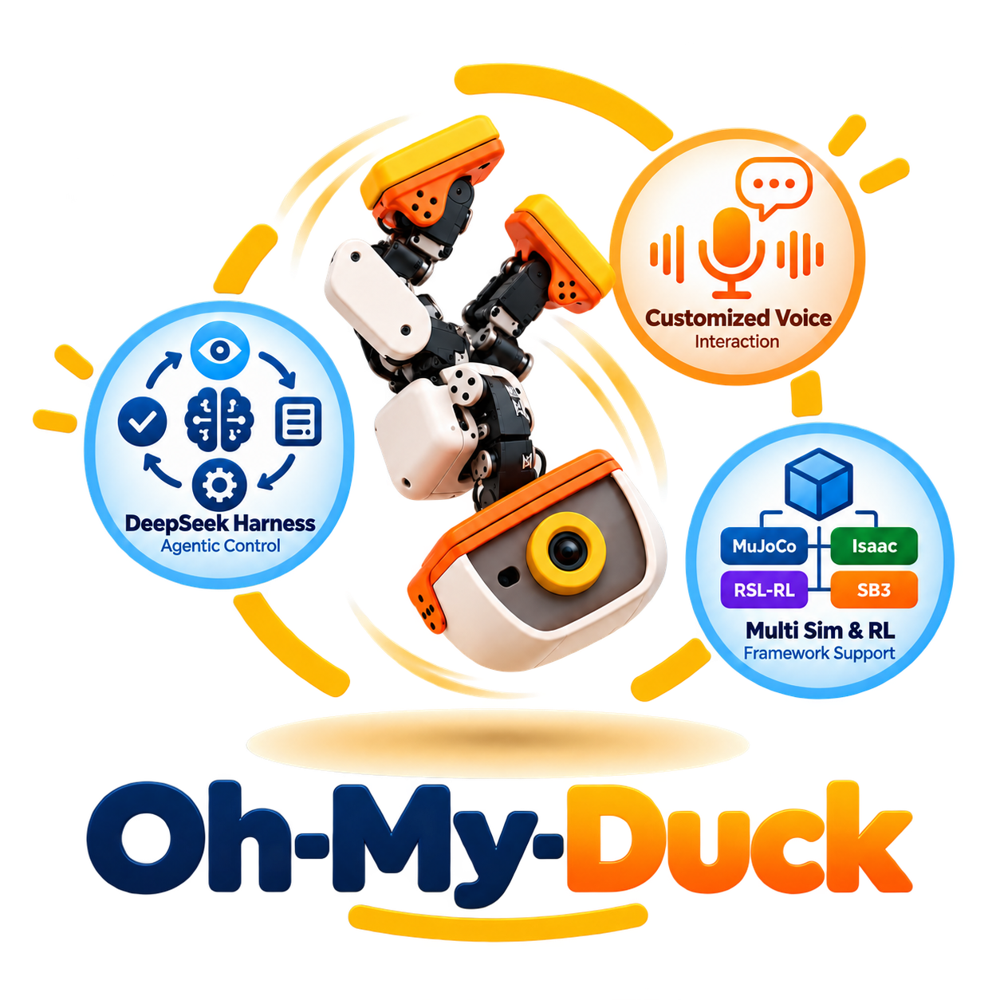
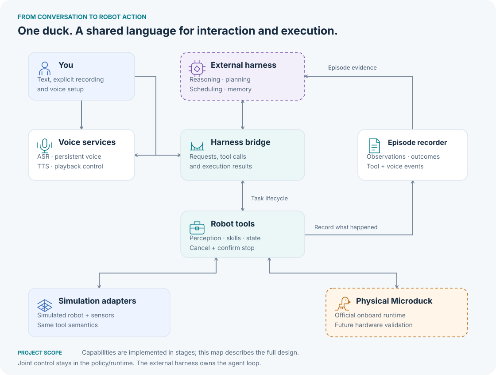
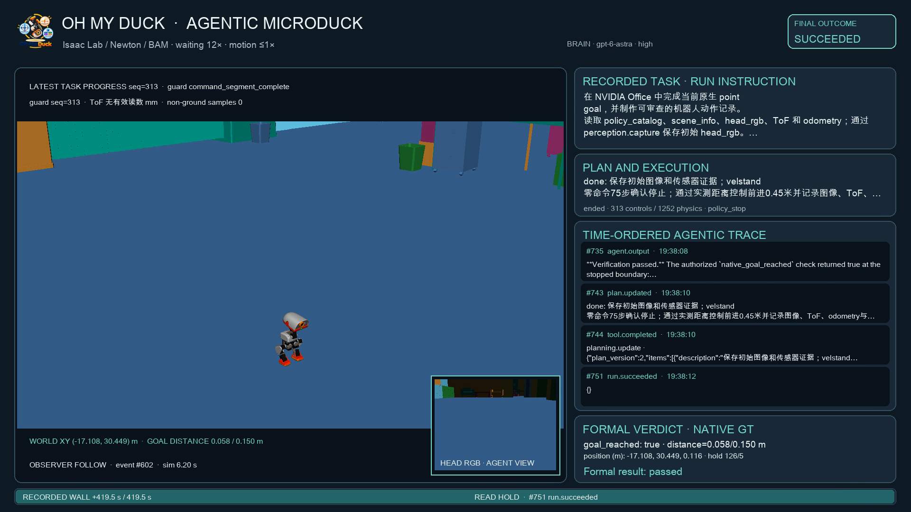
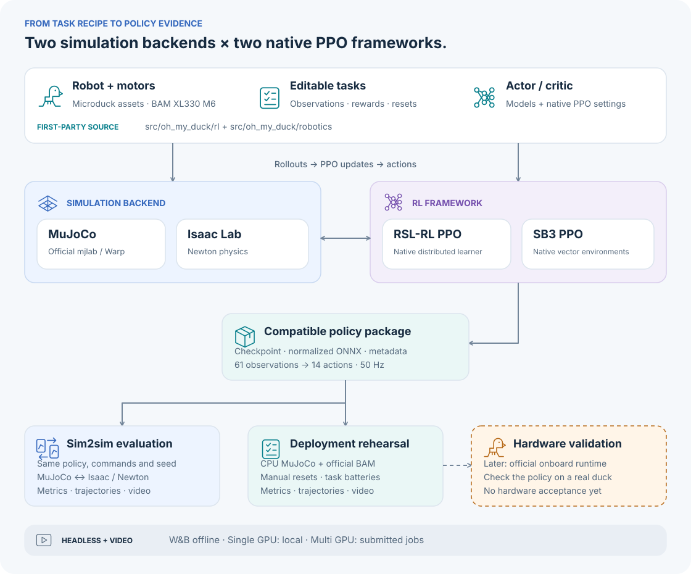

<p align="center">
  
</p>

# Oh My Duck 🦆

Actual CPU policy checks cover metric motion, continuous navigation commands, native backend behavior and cancellation cleanup. Remote preflight verifies all release scenes, official policy hashes and the pinned Harness sources without initializing CUDA. Results and reproduction are in the [offline validation report](docs/reports/offline-release-validation-2026-10-07.md) and [runtime acceptance guide](docs/runtime-release-acceptance.md). GPU acceptance and RL remain stopped.

Metric campaigns preserve exact policy inputs and admitted actions, then independently replay those inputs through the official ONNX models. The CPU matrix and continuous sequence verified 2556 control steps with zero action parity error.

[](docs/implementation-status.md)
[](docs/reports/rl-walking-low-speed-launch-2026-09-29.md)
[](docs/reports/project-status-2026-09-23.md)
[](docs/reports/end-to-end-2026-10-03.md)
[](docs/release-readiness.md)
[](docs/reports/metric-camera-tools-2026-09-30.md)
[](docs/reports/multiskill-demos-2026-10-01.md)
[](docs/metric-policy-tools.md)
[](docs/reports/metric-controller-acceptance-2026-10-07.md)
[](docs/reports/office-skills-acceptance-2026-10-07.md)
[](docs/reports/navigation-acceptance-2026-10-07.md)
[](docs/reports/navigation-acceptance-2026-10-07.md#office-有序导航测量)
[](docs/implementation-status.md)

**An interactive, extensible Microduck—with a persistent voice, shared experiences, and skills you can train.**

Oh My Duck is the implementation of **Agentic Microduck**: a robotics foundation that connects an external embodied AI harness to a small biped robot. It brings together simulation, locomotion training, robot skills, active perception, voice interaction, and evidence of what the duck actually did.

> “Find the red ball and walk up to it.”
>
> The duck looks around, locates the ball, approaches it, and replies in the voice you chose. You can ask what it sees or cancel the task. Observations and outcomes become a traceable episode that the external harness can use as a shared experience.

This is the target experience. The project is under active development; [implementation status](docs/implementation-status.md) distinguishes working components from planned capabilities. Physical-robot validation is deferred until hardware is available.

## What the project provides

| Capability | Purpose |
|---|---|
| **Text and voice interaction** | Explicit recording → speech recognition → the same text/tool control path; spoken responses and playback interruption |
| **A persistent voice** | Describe, audition and confirm a voice once; reuse the versioned voice profile across sessions and simulator/robot changes |
| **Robot skills as tools** | Discover capabilities, run skills, query progress, cancel tasks and confirm actual stopping |
| **Active perception** | Read RGB, 8×8 ToF, IMU and robot state; move the head to obtain observations with timestamps and coordinate frames |
| **Simulation and real-robot adapters** | Preserve tool parameters, units and result semantics across execution backends |
| **Two training backends** | Retain official mjlab / MuJoCo-Warp training and add Isaac Lab with **Newton physics** |
| **Sim2sim and policy export** | Compare policies under the same scenarios; export compatible joint policies with normalization and deployment metadata |
| **Traceable experiences** | Record sensor evidence, commands, task results and voice events for replay and external harness memory |

The duck's name, voice and remembered experiences give it continuity. Learning new motion skills remains an explicit data, training, evaluation and deployment process; conversation alone does not update a locomotion policy.

## How it fits together



**外部 Harness 负责 agent loop。** Oh My Duck 提供机器人工具、执行适配、训练、语音服务与证据。`omd harness` 使用固定版本 `8a5e685b22d032207f53db20454f0992a4ad60fd` 的 Embodied-DeepSeek-Harness 原生 SessionEnvironment、ActionGate 和独立 Verifier，连接官方预训练 ONNX 策略及 CPU MuJoCo/BAM 公寓。真实 Astra 会话已读取图像与状态传感器、调用工具、执行 14 关节动作，并完成有界控制、暂停、策略切换、恢复和 `finish_policy` 正式结束。从 corridor 固定出生位置完成的 office 导航执行了 760 个实际控制步，末段零命令停止，外部障碍接触累计 0；独立 Verifier 判定 passed，Planner 调用原生 `tasks.finish`。[公寓导航验收](docs/reports/harness-office-navigation-2026-09-30.md)。

High-frequency joint control stays with the policy/runtime. The harness chooses tasks and can observe, interrupt or replan; a model response is not itself evidence that a physical task succeeded.

`microduck.observe` returns head RGB, 64 ToF measurements, IMU, 14 servo measurements, odometry, motion progress and the remaining native execution budget at a confirmed physical boundary. Optional frame-bound perception uses an explicit source. `microduck.wait_for_motion` waits for the native motion boundary, allowing the Planner to continue with measured results. Clean fixed-source CPU continuous motions and the current-source Newton Office five-motion matrix passed independent review; package installation and actual replay rendering also passed. The [runtime acceptance campaign](docs/runtime-release-acceptance.md) is stopped at the user's request. Hospital reverse motion and the remaining stages require acceptance. Future allocation requires zero compute processes on the selected device, with no GPU sharing. See the [evidence and remaining scope](docs/reports/runtime-observation-acceptance-2026-10-07.md).

The current foot controller passed three CPU MuJoCo/BAM apartment sessions and three Newton Office sessions. Each scene tested +0.5 m, −0.5 m, +1.0 m and ±45°. Maximum position/angle errors were 3.52 cm / 3.78° in the apartment and 2.16 cm / 4.96° in Office. All ten actions achieved measured upright stopping with zero external-obstacle contacts. The reproducible matrix preserves raw events, camera frames, source/runtime hashes and session cleanup. An independent artifact verifier reconstructs each motion from physical samples and checks native image bytes, source hashes, stopping and execution counters. Target progress monitoring reports stalled commands and confirms stopping. A physically stationary target within tolerance enters zero-command braking and completes after measured stopping. See the [measured cases and scope](docs/reports/metric-controller-acceptance-2026-10-07.md) and [acceptance commands](docs/release-readiness.md#metric-policy-matrix).

External Isaac USD scenes enter through `omd harness --scene-config`; the native Python worker can run on an explicitly selected remote GPU over SSH. The Harness calls `microduck.walk(distance_m)` and `microduck.rotate(angle_deg)` through official `alpha_walking`, with measured progress, braking and five stopped samples. Newton Office tests passed at 0.4 and 1.0 meters and +45°, −45° and +270°; turns include measured translation. Head RGB uses the official forward camera frame, and the observer camera includes the duck and Office geometry. A real Astra/high session executed the distance tool under Newton/BAM, completed 313 control steps without external obstacle contact, and obtained a passed independent verdict before native `tasks.finish`. The 60.3-second agentic MP4 combines actual robot frames, head RGB, public Planner text, plans, tool parameters and the formal verdict. See the [tools and camera acceptance record](docs/reports/metric-camera-tools-2026-09-30.md), [tool parameters](docs/metric-policy-tools.md) and [recording instructions](docs/harness-native-integration.md#agentic-mp4). Multi-scene long navigation and policy-specific object effects remain open; CPU tools have separately verified `kick_left` followed by `alpha_stand`.



Hospital 的官方 `roller` 完成东向、北向和西向三阶段导航，行走段端点位移累计 5.44 米，独立 Verifier 与原始记录复核通过。最终误差 9.56 厘米，连续停止 80 个样本，累计外部障碍接触为零；170 秒 MP4 包含实际场景、head RGB、工具参数和公开 agentic trace。两次未满足动作精度要求的结果完整保留，模型根据当前测量继续完成路线。[导航证据](docs/reports/navigation-acceptance-2026-10-07.md)与[自动验收入口](docs/navigation-acceptance.md)记录固定场景范围、原始图片和资源释放。

当前控制器的 Office 有序路线测得 3.05 米行走段累计位移，最终目标误差 11.68 厘米，零外部接触；两次顺时针转弯触发停滞并通过传感器与有界命令继续运动。最终停止保持因 2400 秒时间预算拒绝，run failed，没有正式 Verifier 结果。自动入口已保存 4266 个事件、549 张原始图片并释放 worker；顺时针响应、预算内正式完成和初始化可靠性继续验收。[Office 测量](docs/reports/navigation-acceptance-2026-10-07.md#office-有序导航测量)。

`microduck.inspect_scene(prompt, source)` provides frame-bound target boxes, surface distance and bearing. Its isolated SAM3.1 + YOLO26 service runs actual text-prompt segmentation and box association on Newton Office RGBD, using the existing local SAM3.1 checkpoint on the GPU host. Actual wall, desk, floor and plant masks returned valid simulator ray distances; empty detections and incorrect YOLO class associations remain visible in the results. Recognition accuracy and hardware perception require separate evaluation. The explicit `simulator_ground_truth` source uses visible native shape masks and Newton ray-hit distances. See [perception and navigation tools](docs/perception-navigation.md).

A real native-Harness Office task now navigates three stages with repeated desk observations, walking turns, measured stopping and replanning after stalled turns. Its explicitly authorized simulator-ground-truth route passed the independent Verifier after 3689 control steps; final goal error was 0.162 m and desk-bound clearance was 1.043 m. A 193.3-second MP4 records the duck, perception captures and agentic trace. Three long walking segments exceeded the tools' strict 5 cm endpoint tolerance and retain their failed states. See the [navigation demo and validation scope](docs/reports/perception-vln-demo-2026-09-30.md).

The furnished NVIDIA Hospital runs the official roller robot with four passive wheel joints, `roller` locomotion and an episodic `crouch` policy. A real native-Harness task used SAM3.1 + YOLO26 on current head images, measured wheel rotation, lowered and recovered the body, and passed independent destination verification. Its 63.4-second MP4 combines actual scene cameras and public agentic trace. Current roller metric control passed three independent sessions covering +0.5 m, −0.5 m, +1.0 m and ±45°; maximum errors were 4.93 cm and 3.75°. All five motions achieved measured upright stopping with zero external-obstacle contacts, and their saved artifacts passed independent verification. The complete Office task also passed with `sitstand`, `alpha_stand`, `ground_pick` and `alpha_walking`: measured sitting/standing, head control, reaching, continuous-state recovery and navigation; final target error 4.55 cm, 80 stopped samples and zero external-obstacle contacts. Its 169.1-second MP4 includes actual scene and head cameras with public agentic trace. Six model observations retain their actual empty detections. Object carrying, recognition accuracy and RTX rendering require separate acceptance. See the [Office task measurements](docs/reports/office-skills-acceptance-2026-10-07.md), [Hospital evidence and videos](docs/reports/multiskill-demos-2026-10-01.md) and [metric evidence](docs/reports/metric-controller-acceptance-2026-10-07.md).

## Train with MuJoCo or Isaac / Newton



RL frameworks are a separate extension axis: RSL-RL and Stable-Baselines3 are the initial supported integrations, with explicit adapters for each supported simulation backend. Framework-native checkpoints and normalization remain part of the policy artifact; framework-independent evaluation enables comparison. See [RL framework choices and extension](docs/rl-frameworks.md).

Both training backends are part of the project scope. The official backend remains available after the Isaac migration. **Isaac uses Newton**, initially targeting its MuJoCo-Warp solver; a PhysX substitution is not an equivalent backend.

Representative RL tasks are flat-ground Walking and StandUp. Task recipes, MDP functions, robot assets and actor/critic settings are maintained in the [RL and robotics modules](docs/architecture.md#source-organization); both backends build on this owned source. BAM actuator behavior, joint mapping, observation/action timing and normalization must match before comparing learning results. Compatible joint policies follow the official **61-observation / 14-action, 50 Hz** contract. Vision/navigation policies need their own adapters; an arbitrary VLA cannot be deployed by simply renaming its output.

Task families have separate environment and PPO configurations under `rl/tasks/<family>/`; see the [RL source map](src/oh_my_duck/rl/README.md). [Training campaigns](docs/rl-campaigns.md) assign independent task/framework runs to GPUs, with explicit sharing and checkpoint recovery when needed.

Training and evaluation run headlessly. `omd preview` creates checkpoint videos and a local gallery alongside numerical metrics. The training host is `jd_B300`; W&B records training under the verified project account and keeps local artifacts. The previous MuJoCo/RSL Walking run finished 50,000 updates, and both Newton/RSL StandUp runs finished 15,000; all three completed export and packaging but failed final behavior acceptance. Eight paired Walking control/low-speed-boost learners passed preparation gates and entered full training. The user stopped all eight on 2026-09-30 at 01:10 UTC; checkpoints, outputs and W&B files remain preserved. Final behavior evaluation is pending, and training will not restart automatically. Locomotion tools await policy behavior acceptance. See the [Walking launch record](docs/reports/rl-walking-low-speed-launch-2026-09-29.md), [stop record](docs/reports/rl-walking-user-stop-2026-09-30.md), and [implementation status](docs/implementation-status.md).

## A voice and history that persist

Voice setup is a deliberate choice: **describe → generate → listen → confirm → save**. Daily TTS uses the active voice profile; restarting or switching execution backends does not silently choose a new voice.

Qwen3 ASR, VoiceDesign and Base TTS use confirmed voice profiles across processes. Recorded speech now runs through the native Harness, actual model tools, official policies, Newton/BAM, independent Verifier and fixed-voice feedback. The verified Office task completed 480 control steps with a final target error of 0.090916 m. A 91.4-second agentic MP4 includes actual simulation views, public task trace, recorded instruction and synthesized feedback. `voice-task` runs this file-based workflow; `voice-session` provides device recording, playback and native task submission. Active-task interruption passed with actual CPU MuJoCo/BAM and Newton policy actions: device-confirmed termination, unchanged action counters afterwards and session resource release. Mac microphone and speaker behavior has separate verification. Microduck audio hardware remains pending. The [release readiness guide](docs/release-readiness.md) includes installed-runtime checks and video production using locked environments. See [voice interaction](docs/voice-interaction.md) and [acceptance evidence](docs/reports/end-to-end-2026-10-03.md).

Episodes preserve what was heard, observed, requested, executed and spoken—including cancellation and partial playback. Simulation and real-world experiences remain labeled separately. The external harness decides how to summarize and retrieve this evidence.

## Built to extend

- Add or replace an external harness through the bridge.
- Register a new skill with explicit inputs, prerequisites, resources, success/failure and cancellation conditions.
- Add sensors with freshness, validity, units, coordinate frames and calibration references.
- Train a joint policy, add a velocity-level navigation policy, or adapt an action-sequence model.
- Run the same tool semantics in simulation and, once validated, on a physical duck.

The first scope is one robot, one external host and one active task. Complex whole-home navigation, continuous full-duplex listening, NFC interaction and general VLA training are later research directions.

## Explore the project

| Start with | What it explains |
|---|---|
| [Project Design](docs/Agentic%20Microduck%20-%20Project%20Design%20v0.1.md) | Full product scope, decisions, module boundaries and interfaces |
| [Execution Plan](docs/Agentic%20Microduck%20-%20Execution%20Plan%20v0.1.md) | Milestones, dependencies and acceptance criteria |
| [Getting started](docs/getting-started.md) | Setup, local training, multi-GPU jobs and headless video evaluation |
| [Architecture and extension guide](docs/architecture.md) | Full framework, module contracts, dependency direction and adapter extension points |
| [Development guide](docs/development.md) | Module layout, source pins, environments, Git and file management |
| [Implementation status](docs/implementation-status.md) | Current progress, measured evidence and remaining work |

All first-party code lives in `src/oh_my_duck`, grouped by project capability: `rl`, `agentic`, `robotics`, `perception`, `voice`, and `experience`, with shared `core` and `infrastructure` modules. Dependency locks live in `environments/`.

```text
src/oh_my_duck/
├── rl/              tasks, rewards, simulators, PPO, export and evaluation
├── agentic/         external Harness, tools, skills and application assembly
├── robotics/        robot models, motors, execution and policy interfaces
├── perception/      perception interfaces
├── voice/           Qwen file inference and persistent voice profiles
├── experience/      episode records
├── core/            shared contracts
├── infrastructure/  environments, jobs and tracking
└── cli/             public commands
```


The public development entry point is `python omd.py --help`. Voice file inference runs through `python -m oh_my_duck.cli.voice` in the isolated ASR and TTS environments. Backend dependencies remain isolated.

## Upstream

Oh My Duck builds on [Microduck](https://github.com/pollen-robotics/microduck), [microduck_rl](https://github.com/pollen-robotics/microduck_rl), [BAM](https://github.com/Rhoban/bam), and [Isaac Lab](https://github.com/isaac-sim/IsaacLab) / [Newton](https://github.com/newton-physics/newton) integration.

Code, 3D assets, model weights and third-party drivers have separate license declarations. See [third-party notices](THIRD_PARTY_NOTICES.md). A distribution license for this project's original code has not yet been selected.
