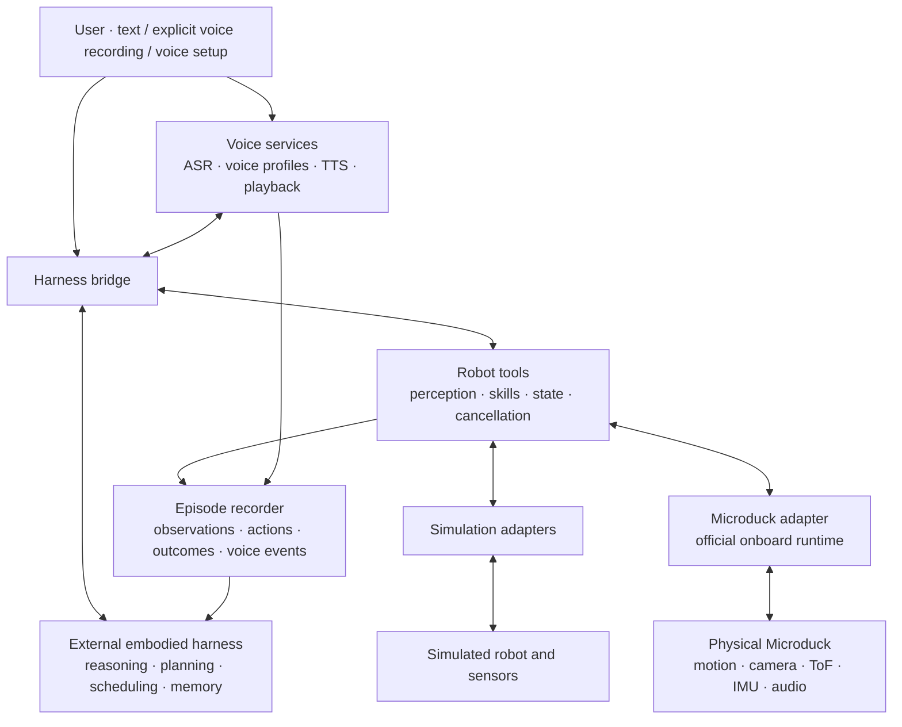
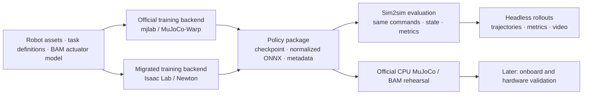

# Oh My Duck 🦆

**An interactive, extensible Microduck—with a persistent voice, shared experiences, and skills you can train.**

Oh My Duck is the implementation of **Agentic Microduck**: a robotics foundation that connects an external embodied AI harness to a small biped robot. It brings together simulation, locomotion training, robot skills, active perception, voice interaction, and evidence of what the duck actually did.

> “Find the red ball and walk up to it.”
>
> The duck looks around, locates the ball, approaches it, and replies in the voice you chose. You can ask what it sees or cancel the task. Observations and outcomes become a traceable episode that the external harness can use as a shared experience.

This is the target experience. The project is under active development; [implementation status](docs/implementation-status.md) distinguishes working components from planned capabilities. Physical-robot validation is deferred until hardware is available.

## What the project provides

| Capability | Purpose |
|---|---|
| **Text and voice interaction** | Explicit recording → speech recognition → the same text/tool control path; spoken responses and playback interruption |
| **A persistent voice** | Describe, audition and confirm a voice once; reuse the versioned voice profile across sessions and simulator/robot changes |
| **Robot skills as tools** | Discover capabilities, run skills, query progress, cancel tasks and confirm actual stopping |
| **Active perception** | Read RGB, 8×8 ToF, IMU and robot state; move the head to obtain observations with timestamps and coordinate frames |
| **Simulation and real-robot adapters** | Preserve tool parameters, units and result semantics across execution backends |
| **Two training backends** | Retain official mjlab / MuJoCo-Warp training and add Isaac Lab with **Newton physics** |
| **Sim2sim and policy export** | Compare policies under the same scenarios; export compatible joint policies with normalization and deployment metadata |
| **Traceable experiences** | Record sensor evidence, commands, task results and voice events for replay and external harness memory |

The duck's name, voice and remembered experiences give it continuity. Learning new motion skills remains an explicit data, training, evaluation and deployment process; conversation alone does not update a locomotion policy.

## How it fits together

**The external harness supplies the agent loop.** Oh My Duck supplies robot-specific tools, execution adapters, training, voice services and evidence. We do not build a second planner or long-term memory system inside the robot integration. A deterministic mock will stand in for the unfinished harness during protocol development.

High-frequency joint control stays with the policy/runtime. The harness chooses tasks and can observe, interrupt or replan; a model response is not itself evidence that a physical task succeeded.

## Train with MuJoCo or Isaac / Newton

Both training backends are part of the project scope. The official backend remains available after the Isaac migration. **Isaac uses Newton**, initially targeting its MuJoCo-Warp solver; a PhysX substitution is not an equivalent backend.

The first task is flat-ground velocity tracking. BAM actuator behavior, joint mapping, observation/action timing and normalization must match before comparing learning results. Compatible joint policies follow the official **61-observation / 14-action, 50 Hz** contract. Vision/navigation policies need their own adapters; an arbitrary VLA cannot be deployed by simply renaming its output.

Training and evaluation run headlessly. Optional offscreen video supports visual inspection alongside numerical metrics. Server jobs may use one or multiple GPUs as the experiment requires.

## A voice and history that persist

Voice setup is a deliberate choice: **describe → generate → listen → confirm → save**. Daily TTS uses the active voice profile; restarting or switching execution backends does not silently choose a new voice.

The initial voice design uses Qwen3 ASR and TTS candidates, with voice design performed on demand and reference-voice synthesis used for daily responses. Model choice remains replaceable and must be validated on the target host.

Episodes preserve what was heard, observed, requested, executed and spoken—including cancellation and partial playback. Simulation and real-world experiences remain labeled separately. The external harness decides how to summarize and retrieve this evidence.

## Built to extend

- Add or replace an external harness through the bridge.
- Register a new skill with explicit inputs, prerequisites, resources, success/failure and cancellation conditions.
- Add sensors with freshness, validity, units, coordinate frames and calibration references.
- Train a joint policy, add a velocity-level navigation policy, or adapt an action-sequence model.
- Run the same tool semantics in simulation and, once validated, on a physical duck.

The first scope is one robot, one external host and one active task. Complex whole-home navigation, continuous full-duplex listening, NFC interaction and general VLA training are later research directions.

## Explore the project

| Start with | What it explains |
|---|---|
| [Project Design](docs/Agentic%20Microduck%20-%20Project%20Design%20v0.1.md) | Full product scope, decisions, module boundaries and interfaces |
| [Execution Plan](docs/Agentic%20Microduck%20-%20Execution%20Plan%20v0.1.md) | Milestones, dependencies and acceptance criteria |
| [Getting started](docs/getting-started.md) | Current setup, server jobs, training and headless video evaluation |
| [Architecture and extension guide](docs/architecture.md) | Full framework, module contracts, dependency direction and adapter extension points |
| [Development guide](docs/development.md) | Module layout, source pins, environments, Git and file management |
| [Implementation status](docs/implementation-status.md) | Current progress, measured evidence and remaining work |

The public development entry point is `python omd.py --help`. Backend dependencies are isolated. Voice, tools and hardware packages will be added as those milestones are implemented.

## Upstream

Oh My Duck builds on [Microduck](https://github.com/pollen-robotics/microduck), [microduck_rl](https://github.com/pollen-robotics/microduck_rl), [BAM](https://github.com/Rhoban/bam), and the planned [Isaac Lab](https://github.com/isaac-sim/IsaacLab) / [Newton](https://github.com/newton-physics/newton) integration.

Code, 3D assets, model weights and third-party drivers have separate license declarations. See [third-party notices](THIRD_PARTY_NOTICES.md). A distribution license for this project's original code has not yet been selected.
