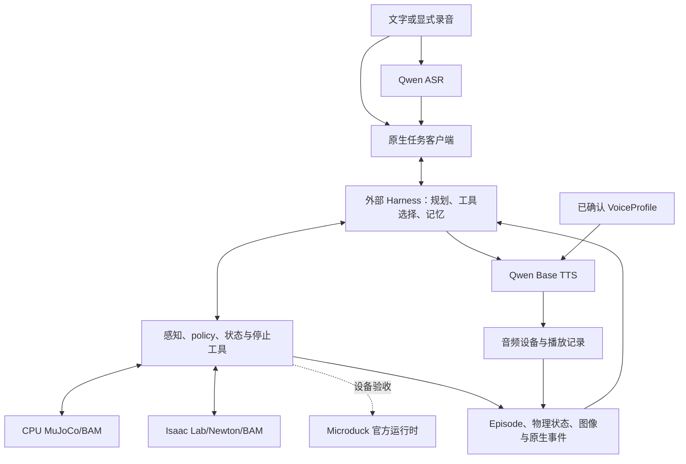
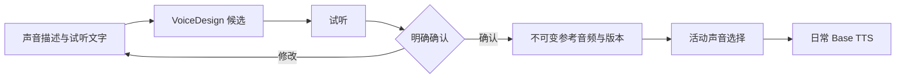

# Agentic Microduck

## 1. 产品与验收范围

Oh My Duck 为 Microduck 提供仿真、训练、技能工具、主动感知、语音交互与可追溯的经验记录。
通用 Embodied Harness 负责模型接入、规划、工具选择、长期记忆和任务调度。
用户通过文字或显式录音提交指令，能够查询进度、中断动作，并听到已确认音色的反馈。

目标交互包含“找到红球并接近”“观察左侧”“跟随目标”和“停止当前任务”。
每项能力具有独立的行为验收，任务结果引用实际传感器与执行状态。
身份、声音及共同经历跨会话保存；运动能力通过数据、训练、评估和部署改进。

| 范围 | 当前证据 | 完整验收要求 |
| --- | --- | --- |
| 原生模型与工具执行 | Luna CPU 文字导航与录音导航、独立 Verifier、原始传感器、agentic MP4 和资源释放通过 | 当前源码的多场景长导航、全部动作精度及重复任务统计 |
| 语音与固定音色 | 三个 Qwen 模型的实际 CPU 推理、四段 WAV 与全部 ASR 回读、36 项音色与参数测试通过 | 识别准确率、交互延迟、音质与 Microduck 音频设备 |
| 感知 | 当前 CPU RGBD、真实 CPU YOLO 与原始像素测量复核；固定源码 Newton RGBD 和 SAM3.1 + YOLO26 服务记录 | 当前 SAM GPU 验收、独立标注评估、目标跟踪和真机校准 |
| 训练与导出 | Walking/StandUp × 两个 backend × 两个原生 PPO 的执行流程、恢复、归一化导出与回放记录 | 自训练有效行为、多个 seed、sim2sim 与最终评估 |
| Newton 资产与准备 | 两种机器人、Office/Hospital 几何、CPU solver/contact、依赖检查与发布准备通过 | 当前源码的实际 GPU 求解、初始化、渲染及完整运行验收 |
| 安装与扩展 | 434 个 source/resource 文件、三份许可证、26 个独立安装调用通过 | 从干净环境复现所声明的完整流程 |
| 真机 | 统一接口和官方运行时来源已记录 | 实际 Microduck 的传输、音频、传感器、控制与任务验收 |

证据入口：[当前状态](implementation-status.md)、[CPU 开发验证](reports/cpu-development-readiness-2026-10-08.md)、
[语音导航](reports/cpu-voice-navigation-2026-10-08.md)、[发布要求](release-readiness.md)。
GPU 验收与 RL 保持停止。后续获得执行授权时，同时最多使用一张空闲 GPU 2–4；
设备要求没有 compute PID 且持续零 utilization。其他用户和项目的进程保留。

## 2. 已确定的设计

| 编号 | 设计要求 |
| --- | --- |
| D01 | 维护官方 mjlab/MuJoCo-Warp 与 Isaac Lab/Newton 两个训练 backend；Isaac 使用 Newton 的 MuJoCo-Warp solver。 |
| D02 | 两个 backend 共享任务要求、观测动作格式、命令序列和评估语义，使用独立锁定环境。 |
| D03 | 复用外部通用 Harness 的 agent loop、推理、规划、记忆和任务调度。 |
| D04 | 感知、主动观察、policy、状态读取和停止作为工具提供给上层模型。 |
| D05 | 仿真与真机使用相同的单位、工具参数、结果类型和取消语义；能力由实际后端声明。 |
| D06 | 开放权重语音模型优先，允许外部 Linux/NVIDIA 主机推理。 |
| D07 | 语音使用显式开始录音、结束提交和文字合成语音；持续监听与全双工属于扩展。 |
| D08 | setup 通过描述、试听和明确确认保存声音，日常使用活动版本，用户主动修改后才能切换。 |
| D09 | 保存观察、工具、执行结果和语音事件，向 Harness 提供带来源的长期 experience。 |
| D10 | 支持 joint policy，并为 velocity policy、VLN、VLA 和 action sequence 提供明确适配接口。 |
| D11 | 训练和评估全程 headless，资源明确分配，输出、源码和 checkpoint 来源完整保存；执行遵守当前 GPU 使用限制。 |
| D12 | 模块、入口、依赖、文档、Git 记录和可复现验收属于工程交付。 |

当前应用规模为一个 robot、一个外部 host 和一个活动任务。接口保留 robot/persona/session 身份。
声音设计按 setup 需要运行；ASR 和 TTS 使用各自锁定环境。不同部署方式通过同一服务接口连接。

| 本项目维护 | 外部 Harness 维护 | 独立扩展与研究 |
| --- | --- | --- |
| 机器人模型、执行器、训练任务、导出与部署适配 | 模型接入、推理与规划 | 通用 VLN/VLA 数据与训练 |
| 传感器、policy、技能工具及执行结果 | 工具选择、并发任务与取消调度 | 复杂地图、重定位及全屋导航 |
| 仿真/真机接口和能力发现 | 长期记忆、检索、角色与表达内容 | NFC、物体交互及多机器人 |
| 录音、ASR、音色资料、TTS 和播放事件 | 决定何时观察、重试与反馈 | 唤醒词、持续监听及全双工 |
| Episode 证据、回放与评估 | 组织带证据的共同经历 | 根据失败记录构建新训练任务 |

## 3. 官方来源与硬件

运行版本由 [`configs/upstream.json`](../configs/upstream.json) 固定。
Microduck task、MDP、模型、BAM、runner、导出与回放属于可编辑的项目源码，
来源与 Apache 许可证保存在 `third_party/microduck_rl/`。通用模拟器和原生 PPO 保持依赖。

| 来源 | 固定提交或版本 |
| --- | --- |
| `microduck_rl` | `cfe1c2adcceb55f6b6e369c888b31c6873175c55` |
| `microduck` | `f0d934e761a0bc96a6a7d1b5bc1260ce5a4120e5` |
| Isaac Lab | `v3.0.0-beta2.patch1` / `ffff603eafc6b74264a5261cc0183d6a65390d78` |
| Native Embodied-DeepSeek-Harness | `8a5e685b22d032207f53db20454f0992a4ad60fd` |

硬件信息使用已审读的官方来源；最终设备参数和实际可用能力须按设备版本核查。

| 硬件 | 已记录的信息 | 接入要求 |
| --- | --- | --- |
| 计算 | RK3566、AI 加速器、1 GB RAM、32 GB 存储 | 板载采集和控制，外部主机运行大模型 |
| 麦克风与扬声器 | 官方采音和播放代码 | 明确采集所有权、格式、播放进度与停止 |
| RGB 相机 | 前置相机，最终分辨率和视场待确认 | 保存内外参、安装位置和版本 |
| ToF / compact LiDAR | 8×8 区域，VL53L5CX / VL53L8CX 驱动 | 64 区测距、有效性、单位与坐标系 |
| 双 IMU | 头部和身体 | 分别保存安装坐标系和实际数据 |
| 舵机 | 15 自由度，当前 policy 使用 14 个，嘴部独立 | 关节名称、编号、HOME、动作映射与控制周期 |
| 嘴部 | 可抓取结构 | 有对象效果的独立任务与物理验收 |
| NFC | 头部和嘴部天线的产品信息 | 驱动、可用接口和实际读取验收 |
| 电池与网络 | 可更换电池、Wi-Fi、Bluetooth | 运行状态、通信中断与命令有效期 |

连接设备时声明实际传感器、技能、音频和限制。缺失或过期测量返回明确状态。
依赖缺失传感器的工具在启动位置拒绝请求。硬件接口与试验范围见
[官方审读](reports/official-rl-compliance.md)和[真机接入要求](harness-native-integration.md)。

## 4. 模块与部署位置

| ID | 模块 | 输入与输出 | 职责 |
| --- | --- | --- | --- |
| M01 | 交互入口 | 文字、录音、setup → 请求 | 文本、录音、试听、连接和停止入口 |
| M02 | 音频设备 | 采集或播放请求 → 文件与状态 | 本机和机载音频、播放中断及资源关闭 |
| M03 | ASR | 音频 → 转写 | 格式检查、模型调用和来源记录 |
| M04 | VoiceDesign | 描述与参考文本 → 候选 | setup 与主动修改声音 |
| M05 | VoiceProfile Store | 确认 → 不可变版本与活动选择 | 音频、文字、模型修订与 SQLite 事务 |
| M06 | TTS | 回复与活动音色 → WAV | 固定声音合成与播放事件 |
| M07 | Harness 接入 | 请求与事件 ↔ 原生服务 | `NativeTaskClient`、原生会话与身份 |
| M08 | Tool Catalog | Schema 与参数 → handler 结果 | 完整 JSON Schema、有限数值和实际能力 |
| M09 | 主动感知 | 观察请求 → 当前帧目标与测量 | RGB、ToF、IMU、几何、检测来源和头部观察 |
| M10 | Policy 与技能 | 参数与观测 → 动作与结果 | 策略适配、终止条件和必要的连续反馈 |
| M11 | Robot Backend | 统一调用 ↔ 执行后端 | 模拟器、官方运行时和设备能力 |
| M12 | 训练与导出 | 任务与配置 → 可评估的 policy 包 | 两个 backend、两个 PPO、恢复、导出与评估 |
| M13 | Episode 记录 | 观察、请求、执行和语音 → 证据 | 原始资料、时间关联、回放与经验接口 |

外部 Linux/NVIDIA 主机运行仿真、训练、模型和工具服务。Harness 可同机或独立部署。
Microduck 板载运行官方控制、传感器及音频路径。交互设备提供录音和声音确认。
高频关节控制保持 50 Hz；上层推理与查询通过工具和确认边界连接。

## 5. 语音与持久声音

### 5.1 请求和中断

1. 用户明确开始录音，结束后提交完整音频。
2. ASR 生成文字，原生任务客户端保留录音、请求、会话和模型来源。
3. Harness 规划并调用机器人工具，独立 Verifier 使用实际结果。
4. 反馈文字交给 TTS，TTS 读取活动 VoiceProfile。
5. 音频设备保存播放开始、完成、中断及已播放进度。

开始新录音可以停止当前播音。动作取消使用独立的任务停止接口，并等待设备确认。
提交“停止”指令后由 Harness 调用相应工具；持续监听具有自己的接收和中断验收要求。
文字入口使用同一任务链路。语音模块提供转写和合成，任务规划由 Harness 执行。

### 5.2 模型与环境

| 功能 | 模型 | 固定 revision |
| --- | --- | --- |
| ASR | `Qwen/Qwen3-ASR-0.6B` | `5eb144179a02acc5e5ba31e748d22b0cf3e303b0` |
| 声音设计 | `Qwen/Qwen3-TTS-12Hz-1.7B-VoiceDesign` | `5ecdb67327fd37bb2e042aab12ff7391903235d3` |
| 日常 TTS | `Qwen/Qwen3-TTS-12Hz-0.6B-Base` | `5d83992436eae1d760afd27aff78a71d676296fc` |

CPU 使用 Float32，CUDA 使用 BFloat16；设备参数在模型 SDK 导入和模型下载之前检查。
ASR 与 TTS 各自使用锁定环境。模型身份保存在转写、合成和候选记录中。
当前源码的实际 CPU 结果见[语音模块验证](reports/voice-audio-modules-2026-10-08.md)。
音质、自由情绪控制、识别准确率和交互延迟均有各自的评估范围。

### 5.3 Setup 与版本

候选记录包含 `candidate_id`、`description`、`reference_audio`、`reference_text` 和 `model_revision`。
已确认 `VoiceProfile` 的实际字段由 [`voice/base.py`](../src/oh_my_duck/voice/base.py) 定义：

| 字段 | 含义 |
| --- | --- |
| `persona_id`, `voice_id`, `revision` | 持续身份、声音身份和不可变版本 |
| `reference_audio` | `PayloadRef`：绝对本地 URI、`audio/wav` 和原始 SHA256 |
| `reference_text` | 参考音频对应的文字 |
| `design_model_revision` | VoiceDesign 模型与固定 revision |
| `synthesis_model_revision` | Base TTS 模型与固定 revision |
| `confirmed_at` | 明确确认的时间 |

SQLite 保存版本历史和活动选择，参考 WAV 按内容 SHA256 保存。确认请求具有一致性检查；
冲突并发写入在事务中拒绝。未确认候选、生成失败和取消 setup 保持现有活动音色。
衍生模型缓存可重建，持久来源为已确认的参考音频、文字和模型版本。

### 5.4 服务与音频设备

| 接口 | 结果 |
| --- | --- |
| `SpeechRecognition.transcribe(audio, language_hint=...)` | 转写文字 |
| `VoiceDesign.design(description, reference_text)` | `VoiceCandidate` |
| `SQLiteVoiceProfileStore.confirm_candidate(...)` | 保存并选择已确认版本 |
| `SpeechSynthesis.synthesize(text, profile)` | `PayloadRef` WAV |
| `AudioDevice.begin_recording()` / `finish_recording(recording_id)` | 录音身份与音频引用 |
| `AudioDevice.play(audio)` / `stop_playback(playback_id)` | 播放身份与实际状态 |
| `AudioDevice.wait_playback(playback_id)` / `close()` | 完成等待与资源释放 |

HTTP 服务提供 `/v1/transcriptions` 和 `/v1/speech`。客户端核对输入音频 SHA256、
返回模型身份、persona、voice revision、编码与输出 SHA256。服务通过本机回环地址或明确的 SSH 转发连接。
实现和操作见[语音源码说明](../src/oh_my_duck/voice/README.md)、[语音交互](voice-interaction.md)与[音色资料](voice-profiles.md)。

真机音频接入需要核查官方采音 worker 的单客户端所有权，建立共享采集或明确的采集调度。
机载录音和播放、运动背景下识别、传输延迟及必要的回声处理通过实际设备验收。

## 6. 原生 Harness 与工具

当前接入使用固定 EDH 的 `startServer`、`SessionEnvironment`、`EmbodiedBackend`、
`execution.start`、ActionGate 和独立 Verifier。`NativeTaskClient` 提供
`open`、`submit`、`status`、`wait`、`stop`、`close`，应用和语音使用同一接口。
任务等待要求有限的正数时间，调用者等待超时保持原生任务执行。
`submit` 接受调用者明确选择的 `context_run_ids`，最多四项同一打开会话中的
已结束任务。原生服务核查归属并生成历史指令、结果与正式验证结论；
连续任务等待 session 收尾到 `ready`，继续使用当前世界状态。
Planner 使用原生 `skills.search` 与 `skills.load` 读取持久经验。
已关闭会话和服务重启后的历史会话保持只读；声音资料和原生 skill library
通过持久存储保留。语音交互和录音文件入口见[语音交互](voice-interaction.md)。

### 6.1 当前工具

| 工具 | 主要参数 | 实际语义 |
| --- | --- | --- |
| `microduck.policy_catalog` | 无 | 当前注册 policy、来源、模型与适用条件 |
| `microduck.scene_info` | 无 | 场景、目标、配置和可用感知 source |
| `microduck.select_policy` | `policy_name` | 选择当前任务使用的 policy |
| `microduck.transition_policy` | `policy_name` | 在规定执行边界切换 policy |
| `microduck.set_command` | `command`, `max_control_steps` | twist/head/body/posture，有限控制步 |
| `microduck.walk` | `distance_m`, `speed_m_s` | 按当前身体朝向测量有符号位移 |
| `microduck.rotate` | `angle_deg`, `angular_speed_deg_s` | 测量相对 yaw，返回实际平移 |
| `microduck.read_sensor` | `sensor` | head RGB、ToF、IMU、joint state 或 odometry |
| `microduck.observe` | 可选 `prompt`, `source` | 确认边界的传感器、进度、目标与剩余预算 |
| `microduck.inspect_scene` | `prompt`, `source` | 当前帧目标框、距离、bearing 与标注图像 |
| `microduck.task_progress` | 无 | 原生执行、停止、目标条件和实际计数 |
| `microduck.wait_for_motion` | 无 | 等待原生确认边界 |
| `microduck.finish_policy` | `execution_id`, `generation`, `boundary_id` | 原生 `policy_stop` 与新鲜终止状态 |

Schema 与实现位于 [`integrations/edh/server.mjs`](../integrations/edh/server.mjs) 和
[`integrations/edh/session.py`](../src/oh_my_duck/integrations/edh/session.py)。
`walk` 接受 −10 至 +10 米，幅度至少 0.1 米；速度为 0.1–0.4 m/s，默认 0.4。
`rotate` 接受 −360 至 +360 度，幅度至少 10 度；角速度为 10–55 deg/s，默认 45。
完成要求为最多 0.05 米或 5 度误差，以及五个连续实际停止样本。
标准脚转向同时使用前向、侧向和 yaw 命令，路线规划需要考虑测得的平移。
`walk` 和 `rotate` 在确认的暂停边界准备请求，随后通过原生 `execution.start` 或
`execution.resume` 执行。`wait_for_motion` 等待执行边界，物理停止依据测得状态单独检查。
原始请求、完成误差与物理停止依据见[工具说明](metric-policy-tools.md)。

### 6.2 生命周期与权限

长任务具有 `accepted`、`running`、`succeeded`、`failed`、`cancelled` 状态。
取消请求与最终物理停止分别记录。命令绑定请求、任务、execution 和 generation；
旧执行结果只能关联原有身份。重试保持世界物理状态并准备新执行所属的命令。
重复准备请求和无效命令在接纳位置拒绝。

每个 policy action 为 14 个 joint offset。ActionGate 接纳之后执行四个 0.005 秒子步。
暂停使旧 generation 失效，设备完成已接纳动作，发布新鲜状态和暂停确认。
`select_policy` 使用实际停止样本及确认边界。`transition_policy` 使用完整 episodic
终止边界，保留姿态、速度与动作历史，接续 standing policy 恢复并测量物理停止。
独立 Verifier 从原生目标状态读取结果。
工具的成功条件、停止原因、ToF、外部接触、姿态和进度检查保留原始要求。

### 6.3 扩展技能

`SkillSpec` 声明身份、版本、参数 Schema、传感器、前置姿态、资源、policy 类型、
观测动作格式、频率、后端、设备、终止条件、取消方式、权重 SHA256 和评估结果。
`follow_object`、`approach_object`、`look_at` 与复合技能具有独立实现和验收要求。
目标跟踪使用有来源、最近时间和有效状态的目标记录；目标丢失、观测过期、通信中断
及超时具有明确的停止行为。工具内部维护必要的快速反馈，Harness 决定任务和观察时机。
motion、head、mouth 资源通过通用调度与唯一电机仲裁入口协调。

## 7. 传感器、感知与通用后端

`RobotBackend` 保持单位、坐标、输入输出、有效性和取消语义。CPU MuJoCo/BAM、
Isaac/Newton/BAM 与真机适配使用明确的配置和实际能力声明。
场景导入采用打包的 JSON Schema，Python CLI 与原生 Node 使用相同检查。

`SensorFrame` 保留 sensor/robot/episode 身份、sequence、采集时间、时钟域、接收时间、
frame、有效性、`PayloadRef` 和 calibration revision。大图像和音频通过引用传递。
跨机器时间使用明确的时钟关联或本机接收年龄。RGB、ToF 与头部姿态关联同一采集状态。
`Validity` 使用 `valid`、`no_target`、`invalid`、`stale` 和 `unavailable`。
带有 `max_age_ms` 的扩展接口要求返回符合年龄条件的观测；无效和未知区域保留相应状态。
长度使用米，内部角度使用弧度，时间使用秒；身体坐标 x 向前、y 向左、z 向上。
quaternion 顺序在具体格式中声明。`robot_id` 表示设备，`persona_id` 表示持续身份，
`episode_id` 表示一次执行记录。

| 感知部分 | 数据与要求 |
| --- | --- |
| RGB | 当前图像、真实 camera geometry、内外参与安装位置 |
| ToF | 8×8 测距、状态、相应姿态；噪声、区域聚合、延迟和无效返回需要硬件标定 |
| IMU | 重力、角速度、安装坐标、噪声与延迟 |
| `simulator_ground_truth` | 原生 shape/segmentation、校准射线和真实几何距离，明确标记来源 |
| `models` | SAM3.1 文本分割、YOLO26 框关联、实际 RGBD 距离与模型来源 |
| 目标记录 | 当前帧身份、query、图像 SHA256、目标框、mask、距离和 bearing 来源 |

可用 source 随当前配置公布；模型服务使用明确 endpoint，连接错误在调用位置返回。
目标框、图像、模型与距离来源接受独立检查。带有目标标注的识别准确率、距离误差、
移动目标跟踪和真机校准分别评估。
模型服务和客户端从原始 RGBD 复算全部目标几何；SAM 保存与源图像一致的二值 PNG mask。
`omd validate perception` 提供真实模型调用、原始资料保存和独立测量复核，
实现位置见[感知源码说明](../src/oh_my_duck/perception/README.md)，
当前 CPU 结果见[测量验证](reports/perception-measurements-2026-10-08.md)。
世界真值用于评估、奖励或 critic；可部署 actor 只使用目标设备实际可获得的信息。

## 8. Policy 适配与扩展

| 类型 | 输入 | 输出 | 接入要求 |
| --- | --- | --- | --- |
| `joint_policy` | 本体观测与命令 | 14 维关节动作 | 满足官方观测、映射、时序与归一化格式 |
| `velocity_policy` | 图像、ToF、目标 | 身体速度命令 | 复用底层 locomotion，定义反馈和停止 |
| `action_sequence_policy` | 图像、语言、状态 | 动作序列或 action chunk | 明确动作含义、时间、取消和设备资源 |
| `composite_skill` | 参数化任务 | 多步骤工具与策略执行 | 复用 Harness 调度，声明实际结果条件 |

官方 policy 和已核验训练包进入共同 registry。`--policy-registry` 明确选择附加包；
距离/角度工具的 locomotion policy 明确配置。每项包保留来源、manifest、模型、
关节格式、推理输出、完整 episodic 时长和接续条件。
登记、执行正确性、学习效果、物体效果及多场景泛化具有各自证据。
VLN/VLA 模型需要匹配 Microduck 的传感器、动作、资源和任务，接口由实际适配器定义。

## 9. 训练、物理与官方格式

两个代表任务为 `Mjlab-Velocity-Flat-MicroDuck` 与 `Mjlab-StandUp-Flat-MicroDuck`。
`mujoco` / `isaac-newton` 和 `rsl-rl` / `sb3` 独立选择，共八个代表组合。
完整官方 registry 作为扩展清单维护。RSL-RL 使用原生 PPO 和 distributed learner；
SB3 使用原生 PPO、VecEnv 与独立任务并行。具体配置和恢复行为由各 framework 保持。

### 9.1 官方观测与动作

| actor 索引，左闭右开 | 宽度 | 内容 |
| --- | --- | --- |
| `[0,3)` | 3 | 身体坐标角速度 |
| `[3,6)` | 3 | 身体坐标重力投影 |
| `[6,20)` | 14 | joint position 减 HOME，排除嘴部 |
| `[20,34)` | 14 | joint velocity，排除嘴部 |
| `[34,48)` | 14 | 上一帧缩放前 action |
| `[48,51)` | 3 | twist 命令 |
| `[51,55)` | 4 | head/neck 命令 |
| `[55,61)` | 6 | body 命令与官方未绑定轴零填充 |

保持 `obs[1,61] → actions[1,14]`、14 个 named servo、canonical HOME、50 Hz、
四个 0.005 秒子步、动作缩放和裁剪、sensor-view reward 与 native normalization。
HOME 作为观测和动作参考使用，其物理保持效果需要实际测量。

### 9.2 物理与执行器

迁移使用官方 BAM XL330 M6、物理子步延迟、负载摩擦、电压行为、per-world friction、
非累积随机化、正确的 passive joint 与 encoder 映射。reset 清理各 world 的状态和缓存。
碰撞形状、foot contact、接触过滤、材质、惯量、armature 和 joint limit 逐项比较。
Newton manager 在 CUDA graph capture 之前编译官方 contact model，保持 solver 数据所有权。
单关节响应、负载、延迟、接触和相同状态的观测具有独立数值验证。

### 9.3 训练与导出验收

新组合执行官方 64-env/5-iteration smoke、有限 reward/state 与 penalty sign 检查、
native checkpoint 保存和恢复、normalizer-aware export、数值 parity、CPU MuJoCo/BAM
部署回放及行为评估。训练效果使用预先声明的场景、命令、seed、指标和 checkpoint 规则。
吞吐、显存、学习曲线和任务成功率分别记录。退化行为按实际课程阶段诊断。

导出使用官方 `run_export` 和 runner export。策略包遵循官方 schema 2 与 publisher 格式；
来源、checkpoint、归一化、兼容信息、配置、版本、SHA256 和评估保留在包及旁侧记录中。
训练推理与 ONNX 使用同一批观测比较，导出后在两种 backend 及 CPU/BAM 使用固定 battery。
仿真通过标记 `sim_validated`，板载和实际设备的任务通过后标记 `hardware_validated`。
本地包校验和公开发布分别执行。

W&B 使用 [`configs/training.json`](../configs/training.json) 的 online 模式及已核对账号，
明确的 `WANDB_MODE` 可指定模式，全部 worker 保留实际设置和本地记录。
RL 目前停止，checkpoint、日志、policy 包、失败记录和视频完整保留。
操作和行为范围见[framework](rl-frameworks.md)、[代表任务](rl-reproduction.md)、
[campaign](rl-campaigns.md)及[运行验收](runtime-release-acceptance.md)。

## 10. Episode 与长期经验

记录保留 persona/robot/backend/session/episode 身份、录音与转写、工具请求参数和返回、
任务状态、取消原因、传感器与校准、实际命令和 policy、物理结果、回复文字、声音版本、
音频与播放进度、场景、seed、源码和依赖版本。事件日志与原始音视频按明确配置保存。

Harness 决定总结、检索和长期保存内容。经验保留证据引用，并区分用户陈述、模型判断、
实际测量以及 simulation/real domain。历史回放引用当时的声音版本。
部分播放记录实际位置，无法确定已播放文字范围时保留相应限制。

`omd replay` 提供原生会话管理与 terminal run 导出。事件回放展示实际请求和结果；
仿真重跑固定源码、场景和 seed，并记录跨版本差异。硬件日志回放用于资料分析，
动作重新执行具有独立调用和设备条件。

## 11. 源码、配置与公开入口

| 职责 | 目录与入口 |
| --- | --- |
| 公开命令 | `cli/`、`omd.py`、`python -m oh_my_duck` |
| 应用、工具与技能 | `agentic/application.py`、`agentic/tools/`、`agentic/skills/` |
| 原生任务客户端 | `agentic/harness/base.py`、`integrations/native_client.py` |
| EDH 环境、设备、会话与通信 | `src/oh_my_duck/integrations/edh/` |
| 原生 Node 部署与角色 | 根目录 `integrations/edh/` |
| 数据类型与身份 | `core/contracts/` |
| 在线执行、policy 与模型 | `robotics/backends/`、`robotics/policies/`、`robotics/microduck/` |
| 感知 | `perception/` |
| WAV、音色、模型、HTTP、设备和会话 | `voice/` |
| Episode 与原生导出 | `experience/` |
| Task、MDP、simulator、PPO、export 与 evaluation | `rl/` |
| 运动、原生任务和发布验收 | `validation/` |
| 安装、环境和所属进程 | `infrastructure/` |
| 固定版本、训练、场景和发布计划 | `configs/` |
| 锁定依赖 | `environments/` |

应用接口导入保持 simulator、Torch 和语音模型的延迟加载。
`ToolCatalog` 注册时验证完整 JSON Schema Draft 2020-12，调用时验证有限 JSON 参数。
`omd status` 读取软件成熟度；在线能力由后端提供。
源码定位见[architecture](architecture.md)，使用方式见[getting started](getting-started.md)。

## 12. 交付与验收

| 里程碑 | 交付内容 | 通过条件 |
| --- | --- | --- |
| M0 | 官方来源、版本、代码审读、策略和硬件信息 | 能指向实际实现并复现官方链路，记录阅读覆盖和未知项目 |
| M1 | 两个训练 backend、BAM、导出、基础工具与执行适配 | 格式和时序一致、实际物理证据、有效行为与交叉评估 |
| M2 | 显式录音、ASR、setup、固定 TTS、播放和任务中断 | 同一任务链路、跨会话音色、实际停止及音频设备证据 |
| M3 | RGB/ToF、主动观察、目标接近与跟随 | 新鲜测量、距离条件、目标丢失与取消结果 |
| M4 | 记录、回放、参考应用、安装与扩展教程 | 干净环境复现公开声明的流程，每项能力关联验收报告 |

运动评估包含跌倒、命令跟踪、脚滑、成功率、板载推理及控制周期。
语音评估包含意图正确率、中文错误、转写与首次播音延迟、停止延迟、资源和音色一致性。
系统评估包含观测新鲜度、取消完成时间、通信中断行为和记录完整性。
固定声音、修改声音、迟到结果、过期测量、目标丢失、sim/real 经验及后端语义分别检查。
报告明确样本数、场景、统计方法、阈值、源码和未验收范围。

## 13. 需要独立推进的能力

当前源码 Newton 求解与首次 kernel 初始化、长导航和严格动作精度、多场景泛化、
识别准确率、图像输入独立 VLN、物体抓取和携带效果、自训练行为、Microduck 音频和传感器、
板载部署与真机任务继续按各自验收推进。UI 载体、NFC、全双工和通用 VLA 数据需要相应设计与评估。
API 或依赖升级固定新版本并重新检查受影响路径。

GPU 工作使用[六阶段发布验收](runtime-release-acceptance.md)，保留实际模型、传感器、
policy、ActionGate、正式 verdict、MP4 和进程释放。CPU 成果和准备检查分别提供证据。
具体执行次序和各步骤完整要求见[执行计划](Agentic%20Microduck%20-%20Execution%20Plan%20v0.1.md)。

## 14. 维护要求

每次迭代同步设计、执行计划、implementation status、CLI maturity 和相关源码说明。
功能使用独立 feature branch，相关运行与检查通过后合入并推送 main。
实验使用固定源码、独立输出目录、明确资源和原始资料；失败产物保留。
图示随模块和接口更新。模型与后端变化保持工具单位和结果语义，声音变化由用户明确确认。
版本和来源以配置、源码、依赖锁和独立报告为依据。
