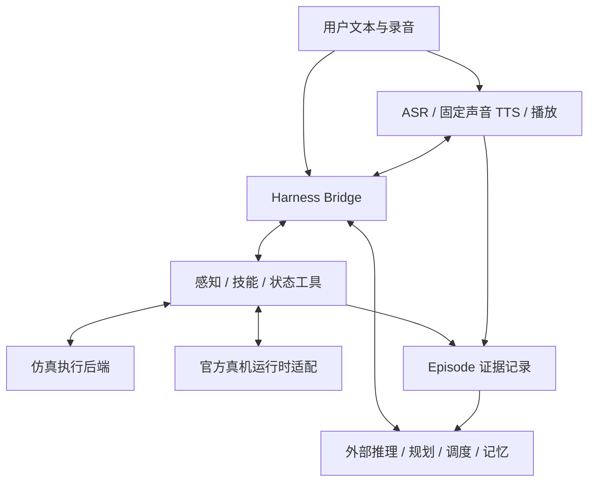
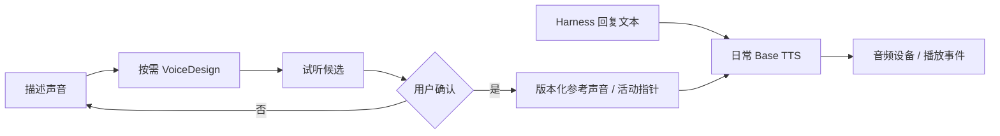
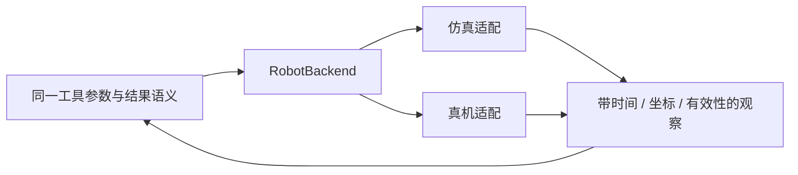
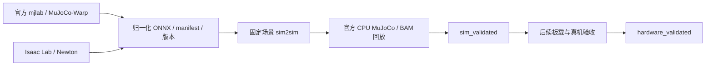
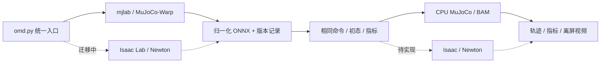

# Agentic Microduck

## 项目概览与详细设计 · v0.2

**一句话定位：让外部 Embodied Harness 驱动一只可交互、可扩展、拥有持久声音与共同经历的 Microduck；本项目提供技能工具、主动感知、仿真/真机适配、语音与经验记录，以及官方 MuJoCo 和 Isaac/Newton 双训练后端。**

本文件保留原文件名以维持链接，内容已随 2026-09-06 的用户决策更新至 v0.2。当前已开始工程实现；功能状态以本节及[实现进度](implementation-status.md)为准，设计提案不等于已验证能力。完整逐文件审计仍在进行，Isaac 迁移与真机试验尚未完成。

**当前执行条件**：服务器任务通过 Alaya HTrain `submit` 提交；训练与评测均 headless，离屏保存视频。可按实际需要使用单节点多 GPU，不添加人为的任务数量或运行时长上限。现阶段没有真机，只验收仿真；外部 Harness 后续先使用确定性 mock。

**当前开发策略：先整体框架，后逐步填充功能。** 完整项目 scope 保持本文第 1–10 节的交互、工具、感知、声音、经验与训练设计。整体轻量框架已建立：契约、执行后端、技能、工具、感知、策略、Harness、语音、记录、训练及应用装配均有独立模块；接口占位与可运行实现明确区分。现有 MuJoCo 适配保留在框架内，隔离 Python 环境与主要依赖版本已可读取；worker设备检查、CPU MuJoCo基础仿真与EGL渲染已通过，机器人训练/回放尚未验证。已建立本地 Git 与统一入口；远程 `https://github.com/jixinyan/Oh-My-Duck.git` 目前认证失败。详细状态与测试见 [implementation-status.md](implementation-status.md)。

**最新进度（2026-09-06）**：两个job均已结束。MuJoCo probe（`omd-probe-20260906-01`）成功：worker识别到1张H200，CUDA/Warp设备检查、CPU MuJoCo有限步仿真与EGL离屏图片生成通过；这不代表GPU物理、机器人策略回放或训练已通过。CPU ONNX结构与16组输入检查通过。Isaac两套隔离环境已安装，资产转换、规范关节映射、Newton PD诊断任务及有限步视频/导出入口已实现；11项轻量测试和4项Isaac包内CPU检查通过。资产转换job（`omd-isaac-assets-20260906-01`）失败于Omniverse Kit首次启动的EULA交互提示（`EOF when reading a line`），未完成资产转换或进入Newton物理验证。BAM行走迁移、训练、视频与sim2sim仍待完成。启动修复已加入显式 `--accept-eula` 和无交互预检查；用户已明确同意 NVIDIA Omniverse EULA，转换重试 `omd-isaac-assets-20260906-02` 已提交，等待worker结果。详见[Isaac接入指南](isaac-newton.md)与[实时进度](implementation-status.md)。

**Isaac 参考审读（2026-09-06）**：已静态审读 `kabilankb/isaaclab-microduck` 默认分支的固定版本 `4310fe0`，借鉴独立任务包、显式 Newton/MJWarp 配置、资产转换与行为评测方法。参考实现仍缺 BAM 与观测延迟，关节排列和最终 solver 参数需独立验证；它不替代官方 MuJoCo 基线，也不表示本项目 Isaac 已实现。第 03–07 步按环境 → 资产与映射 → BAM → 同策略 sim2sim → 训练导出逐步验收，详见[审读与迁移细化](reports/isaac-newton-reference-review.md)。独立功能使用分支，每个可检查阶段及时提交；完整项目 scope 保持不变。

**框架验收（2026-09-06）**：8 项轻量测试通过，覆盖模块依赖隔离、工具注册/请求关联、事件域与证据保存、50 Hz 时序及 Newton 禁止静默降级；Python 语法编译通过。尚未提交 GPU 训练/回放 job，具体功能继续逐步实现。见[验证记录](reports/framework-validation.md)。

原始想法文档 `Agentic Microduck.md` 未随本次两份设计材料导入；当前完整范围以本文为准。

逐步开发与验收安排见 [执行计划 v0.1](Agentic%20Microduck%20-%20Execution%20Plan%20v0.1.md)。

**阅读路径**：先看第 1–4 节理解定位、范围和模块；第 5–10 节定义实现接口与关键流程；第 11–14 节用于安排开发和验收。当前图示以内嵌 Mermaid 保存，可在 GitHub 阅读；代码边界见[架构与扩展指南](architecture.md)。

---

## 1. 产品定位与用户体验

### 1.1 用户最终获得什么

本项目面向 Microduck 用户、开源贡献者和机器人学习研究者，提供三类能力：

1. **玩与交互**：通过一句语音或文本命令，让小鸭执行技能、观察周围、反馈进度和结果。
2. **开发与扩展**：替换大脑、添加传感器工具、接入新的 RL / VLN / VLA 策略，在仿真与真机上使用相同的调用接口。
3. **训练与部署**：选择官方 mjlab / MuJoCo-Warp 或 Isaac Lab / Newton 定义任务、训练策略、开展 sim2sim 评测并导出兼容策略包。

用户体验强调连续性：小鸭有固定名字和声音，能够通过外部 harness 的长期记忆记住用户偏好及真实发生的共同经历。更换模型、重启或开启新会话，不应重置声音身份。

### 1.2 一个目标体验

> 用户按下录音按钮：“小鸭，找到红球，走到它前面。”
>
> ASR 将录音转成文本，harness 调用观察工具识别目标，再启动接近目标的技能。技能持续执行，上层可调用状态或传感器工具了解进度。
>
> 到达后，小鸭用 setup 时确认的音色说：“找到啦，我停在球前面了。”
>
> 如果用户重新录音说“先停下”，harness 取消当前技能，小鸭在确认执行状态后回应。

这是后续整体验收场景，不是第一项迁移任务的交付承诺。第一个技术里程碑仍是官方行走基线向 Isaac Lab + Newton 的迁移验证。

### 1.3 “养成”具体体现在哪里

| 维度 | 用户能感受到的变化 | 数据依据与归属 |
|---|---|---|
| 身份持续 | 一直使用同一个名字与音色 | 本项目保存声音配置；harness 保存角色配置 |
| 用户偏好 | 记得用户偏好的称呼、表达方式 | harness 的记忆与检索 |
| 共同经历 | 能提起“上次一起找到的红球” | 本项目记录观察与任务结果，harness 组织为经验 |
| 技能成长 | 新安装的技能可用，已测技能的成功率提高 | 版本化技能与评测结果 |

长期记忆不会自动改变 RL policy 的权重。真正的运动能力改善通过数据、训练、评测和部署形成闭环；对话中的成长描述应与已记录的事实一致。

## 2. 已确定的决策与范围

### 2.1 已确定

| 编号 | 决策 |
|---|---|
| D01 | 支持两种正式训练后端：官方 mjlab / MuJoCo-Warp，以及 Isaac Lab / Newton。Isaac 必须使用 Newton，优先 MuJoCo-Warp solver。 |
| D02 | 官方 mjlab 后端持续维护，既可独立训练，也用于 sim2sim 对照；两后端共用策略契约、命令序列和评测输出语义。迁移收益通过实验衡量。 |
| D03 | 直接复用另一个项目的通用 Embodied Harness；该项目负责 agent loop、推理、规划、记忆及任务调度机制。 |
| D04 | 感知、主动观察、动作技能和状态查询均作为工具提供给上层大脑。 |
| D05 | 仿真与真机必须共用工具语义、输入输出协议和 harness 接口。 |
| D06 | 模型选择以开放权重为优先，允许外部 Linux + NVIDIA 主机推理。 |
| D07 | 首版语音不要求持续监听或原生全双工；核心是录音转写和文字合成语音。 |
| D08 | 用户在 setup 中描述、试听并确认音色，之后一直使用该声音，除非用户主动修改。 |
| D09 | 记录可追溯的观察、工具调用、实际执行结果和语音事件，供 harness 构建长期 experience。 |
| D10 | 为 RL、VLN、VLA 保留适配接口；具体模型须满足 Microduck 的观测、动作和运行资源要求。 |
| D11 | 服务器运行经 job 提交、全程 headless、按需保存离屏视频；允许单节点多 GPU，无额外项目级时长/数量上限。 |
| D12 | 优先建立服务整个项目的模块化框架和稳定衔接边界，再逐项实现功能；Git、清晰入口、文件管理、完整项目总览 README 及原始文档进度同步属于工程交付。 |

### 2.2 首版建议，允许后续调整

- 录音采用显式开始 / 结束的交互，例如电脑或手机页面上的录音按钮；具体 UI 载体尚未选定。
- ASR 基线为 `Qwen3-ASR-0.6B`。
- setup 声音设计使用 `Qwen3-TTS-12Hz-1.7B-VoiceDesign`；日常合成使用 `Qwen3-TTS-12Hz-0.6B-Base`，复用确认后的参考声音。
- 面向 harness 的工具与主机服务优先使用 Python；硬件控制复用官方 Rust 运行时。
- 使用单机器人、单主机和单活动任务作为初始实现规模，接口保留多机器人标识。
- 语音模型按需要加载，声音设计不与持续训练或日常推理强制常驻同一 GPU。

### 2.3 项目边界

| 本项目负责 | 通用 harness 项目负责 | 后续扩展 |
|---|---|---|
| Microduck 资产、Isaac 任务、执行器适配、训练与导出 | 上层模型接入、推理与规划 | VLN / VLA 数据采集与微调 |
| 传感器、技能、状态等工具适配 | 工具选择、并发任务管理与取消协议 | 复杂导航、地图与重定位 |
| 仿真 / 真机后端与能力发现 | 长期记忆、经验检索、总结与个性管理 | NFC 与嘴部交互技能 |
| 录音、ASR、声音设计、TTS、播放状态 | 决定说什么、如何解释结果 | 唤醒词、持续监听、全双工模型 |
| 机器人执行结果、记录、回放和评测 | 决定何时观察、监控、重试或重新规划 | 多机器人与跨设备协作 |

我们提供一个接入上述 harness 的参考应用。参考应用不再实现第二套长期记忆或 agent 调度系统。

## 3. 官方基础与硬件约束

### 3.1 已有软件链路

`microduck_rl` 当前使用 **mjlab + MuJoCo Warp + PPO / RSL-RL** 训练，已有 GPU 并行环境、BAM 执行器建模、随机化、ONNX 导出和 CPU MuJoCo 回放。迁移不是从 CPU 仿真第一次转向 GPU；其目标是接入 Isaac 任务与感知生态，并建立统一开发环境。[S01][S02]

`microduck` 提供板载运行时：`robotd` 管理控制与策略，`tofd` 提供深度，`mediad` 提供视频与远程接口等。已有协议是适配起点。设计文档描述的目标架构与当前实现可能存在差异，开发时须核查被调用的方法及部署版本。[S03][S04]

调研时记录的仓库快照：

- `microduck_rl`：`1e79c29c97d8b38aee9eefde77a545860ba7658e`
- `microduck`：`bc41fb5c9a9b39894669c1e022e375cf83800382`

这两个提交用于标记调研起点，不构成已验证的运行组合。实施 M0 时重新核对内容并生成实际版本锁定文件。

### 3.2 硬件与能力发现

| 硬件 | 官方公布 / 代码可见的信息 | 设计影响 |
|---|---|---|
| 计算 | RK3566，AI 加速器，1 GB RAM，32 GB 存储 | 小鸭负责采集、播放和控制；大模型初期在外部主机运行 |
| 麦克风与扬声器 | 产品规格包含麦克风和扬声器；已有采音与声音播放代码 | 需要可复用的音频输入 / 输出接口 |
| RGB 相机 | 前置；最终分辨率与视场待定 | 不将驱动当前默认分辨率视作最终产品参数 |
| ToF / compact LiDAR | 8×8 测距矩阵；驱动支持 VL53L5CX / VL53L8CX | 提供 64 区测距及有效性状态，不宣称高密度全向点云 |
| 双 IMU | 头部、身体各一个 | 标明参考坐标系及实际可读取的数据 |
| 舵机 | 15 自由度；官方当前策略输出覆盖其中 14 个，嘴部单独控制 | 模型自由度、策略动作与硬件编号分别映射 |
| 嘴部 | 可抓取结构 | 独立工具及后续受限物体交互任务 |
| NFC | 产品规格为头部、嘴部各一处天线 | 驱动与稳定接口尚未在本次审读中确认，作为扩展能力 |
| 电池与连接 | 可更换电池，Wi-Fi、Bluetooth | 通过已有状态接口判断运行条件；网络连接不承担高频关节闭环 |

来源为官方规格与关键实现。[S05][S06][S07] 上游明确说明部分产品参数尚未定型；开发板也可能缺少部分传感器。

**能力发现是入口要求**：连接时返回 `camera`、`tof`、`audio_capture`、`audio_playback`、`nfc`、`skills` 等实际能力。缺失能力时返回明确的 `unsupported` / `unavailable`，不得以全零数据冒充测量结果。

例如，缺少 ToF 的仿真场景或真机仍可使用站立技能，但依赖测距的接近目标工具应拒绝启动或使用事先定义的降级策略。

## 4. 总体架构与模块



图中的外部 Harness 是独立项目；工具、声音、后端适配与事件记录属于本项目。双向箭头表示请求和结果回传。训练链路与在线交互链路独立运行，通过版本化策略包连接。

### 4.1 模块职责

| ID | 模块 | 输入 → 输出 | 责任边界 |
|---|---|---|---|
| M01 | 交互入口 | 录音 / 文本 / setup 操作 → 请求 | 录音按钮、试听、连接状态和文本备用入口 |
| M02 | 音频设备适配 | 录音请求 / 音频 → 音频片段 / 播放进度 | 本机设备与 Microduck 音频设备切换 |
| M03 | ASR 服务 | 音频片段 → 转写结果 | 采样率转换、模型调用与文本结果；不规划动作 |
| M04 | 声音设计 | 自然语言描述 → 候选参考声音 | setup / 用户修改时运行，确认后保存 |
| M05 | Voice Profile Store | 声音确认 → 持久配置 | 参考音频、文本、模型修订与活动声音版本 |
| M06 | TTS 与播放 | 回复文本 + 声音配置 → 音频 / 播放事件 | 日常固定音色合成、停止播放和声音复用 |
| M07 | Harness Bridge | 指令 / 观察 / 事件 ↔ harness | 唯一 agent 接入点，映射外部协议 |
| M08 | Tool Catalog | 工具描述 / 调用 → 类型化工具结果 | 能力声明、参数校验、状态与错误语义 |
| M09 | 感知工具 | 读取 / 观察请求 → 带时间与坐标系的观察 | RGB、ToF、姿态、状态、主动注视 / 扫描 |
| M10 | 技能运行与策略适配 | 任务参数 + 观测 → 命令 / 任务结果 | RL / VLN / VLA 适配及所需本地执行循环 |
| M11 | Robot Backend | 标准调用 ↔ 仿真 / 真机 | 将统一语义映射到 Isaac 或官方运行时 |
| M12 | Isaac 训练与导出 | 资产 + 任务 + 配置 → 可评估策略包 | 训练、回放、评测、兼容导出 |
| M13 | Episode Recorder | 所有关键事件 → 可追溯记录 | 原始证据、时间关联与回放；不自行总结长期记忆 |

### 4.2 部署位置

- **外部 NVIDIA 主机**：Isaac 训练 / 仿真、语音推理、工具服务；harness 可同机也可另行部署。
- **Microduck 板载**：官方运动控制、传感器采集、音频采集与播放、必要的本地命令超时处理。
- **交互设备**：setup、录音触发、试听及文本输入，可与推理主机合一。
- **大脑**：遵循外部 harness 的模型部署方式，本项目不固定 VLM。

允许外部主机运行 VLN 等策略并向小鸭发送速度目标；底层行走策略与电机闭环保持板载。实际模型并发数、显存占用与延迟在目标 GPU 上测量，不预先承诺。

## 5. 语音设计：轻量入口与持久声音身份



### 5.1 首版交互规则

1. 用户显式开始录音，结束后提交一个完整音频片段。持续监听不是依赖。
2. ASR 返回文本，bridge 按普通用户指令交给 harness。
3. harness 决定工具调用和回复内容；语音模块不自行规划或确认任务成功。
4. TTS 使用当前活动声音配置合成，音频适配器负责播放。
5. 不需要语音时，文本入口仍可运行同一任务链路。

**首版中断语义**：用户开始新录音时可以停止当前播音，避免把小鸭声音录入新指令；这不自动取消正在执行的动作。用户说“停下”并提交后，由 harness 调用取消 / 停止工具。录音按钮之外提供显式停止动作入口。未启用持续监听时，不承诺任意时刻说出“停”都会被接收。

例如，跟随过程中按下录音问“你看见球了吗”，可暂停小鸭的播音，跟随技能继续运行；提交“不要跟了”后才取消跟随。普通暂停说话与取消动作是两个事件。

### 5.2 模型角色

| 阶段 | 初始模型选择 | 调用时机 |
|---|---|---|
| 识别 | `Qwen/Qwen3-ASR-0.6B` | 每次录音提交后；保留以后启用流式识别的可能 |
| 声音设计 | `Qwen/Qwen3-TTS-12Hz-1.7B-VoiceDesign` | setup 或用户修改音色时 |
| 日常合成 | `Qwen/Qwen3-TTS-12Hz-0.6B-Base` | 根据已确认的参考音频与参考文本合成 |

以上名称是候选模型标识，不是本项目已测性能结果。Qwen 官方提供声音设计后通过参考音频复用的流程；实际声音一致性、语言表现和推理资源需要验收。[S08][S09]

0.6B Base 的核心用途是参考声音复用。日常语气 / 情绪的自由控制能力不作为该配置的已保证特性，也不依赖每次重新设计声音。后续若需更强表达控制，再比较相应模型与接口。

### 5.3 Setup 流程

1. 用户输入声音描述，例如：“声音明亮、有一点沙哑，说话轻快但不尖锐。”
2. 使用固定试听文本生成候选音频，例如：“你好呀，我是你的小鸭。以后我们一起探索吧。”
3. 用户试听，可修改描述重新生成。
4. **用户确认**后，创建不可变的声音版本，保存参考音频、文本和生成来源。
5. 将该版本设为活动声音，后续对话自动复用。

取消 setup 不替换已有声音。新建小鸭尚未确认音色时可继续使用文本；不暗中选定一个永久声音。修改音色沿用相同流程，并保留上一版以便回退。

### 5.4 VoiceProfile 提案

```json
{
  "schema_version": 1,
  "persona_id": "duck-001",
  "voice_id": "voice-001",
  "revision": 1,
  "description": "明亮、略带沙哑，轻快但不尖锐",
  "language": "zh",
  "reference_audio": "voices/voice-001/v1/reference.wav",
  "reference_text": "你好呀，我是你的小鸭。以后我们一起探索吧。",
  "design_model": "Qwen/Qwen3-TTS-12Hz-1.7B-VoiceDesign",
  "synthesis_model": "Qwen/Qwen3-TTS-12Hz-0.6B-Base",
  "model_revisions": {},
  "reference_sha256": "<在生成并保存音频后计算>",
  "confirmed_at": "<用户确认时间>"
}
```

这是示例结构。`model_revisions` 在实际 setup 中记录模型权重和推理实现版本，不能在发布配置中留空。衍生的 speaker prompt / embedding 可缓存，但参考音频和文本是可重建配置的持久来源；模型更新后按兼容性重新构建缓存。

活动声音指针与不可变版本分开存储，避免生成失败覆盖现有音色。一个 persona 可在仿真和真机间使用同一声音；物理机器人编号不决定声音模型的内部状态。

### 5.5 最小服务接口

| 接口（本项目提案） | 返回 |
|---|---|
| `transcribe(audio, language_hint?)` | `text, language?, audio_id, duration_ms`；置信度只有模型提供时才返回 |
| `design_voice(description, sample_text)` | `candidate_id, audio_id, reference_text` |
| `confirm_voice(candidate_id, persona_id)` | `voice_id, revision` |
| `synthesize(text, voice_id, revision)` | `audio_id, format, sample_rate, duration?` |
| `play_audio(audio_id)` | `playback_id`，随后产生开始 / 完成 / 中断事件 |
| `stop_playback(playback_id)` | `stopped, played_ms` |

声音选择不放在每一条普通回复中由大脑自由生成。bridge 将已选声音自动附到 TTS 请求上，保证用户设定的持久性。

### 5.6 音频设备接入

官方当前音频 worker 已使用机载麦克风进行摸头声音检测，且代码注明采集设备为单客户端。[S10] 真机适配须从共享采音路径分发数据，或明确安排采集所有权，不能让多个服务同时独占打开设备。

本次已确认采音实现，尚未确认一个可直接复用的完整远程 ASR 音频接口。开发 M2 时核查音频传输与播放路径；不把架构文档里的双向音频目标当作现成能力。首版不要求机器人同时播音与录音；以后开放双向持续音频时再加入并实测回声消除。

## 6. Harness 接入与统一工具协议

### 6.1 通用 harness 接口约束

外部 harness 的最终 API 尚未提供。本项目先定义语义契约，实际名称、传输方式在 bridge 内映射：

- 提交用户文本，并携带录音、会话和请求来源。
- 注册工具描述、参数 schema 和实际设备能力。
- 将观察、任务进度、结果及中断事件交给 harness。
- 接收待播报文本和工具调用。
- 使用 harness 提供的任务标识与取消机制。

开发时使用一个最小确定性 harness stub 验证接口，例如固定把“坐下”映射到已注册技能。stub 只验证连接，不实现替代版 agent loop 或长期记忆。

### 6.2 工具示例

下列名称属于本项目，不表示官方已有同名 API。

| 工具 | 主要参数 | 结果 / 运行方式 | 首版阶段 |
|---|---|---|---|
| `get_capabilities` | `robot_id` | 传感器、技能、格式、后端和限制 | M1 |
| `read_sensor` | `sensor, max_age_ms, frame?` | 数据引用、采集时间、有效性、坐标系 | M1 基础状态；M3 RGB / ToF |
| `get_robot_state` | `robot_id` | 姿态、执行技能、运动、健康状态 | M1 |
| `look_at` | `target, frame` | 请求结果与可达性；必要时持续保持 | M3 |
| `inspect` | `direction / region` | 转头 / 扫描后的观察及观察姿态 | M3 |
| `run_skill` | `skill_id, parameters` | `task_id`；长期运行采用任务状态协议 | M1 |
| `get_task_status` | `task_id` | 状态、进度证据、终止原因 | M1 |
| `cancel_task` | `task_id, reason` | 取消请求及最终取消状态 | M1 |
| `stop_motion` | `robot_id` | 请求停止当前运动，报告实际结果 | M1 |
| `follow_object` | `target_id, desired_distance` | 跟随任务，内部保持目标跟踪与速度反馈 | M3 / 后续策略 |
| `approach_object` | `target_id, stop_distance` | 有到达条件的接近任务 | M3 |

`read_sensor` 是读取测量，不等于已经知道物体身份。目标检测 / 识别可以由上层 VLM 读取图像完成，也可注册独立的感知模型工具。`follow_object` 的 `target_id` 必须指向有来源、最近观测时间和有效状态的目标记录。

### 6.3 任务结果与中断

长时间工具遵循以下概念状态：

`accepted → running → succeeded / failed / cancelled`

取消可经过 `cancelling`。收到取消请求不代表物理动作已停止；最终状态来自执行适配器的确认或已定义的超时处理。官方原始命令被接受也不自动等于用户目标完成。

请求携带 `request_id`、`task_id`、`robot_id` 和 `session_id`。重复请求不应重复触发一次性动作；旧任务的迟到结果要关联原始任务，不能重新启动已取消的动作。取消协议机制由 harness 复用，Microduck 适配器实现机器人侧停止与状态映射。

例如，`approach_object` 必须通过新鲜观察确认目标距离达到阈值后再返回到达，而不是发出一次速度命令后立即返回成功。

### 6.4 谁负责快速反馈

上层大脑决定“跟谁”“何时查看进度”“是否换任务”，可以按需调用 `read_sensor` 和 `get_task_status`。工具内部的执行器按自身频率处理必要的连续反馈；板载行走策略维持 50 Hz 控制。[S11]

这样的分工允许大脑推理变慢或偶尔不调用传感器时，已经启动的技能仍按定义运行。工具声明目标丢失、观测过期、连接中断、超时后的行为，不能无限沿用最后一个有效速度。

头部扫描与视觉跟随可能争用相机朝向。工具声明 `motion`、`head`、`mouth` 等资源要求；通用 harness 负责协调，后端保证电机命令有单一仲裁入口。首版可简单串行执行争用相同资源的技能。

## 7. 仿真与真机共用后端



### 7.1 相同语义，不承诺相同数值

`RobotBackend` 是项目内部的后端接口。运行配置选择 `isaac` 或 `microduck`，工具不据此改变参数含义。

| 接口概念 | Isaac 后端 | 真机后端 |
|---|---|---|
| 相机 | 仿真相机 / 渲染输出 | 官方视频帧获取路径 |
| ToF | 8×8 区域测距模型 | `tofd` 的测距与状态 |
| 姿态与关节 | 模拟传感器 / 状态适配 | 官方运行时状态与传感器 |
| 速度 / 注视 / 技能 | 仿真执行适配器 | 官方机器人控制协议 |
| 录音与播放 | 电脑音频设备 | 机载麦克风和扬声器 |
| 任务结果 | 统一条件的评估器 | 相同语义，依赖实际观测 |

两个后端返回不同的测量值是正常的。通用性要求相同单位、参考坐标系、动作含义、结果类型、取消方式与能力发现。

### 7.2 SensorFrame 提案

关键字段：`sensor_id, robot_id, episode_id, sequence, capture_time, clock_domain, received_at, frame_id, validity, payload_ref, calibration_revision`。

- 大图像与音频返回对象引用，不将全部二进制内容塞入工具 JSON。
- 跨机器时不能直接相减各自的单调时钟；记录时钟域和同步估计，或明确只能使用本地接收年龄。
- 时间对齐不能只靠最新值：头部转动时，ToF 和 RGB 要关联采集时刻的关节与姿态。
- `max_age_ms` 表示工具允许的最大数据年龄；拿不到符合要求的数据就返回 `stale`。
- ToF 至少区分有效测距、无有效目标、测量无效 / 未知。未知区域不能当作可通行空间。

### 7.3 坐标、校准与身份

采用米、弧度、秒。与官方协议一致，身体参考系 `x` 向前、`y` 向左、`z` 向上。[S04] 所有向量和姿态标明参考系，四元数顺序写入接口定义，不能直接依赖模拟器默认顺序。

`robot_id` 表示设备 / 模拟实体；`persona_id` 表示小鸭的持续身份；`episode_id` 表示一次执行记录。声音可跨后端复用，经验记录必须标注 `sim` / `real`，默认分开检索，防止把仿真中的找到物体当作现实经历。

### 7.4 传感器仿真

- RGB：使用可配置相机内外参和安装位置；最终硬件参数确认后再校准。
- ToF：从 8×8 分区测距近似开始，后续标定区域聚合、噪声、无效返回及延迟；理想单射线仅是最初近似，不等于完整 ToF 物理模型。
- IMU：明确重力、角速度、安装偏差、噪声及延迟。
- Actor 输入只使用部署端实际可获得的信息。世界真值可用于奖励、critic 或评测，但不得泄露给声明可部署的 actor。

例如，“走到球前”可用世界坐标计算训练奖励，但实际导航输入应来自相机 / 测距 / 可部署估计器。

## 8. Policy 与技能扩展设计

### 8.1 策略类别

| 适配器类别 | 典型输入 | 典型输出 | 部署边界 |
|---|---|---|---|
| `joint_policy` | 本体观测 + 命令 | 14 维关节策略动作 | 满足官方完整契约时可导出到官方板载运行时 |
| `velocity_policy` | 图像 / ToF / 目标 | 身体速度命令 | 可在外部主机运行，复用板载行走策略 |
| `action_sequence_policy` | 图像 / 语言 / 状态 | 一段动作或动作块 | 需要专门定义动作含义、时序与执行适配 |
| `composite_skill` | 参数化任务 | 多步骤工具或策略执行 | 调度机制复用 harness，机器人细节由工具提供 |

VLN / VLA 是策略类别，不是即插即用的硬件兼容证明。例如一个为机械臂输出末端位姿的 VLA 不能直接把动作数组映射成 Microduck 的腿部舵机；需任务匹配、动作适配与必要训练。

### 8.2 SkillSpec 提案

每个技能至少声明：

- `skill_id, version, description, parameter_schema`；
- 所需传感器、硬件版本、前置姿态和互斥资源；
- `policy_kind, observation_schema, action_schema, update_hz`；
- 可运行后端、推理设备及推理运行时；
- 成功、失败、超时、目标丢失和取消条件；
- 策略文件与校验值、训练配置和评测报告。

例如，跟随技能声明依赖相机、占用头部与运动资源，目标丢失后停止并回报；坐下技能声明从支持的姿态启动，达到坐姿才结束。

## 9. 双训练后端、sim2sim 与部署



### 9.0 训练后端边界与评测矩阵

训练后端 `mujoco` 指官方 mjlab / MuJoCo-Warp，训练后端 `isaac-newton` 指 Isaac Lab / Newton。它们与第 7 节的仿真/真机执行后端属于不同维度。公共层负责关节与观测动作契约、命令时序、评测格式、来源记录；任务管理、物理步进、执行器和训练启动由各后端适配。两套 Python 环境独立。



目标矩阵覆盖两种训练来源 × 两种评测后端，额外保留官方 CPU MuJoCo/BAM 部署回放。逐格记录是否通过，不因同为 MuJoCo-Warp solver 就假设完全一致。无真机时最多标记 `sim_validated`。

### 9.1 迁移起点

Isaac Lab 调研时最新发布页列出 `v3.0.0-beta2.patch1`；Newton 集成仍标记为 Beta。初期选择固定发布版本或已验证提交，并记录其匹配的 Newton、MuJoCo Warp、Warp、Python 与训练库版本，不能混用滚动文档里的依赖。[S12][S13]

本项目不要求完整 Isaac Sim 在所有场景中运行。根据固定版本实际支持的功能，纯物理训练可评估 kit-less 路径；相机渲染方案另行验证。

### 9.2 第一项任务：平地速度跟踪

依次完成：

1. 官方环境可复现，记录训练配置和基线指标。
2. 从官方 MJCF 与配置提取几何、关节、碰撞、质量惯量、默认姿态和执行器参数。
3. 验证选定 Isaac 版本的资产导入路径；若需要 USD，记录可复现转换流程并比较导入前后的物理参数。
4. 实现 BAM 适配，验证单关节响应、延迟、摩擦和接触。
5. 对齐 actor 观测、动作处理、奖励、终止、reset 与随机化。
6. 用同一官方策略在两套环境交叉评估，再在 Isaac 中训练策略。
7. 导出兼容包，经官方 MuJoCo 回放后再进行真机验证。

### 9.3 执行器与物理一致性

官方 BAM 配方涉及电压控制、摩擦、负载下电压变化和延迟；齿隙版本有被动关节和编码器反馈处理。[S14] 不能用通用理想 PD 替换后就宣称完成 sim-to-real 配方迁移。

核对重点：

- 摩擦与阻尼由何处计算，是否需要修改 solver 字段；避免重复处理或遗漏。
- 延迟的单位与更新频率，物理子步与策略控制步的区别。
- 每个并行环境独立的随机化状态、延迟缓存与 reset。
- 足部 / 身体碰撞形状、接触参数、关节限位、惯量和 armature。
- 被动齿隙关节不进入 14 维动作，但需要正确进入物理与编码器观测。

先复现普通行走模型；齿隙变体是后续对照，除非目标基线策略本身依赖该变体。

### 9.4 官方策略契约

当前官方运行时使用 `obs[1,61] → actions[1,14]`，控制频率 50 Hz。[S11]

| 索引，左闭右开 | 宽度 | 语义 |
|---|---:|---|
| `[0,3)` | 3 | 身体坐标系角速度 |
| `[3,6)` | 3 | 身体坐标系重力投影 |
| `[6,20)` | 14 | 关节位置减默认姿态，排除嘴部 |
| `[20,34)` | 14 | 关节速度，排除嘴部 |
| `[34,48)` | 14 | 上一帧缩放前的策略动作 |
| `[48,51)` | 3 | 速度命令 |
| `[51,55)` | 4 | 头 / 颈命令 |
| `[55,61)` | 6 | 身体姿态命令，当前未绑定轴遵循官方零填充规则 |

兼容还要求关节名称与顺序、单位、默认姿态、动作缩放 / 裁剪、输入归一化和命令编码一致。官方 exporter 把观测归一化包含在 ONNX 图中，并附加元数据。[S15]

**兼容导出模式只适用于满足这套契约的 joint policy。** 视觉导航或具有不同观测的策略不能只修改文件后缀或 manifest 就宣称可被官方运行时加载。

### 9.5 策略包

提议交付结构：

```text
policy-package/
  policy.onnx
  manifest.json              # 遵循官方可接受的字段与语义
  compatibility.json         # 本项目检查结果、关节映射、归一化与运行时要求
  training-config.yaml
  versions.json
  eval.json
```

`manifest.json` 适配官方 schema 2，包括 `model_api`、维度、机器人类型、策略类型、命令编码和训练 / 评测信息。[S16] 额外内部数据保存在旁侧文件，避免假设官方运行时会读取自定义字段。日常部署继续复用官方加载与更新机制。

### 9.6 验证顺序

格式与数值一致性 → 单关节与接触 → 官方策略交叉评估 → 新策略训练 → CPU MuJoCo 回放 → 板载加载 / 推理 → 真机任务评测。

同一观测批次应验证训练端推理和 ONNX 推理输出一致；同一测试状态应验证 Python 观测构建与官方运行时契约一致。性能比较固定 GPU、环境数、渲染设置和测量范围，分别报告仿真吞吐、显存及达到相同任务指标的训练时间。

通过仿真验证后只能标记 `sim_validated`。真机阶段完成前，不能标记 `hardware_validated`。

## 10. 记录、长期经验与可回放性

### 10.1 Episode 数据

记录项至少包括：

- persona / robot / backend / session / episode 标识；
- 录音与 ASR 文本引用、使用的语音模型；
- 工具请求、参数、返回、任务状态和取消原因；
- 关键传感器帧及校准版本；
- 实际执行命令、policy 版本、运行状态与结果证据；
- 回复文本、声音版本、音频与已播放进度；
- 仿真场景、随机种子与软件版本，或真机硬件 / 运行时版本。

轻量事件日志可以持续保存，原始音视频按配置采样和保留。首版先记录任务前后关键帧和短录音，不强制持续保存高码率视频。

### 10.2 与 harness memory 的关系

本项目提供证据和事件，harness 决定总结、检索与长期保存什么。对外输出的经验应保留证据引用，并区分用户陈述、模型判断与实际测量。

例：“用户喜欢较慢语速”来自用户偏好；“本次红球接近成功”来自任务结果；“可能是上次的球”属于模型推测，不能写成身份确认。

更新声音应保留版本引用，历史回放使用当时版本。语音被中断时记录播放位置；若无法精确对齐到文字，明确标记“部分播放”，不编造用户已听到的句子范围。

### 10.3 回放的范围

- **事件回放**：查看系统听到、看到、调用和执行了什么。
- **仿真重跑**：使用固定版本、场景与种子进行可比较实验，不承诺跨版本逐位确定性。
- **硬件记录回放**：默认只分析记录，不自动向机器人重新发送历史动作。

## 11. 开发结构与配置建议

当前实际采用一个轻量 Python 核心包加独立训练工作区。先建立可扩展接口，不提前安装或启动每个模块的重型依赖；未来服务可独立进程部署，必要时再拆为独立分发包。

```text
oh-my-duck/
  omd.py                         # 统一入口；安装后也可使用 omd
  src/oh_my_duck/
    application.py               # 明确注入服务，不隐式启动 agent loop
    cli.py                       # CLI 路由
    contracts/                   # 身份、任务、传感器帧、事件
    backends/                    # 在线 RobotBackend：sim / real
    skills/                      # 技能元数据与执行生命周期
    tools/                       # 实际注册工具与调用结果
    perception/                  # 主动观察、目标证据与有效性
    policies/                    # joint / velocity / action-sequence 适配
    harness/                     # 外部 bridge，后续 mock / 真正接口
    voice/                       # ASR、音色设计/存储、TTS、音频设备
    recording/                   # episode 记录；当前 JSONL
    training/                    # 离线 TrainingBackend 协议与注册
  training/
    common/                      # 跨模拟器关节契约、命令时序和评测
    mujoco/                      # 当前官方后端的进程内实现
    # isaac_newton/               # 后续实际迁移时添加
  scripts/                       # 环境获取、job 提交、进程入口
  configs/                       # 组件成熟度、上游版本、实验协议
  tests/                         # 契约/模块边界/实际行为
  docs/                          # 总体设计、步骤、架构和证据
```

模块接口是明确的后续实现位置，不表示能力已经可运行。`omd status` 展示软件成熟度；它不能替代连接设备后得到的真实能力发现。核心包不导入模拟器、Torch 或语音模型；实际训练位于分开的环境中。在线机器人执行后端与离线训练后端分别建模。详见[架构与扩展指南](architecture.md)。

示意配置：

```yaml
schema_version: 1
persona_id: duck-001
robot_id: sim-duck-001
backend:
  kind: isaac                  # 或 microduck；端点由连接配置提供
harness:
  adapter: external            # 协议待接入项目确定
voice:
  input_mode: explicit_recording
  asr: Qwen/Qwen3-ASR-0.6B
  active_profile: voice-001/v1
  tts: Qwen/Qwen3-TTS-12Hz-0.6B-Base
recording:
  events: true
  sensor_mode: keyframes
  experience_domain: simulation
```

上述配置不代表已存在的命令或可运行示例。实际发布前补充模型修订、后端连接与存储路径，并进行 schema 校验。

## 12. 分阶段交付与验收

| 阶段 | 交付内容 | 验收条件 | 主要依赖 |
|---|---|---|---|
| M0 上游基线 | 两仓库结构 / 依赖审计、版本锁定、官方策略基线、硬件能力清单 | 官方链路可重现；记录未验证项 | 可用 GPU、官方资产 / 策略 |
| M1 训练与通用工具 | Isaac 行走任务、BAM 适配、官方兼容导出、基础工具、两个后端契约 | 同一工具脚本可运行；交叉评估通过；真机状态单独标记 | M0；硬件验证需要真机 |
| M2 语音与固定声音 | 录音转写、setup 试听确认、持久声音、日常合成、播放中断、bridge | 重启 / 新会话不改变声音；语音能触发技能并反馈结果 | M1 工具；harness 或 stub |
| M3 主动感知 | RGB / ToF、read_sensor、look / inspect、受限接近或跟随示例 | 上层能查询进度；目标丢失与过期数据有明确行为 | 传感器、校准、策略 |
| M4 开源可复现版本 | episode 回放、评测场景、扩展教程、完整参考应用 | 新用户按文档复现仿真演示；真机步骤与限制清楚 | M1–M3 |

整体框架先完成接口、依赖边界、入口和测试；M0 审计与官方复现仍是正式 Isaac 迁移的前置。M1 是第一个核心工程里程碑。M2 不需要等待复杂视觉导航成熟，使用基础动作即可完成语音闭环。

### 12.1 必须验证的行为

| 测试 / 评测 | 具体例子 | 验收依据 |
|---|---|---|
| 后端契约 | 同一个坐下请求分别发往仿真与真机 | 参数与结果含义一致，能力缺失可解释 |
| 观测 / 导出 | 固定状态构建 61 维观测，并比较 ONNX 输出 | 关节、单位、归一化与数值误差满足约定 |
| 执行取消 | 行走时取消，再送达旧任务结果 | 已取消任务不会被旧结果重新激活 |
| 固定声音 | 生成多种长度文本，重启后继续合成 | 主观试听与声音一致性评估；配置引用相同 |
| 声音修改 | 新音色生成失败 / 用户未确认 | 当前活动音色不变 |
| 语音控制 | 安静与舵机运动背景下识别“坐下 / 转身 / 停下” | 指令意图正确率及端到端延迟 |
| 传感器有效性 | 断开 ToF、注入过期帧 | 返回不可用 / 过期，不伪造距离 |
| 跟随反馈 | 目标移出视野 | 技能按声明停止 / 回报，不无限延续速度 |
| 经验记录 | 仿真成功、真机失败、播放中断 | 域、结果与证据均可区分 |

### 12.2 指标与通过门槛

运动：跌倒率、速度跟踪误差、脚滑、任务成功率、板载推理耗时及控制周期达标情况。

语音：指令意图正确率、中文识别错误、录音结束至文本延迟、文本至首次播音延迟、停止播音延迟、峰值显存 / 内存、长短文本声音一致性。

系统：新鲜观测获取率、取消完成时间、掉线后的行为、回放记录完整性。

此版本不虚构统一数值门槛。M0 在目标设备上测量官方基线，M1 / M2 开始前固定测试场景、样本数、统计方法与可接受退化范围。运动训练建议至少三个随机种子作初步比较；硬件数据不足时报告样本量，不把单次成功当作稳定性证明。

## 13. 风险、未决项与后续研究

| 项目 | 当前处理 | 决策节点 |
|---|---|---|
| Isaac / Newton Beta API 变化 | 固定经过验证的版本组合，升级单独评测 | M0 |
| BAM 与 solver 的耦合 | 先单关节 / 接触验证，再扩大训练 | M1 |
| job 实际 GPU / 渲染环境 | 入口机可见 8×H200；worker 分配、CUDA 与 EGL 单独验证 | M0 / M2 |
| 当前没有真机 | 本阶段专注仿真，硬件验收保持待完成 | 后续硬件阶段 |
| harness 最终协议未提供 | 使用 bridge 与最小 stub，避免业务逻辑散落到工具 | M1 |
| setup / 录音 UI 载体未选 | 显式录音为暂定方式，保持设备无关接口 | M2 |
| 远程音频路径与采集所有权 | 核查现有 worker，建立共享或受控采集 | M2 |
| 固定声音效果 | 使用参考音频版本化；跨文本、跨会话试听 | M2 |
| ToF 与相机最终参数未定 | 能力发现 + 外参 / 参数版本化 | M3 |
| NFC / 嘴部闭环技能 | 先核查真实接口，再做实验 | 后续 |
| VLN / VLA 数据管线 | 先让 episode 日志可用；数据集格式、遥操作、训练方法另行设计 | 后续 |

可研究的方向包括：利用转头选择观察视角；RGB + 稀疏 ToF 导航；技能发现与可组合执行；从真实失败记录生成训练场景；利用 NFC 为物体赋予可靠身份。每项研究须有自己的数据与评测，不作为第一版声音模块的前置条件。

## 14. 迭代规则

- 本文是 v0.1 设计基线。后续改变范围或接口时，先更新决策表和对应流程图，再同步实现。
- 将“已决定 / 提案 / 已实现 / 已验证”分别记录，避免设计描述逐渐被误读成能力声明。
- 模型切换不改变工具契约；后端切换不改变单位与输入输出语义；声音切换必须由用户主动确认。
- 训练基线、机器人运行时、harness、语音模型分别记录版本。
- 当前图示直接内嵌 Mermaid，随范围与模块关系同步更新；若后续提供 SVG / PNG 导出版，再与源图一并维护。原文引用的外部图稿未导入本仓库，现已替换为可随代码维护的内嵌图。

| 版本 | 日期 | 变更 |
|---|---|---|
| 0.1 | 2026-09-06 | 首次整合项目定位、Isaac 迁移、通用工具、轻量语音、持久音色与经验记录设计 |
| 0.2 | 2026-09-06 | 用户确认完整 scope 下双训练后端、sim2sim、Newton、job/headless/视频、仿真优先与后续 mock；优先整体框架、README 项目总览、本地 Git 和文档同步 |

## 15. 来源与证据边界

以下来源已在前期讨论中查阅。上游 `main` 与在线文档会变化；实施时以锁定版本代码为准。所有本项目接口和性能验收方案均是设计提案，不是上游承诺。

- **[S01]** [Microduck RL 官方仓库与说明](https://github.com/pollen-robotics/microduck_rl)：训练框架、任务与 sim-to-real 链路。
- **[S02]** [训练项目依赖](https://github.com/pollen-robotics/microduck_rl/blob/main/pyproject.toml)：mjlab、Warp、BAM 依赖与版本关系。
- **[S03]** [Microduck 运行时仓库](https://github.com/pollen-robotics/microduck)：板载服务与项目入口。
- **[S04]** [官方 IPC 协议](https://github.com/pollen-robotics/microduck/blob/main/duck-ipc-proto/src/lib.rs)：命令、状态、参考坐标系与结果。
- **[S05]** [官方硬件规格](https://pollen-robotics.com/microduck/press-kit/)：计算、音频、IMU、ToF、NFC 与未定型参数。
- **[S06]** [ToF 驱动](https://github.com/pollen-robotics/microduck/blob/main/tof/src/sensor.rs)：两代传感器、64 区输出。
- **[S07]** [ToF 几何转换](https://github.com/pollen-robotics/microduck/blob/main/kinematics/src/tof.rs)：测距到身体坐标系、姿态与地面处理。
- **[S08]** [Qwen3-ASR-0.6B 模型说明](https://huggingface.co/Qwen/Qwen3-ASR-0.6B)：语言与推理模式。
- **[S09]** [Qwen3-TTS 官方仓库](https://github.com/QwenLM/Qwen3-TTS)：VoiceDesign、Base 与 design-then-clone 流程。
- **[S10]** [官方音频采集 worker](https://github.com/pollen-robotics/microduck/blob/main/pet-detect/src/worker.rs)：共享采音与当前实现。
- **[S11]** [官方策略观测定义](https://github.com/pollen-robotics/microduck/blob/main/duck-control/src/obs.rs)：61 维输入、14 维输出与观测语义。
- **[S12]** [Isaac Lab 发布记录](https://github.com/isaac-sim/IsaacLab/releases)：3.0 Beta 系列状态。
- **[S13]** [Newton 后端说明](https://isaac-sim.github.io/IsaacLab/release/3.0.0/source/overview/core-concepts/physical-backends/newton/index.html)：solver、支持范围与成熟度。
- **[S14]** [执行器配置](https://github.com/pollen-robotics/microduck_rl/blob/main/src/mjlab_microduck/robot/microduck_constants.py)与[摩擦 / 齿隙适配](https://github.com/pollen-robotics/microduck_rl/blob/main/src/mjlab_microduck/actuator/friction_dr_bam.py)：BAM 迁移依据。
- **[S15]** [官方 ONNX 导出](https://github.com/pollen-robotics/microduck_rl/blob/main/scripts/export.py)：归一化与元数据。
- **[S16]** [官方 policy manifest](https://github.com/pollen-robotics/microduck/blob/main/docs/policy-manifest.md)：策略包语义与部署字段。
