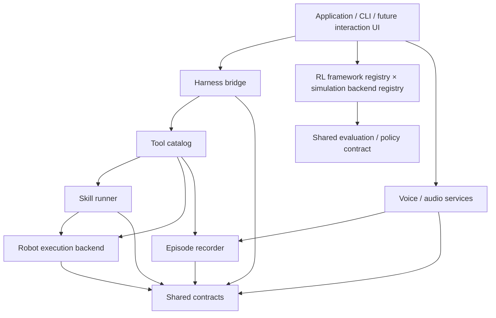

# Architecture and extension guide

This is the implementation framework for the full Project Design, not just the current locomotion experiment. The user's latest priority is **establish the module boundaries first, implement capabilities incrementally**.

## Dependency direction



Only concrete adapters import MuJoCo, Isaac, model SDKs or transport libraries. The application framework uses the standard library and imports no simulator at startup. The external harness owns reasoning, general scheduling and long-term memory. A skill may have a local feedback loop, but that is not another agent scheduler.

## Source organization

All first-party implementation lives in `src/oh_my_duck/`:

```text
cli/                         unified public commands
core/                        shared contracts and project configuration
agentic/                     harness, tools, skills and application assembly
robotics/                    execution backends, policies and Microduck models/motors
rl/tasks/                    editable task recipes and catalog
rl/mdp/                      observations, rewards, resets, commands and curricula
rl/models/                   configurable actor/critic definitions
rl/backends/{mujoco,isaac_newton}/
rl/learners/{rsl_rl,sb3}/      native PPO integrations
rl/training/                 task/framework registry and process dispatch
rl/artifacts/                normalized export and schema-2 packaging
rl/evaluation/               audits, metrics and deployment rehearsal
perception/                  active perception interfaces
voice/                       audio, ASR, TTS and persistent voice interfaces
experience/                  episode recording and replay contracts
infrastructure/              scheduler, environment setup and offline tracking
```

`environments/` contains dependency manifests and locks only. MuJoCo, Isaac/Newton,
and asset conversion keep separate environments because their native libraries have
incompatible pins. `tests/rl/` separates dependency-specific tests from the lightweight
core suite. Robot source assets are package data; generated assets and experiment
outputs are ignored. Upstream ancestry and licenses live in `third_party/`.

RL and agentic share robot/policy contracts rather than importing each other's
implementation. `robotics/backends` implements online robot execution;
`rl/backends` supplies batched simulation. Optional runtime imports remain inside
concrete adapters. A task binding must be explicitly implemented before it becomes
trainable on another backend; no diagnostic fallback is allowed.

## Data through the system

1. The interaction layer supplies text directly or through ASR.
2. The bridge forwards it to the external harness with request/session identity.
3. The harness invokes only tools registered with actual implementations.
4. Tool handlers validate arguments and call a skill runner or robot backend.
5. Long-running actions return task handles; cancellation and actual stopped state remain separate.
6. Tools and voice emit events with episode identity, simulation/real domain, timestamps and evidence references.
7. The recorder persists evidence. The harness decides what to remember and what to say.
8. TTS consumes the confirmed active voice profile and the harness's response text.

Current contracts are Python interface proposals, not a frozen external wire protocol. No concrete robot backend or model is silently created by constructing a protocol.

## How to add functionality

**A robot backend:** implement `RobotBackend`; report only real capabilities; return unavailable/stale sensor states explicitly; carry clock domain and frame references. Test velocity units, command expiry and physical stop confirmation.

**A skill:** declare required sensors, resources, supported backends, parameters and terminal conditions in `SkillSpec`; implement lifecycle through `SkillRunner`. Reuse external harness scheduling rather than creating a global task planner.

**A tool:** construct a `ToolDefinition` and register a callable in `ToolCatalog`. Validate arguments at the adapter boundary. Unknown tools return `unsupported`; duplicate names and mismatched request IDs are rejected.

**A voice adapter:** implement the model/audio protocol. Persist user-confirmed reference audio and immutable voice revision independently from a process-local model cache. A microphone interruption does not by itself cancel robot motion.

**A training backend:** keep simulator dependencies in its own environment. Produce commands/artifacts through the offline adapter interface, reuse the same evaluation timing/units and record versions. Isaac is specifically Newton; do not silently fall back to PhysX.

**An RL framework:** register supported backend/operation bindings in `rl/training/frameworks.py`, keep native VecEnv and checkpoint logic in isolated runtime adapters, and preserve the shared task contract. See [RL framework extension](rl-frameworks.md).

## Current framework limits

The interfaces are intentional scaffolding. They do not claim implemented sensor acquisition, cancellation, TTS, real-robot transport, autonomous behavior or Isaac training. Tool handlers must validate their declared schemas; automatic JSON Schema validation is not yet implemented. The JSONL recorder supports a single process with threads, not cross-process locking or a database durability contract.

`configs/project.json` and `omd status` describe **software maturity**, not live robot capability discovery. Keep future device-specific discovery separate.

## Development sequence

1. Establish and verify the framework, dependency boundaries, module map and entry point.
2. Fill the official training/evaluation adapter and record actual worker evidence.
3. Add Newton training and sim2sim tests.
4. Fill robot execution, skill/tool adapters and deterministic Harness mock.
5. Add voice, perception, replay and hardware functionality by milestone.

The original Project Design and Execution Plan remain the product and milestone authorities. Update them together with this architecture document when changing boundaries.

## Validation boundary

Directory migration does not establish task parity. Existing PD diagnostics remain
labelled diagnostic. Full Newton Walking/StandUp binding, export, rehearsal and
behavior validation are tracked separately in the implementation status.
