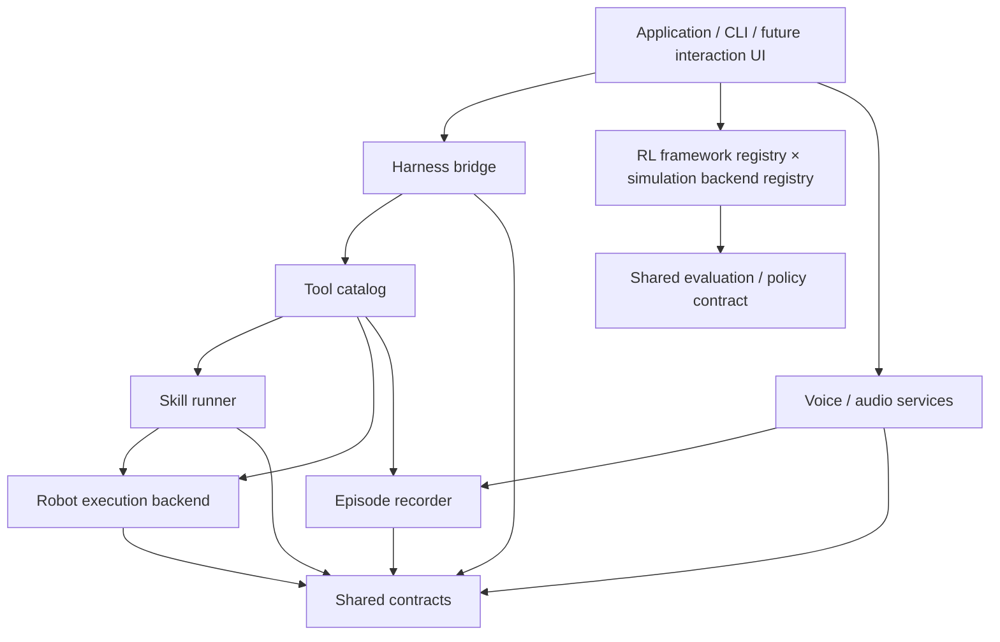

# Architecture and extension guide

The implementation covers the full Project Design. The source map lists module responsibilities, public entry points and extension boundaries.

## Dependency direction

Only concrete adapters import MuJoCo, Isaac, model SDKs or transport libraries. The application framework uses the standard library and imports no simulator at startup. The external harness owns reasoning, general scheduling and long-term memory. A skill may have a local feedback loop, but that is not another agent scheduler.

## Source organization

Application, robot, training, shared acceptance and replay modules live in `src/oh_my_duck/`:

| Capability | Source directory | Starting point |
| --- | --- | --- |
| Public commands | `cli/` | `cli/__init__.py`, `cli/validation.py` |
| Native EDH physical session | `integrations/edh/` | `environment.py`, `device.py`, `session.py`, `worker.py` |
| 原生模型、传输与摘要调用 | 仓库根目录 `integrations/edh/` | `server.mjs`、`model-transport.mjs`、`model-context.mjs`；原生 Harness 管理 agent loop 与 compaction |
| Shared native CPU/Newton scene configuration | `integrations/edh/` | `scene.schema.json`, `scene_configuration.py`; Node admission in `integrations/edh/scene-configuration.mjs` at the repository root |
| Application dependencies, tools and skills | `agentic/` | [Source map](../src/oh_my_duck/agentic/README.md), `application.py`, `harness/base.py`, `tools/`, `skills/` |
| Native task HTTP client | `integrations/` | `native_client.py`; implements `HarnessBridge` for voice and application services |
| Shared types and configuration | `core/` | `core/paths.py` |
| Online robot execution | `robotics/backends/` | `simulation.py`, `isaac_official.py` |
| Official robot assets and policies | `robotics/microduck/` | `official_policies.py` |
| Native joint graph and training-package catalogue | `robotics/policies/` | `joint_onnx.py`, `catalogue.py` |
| Task families | `rl/tasks/<family>/` | `environment.py`, `ppo.py` |
| Shared task variants | `rl/tasks/shared/` | Symmetry and terrain definitions |
| MDP and actor/critic | `rl/mdp/`, `rl/models/` | Observations, rewards, commands and curricula |
| Batched training simulators | `rl/backends/` | `mujoco/`, `isaac_newton/` |
| Newton asset preparation | `rl/backends/isaac_newton/` | `assets.py`, `asset_reuse.py`, `paths.py` |
| USD collision geometry and materials | `rl/backends/isaac_newton/task_binding/` | `collision_assets.py` |
| Newton collision masks and explicit contact pairs | `rl/backends/isaac_newton/task_binding/` | `collision_model.py` |
| Official solver materials and contact tables | `rl/backends/isaac_newton/task_binding/` | `contact_model.py`, `manager.py` |
| Native PPO | `rl/learners/` | `rsl_rl/`, `sb3/` |
| Training registration and dispatch | `rl/training/`, `rl/experiments/` | `tasks.py`, `frameworks.py`, `campaign.py` |
| Export and deployment rehearsal | `rl/artifacts/`, `rl/evaluation/` | Export, schema-2 packaging and metrics |
| Active perception | `perception/` | [Source map](../src/oh_my_duck/perception/README.md); `frames.py` for RGBD/PNG admission, `rgbd.py` for measurements, `validation.py` for source consistency, `client.py`/`service.py` for models and HTTP; `mujoco.py` owns actual CPU render geometry and apartment target labels |
| Voice interaction | `voice/` | [Source map](../src/oh_my_duck/voice/README.md); `audio.py` for shared WAV/URI/SHA256 operations; `qwen.py` for model inference; `profiles.py` for confirmed voices; `service.py`, `remote.py`, `session.py`, `device.py` for HTTP, sessions and audio devices |
| Experience and replay export | `experience/` | `harness_replay.py` |
| Measured policy acceptance | `validation/metric/` | `plans.py`, `case.py`, `campaign.py`, `verify.py`, `policy.py` |
| Native task, pose and navigation acceptance | `validation/harness/` | `control.py`, `metric_admission.py`, `motion_guard.py`, `pose.py`, `pose_records.py`, `replay.py`, `navigation.py` |
| 连续任务与语音历史引用检查 | `validation/harness/` | `task_continuation.py`、`voice_context.py` |
| Registered policy package admission and execution | `validation/harness/` | `registry.py`, `package_execution.py` |
| Release preparation and package checks | `validation/release/` | `plans.py`, `worker.py`, `campaign.py`, `package.py` |
| CPU Newton asset audit | `validation/release/` | `assets.py` / `omd validate model-assets` |
| Model perception and independent RGBD audit | `validation/` | `perception.py` / `omd validate perception` |
| Setup and process ownership | `infrastructure/` | [资源管理说明](../src/oh_my_duck/infrastructure/README.md)；`gpu_inventory.py`、`bootstrap_isaac.py`、`usd_runtime.py`、`owned_process.py`、`acceptance_supervisor.py` |

`omd validate` selects an acceptance implementation through a lazy dispatcher.
`omd replay` manages native sessions and exports terminal run evidence. Metric and
release configuration schemas depend only on the validation plan modules; they
can be checked without loading a policy, simulator or native Harness. Existing
acceptance script paths are compatibility entry points for recorded invocations.
Metric provenance schema 2 records both the implementation source hash and the
entry-point hash; independent verification compares both with the recorded Git
revision. Schema 1 records retain their original source verification.

The [native worker source map](../src/oh_my_duck/integrations/edh/README.md)
separates simulation and sensors, device ownership, session and tool control,
and process transport. `integrations/edh_native.py` exports the public classes and
remains the executable module used by the native server and SSH workers.

The [Newton backend source map](../src/oh_my_duck/rl/backends/isaac_newton/README.md)
locates task binding, simulator physics, BAM and asset preparation. Explicit asset
reuse checks clean ancestor source, complete conversion inputs and resolved
dependencies before copying SHA256-verified generated files into a new directory.
Conversion provenance and physical-validation status are preserved. Standard
source-fingerprint verification remains required at runtime.

`environments/` contains dependency manifests and locks only. MuJoCo, Isaac/Newton,
and asset conversion keep separate environments because their native libraries have
incompatible pins. `tests/rl/` separates dependency-specific tests from the lightweight
core suite. Robot source assets are package data; generated assets and experiment
outputs are ignored. Upstream ancestry and licenses live in `third_party/`.

The Linux x86_64 Newton environment selects `usd-exchange==3.0.0`, supplying
OpenUSD 26.08 as the unique `pxr` provider. Setup verifies
installed file hashes and includes the native Harness dependencies. Metadata
checks and online initialization require `infrastructure/usd_runtime.py` before
CUDA. Registered learners, native RSL workers, evaluation, diagnostics and direct
environment creation check their execution environment before GPU allocation or
native simulation launch. Actual invocation and installed dependency boundaries
are recorded in [execution preflight](reports/newton-execution-preflight-2026-10-08.md).
Perception model services use their separately locked environment; their
client and frame-validation modules belong to the simulator execution path.
See [actual dependency and import validation](reports/openusd-readiness-2026-10-08.md).

`task_binding/collision_assets.py` owns official MJCF compilation, USD instance
expansion, source geometry mapping and physics material preparation. It can be
called directly on an actual USD stage without starting the simulator.
`task_binding/collision_model.py` applies source masks, contact parameters,
geometry orientation and ground pairs to the actual Newton builder. Actual
two-world configuration and finalized CPU data passed
[collision model validation](reports/collision-model-2026-10-08.md).
Actual Office and Hospital geometry, signed-scale normalization and finalized
CPU models passed [external scene validation](reports/external-scene-cpu-2026-10-08.md).
`task_binding/collisions.py` owns scene spawning and registers the native callback.
`task_binding/contact_model.py` configures official materials and contact masks
on the actual solver model. `task_binding/manager.py` compiles its native MuJoCo
Warp tables before graph capture. Four actual CPU solver models and compiled
arrays passed [contact model validation](reports/contact-model-2026-10-08.md).

RL and agentic share robot/policy contracts rather than importing each other's
implementation. `robotics/backends` implements online robot execution;
`rl/backends` supplies batched simulation. Optional runtime imports remain inside
concrete adapters. A task binding must be explicitly implemented before it becomes
trainable on another backend; no diagnostic fallback is allowed.

## Data through the system

1. The interaction layer supplies text directly or through ASR.
2. The bridge forwards it to the external harness with request/session identity.
3. The harness invokes only tools registered with actual implementations.
4. Tool handlers validate arguments and call a skill runner or robot backend.
5. Long-running actions return task handles; cancellation and actual stopped state remain separate.
6. Tools and voice emit events with episode identity, simulation/real domain, timestamps and evidence references.
7. The recorder persists evidence. The harness decides what to remember and what to say.
8. TTS consumes the confirmed active voice profile and the harness's response text.

`ApplicationServices.harness` uses the native task interface: `open`, `submit`,
`status`, `wait`, `stop` and `close`. `integrations/native_client.py` implements
these operations through the pinned native HTTP API. The server owns tool
registration and experience records. Tool schemas use JSON Schema Draft 2020-12
through the `validation` extra; registration validates the schema and invocation
validates finite JSON arguments before the handler runs.

原生任务提交接受同一打开会话中明确选择的已结束任务引用。
服务生成历史摘要并核查归属，客户端等待任务收尾后提交后续任务。
Planner 使用原生 `skills.search` 和 `skills.load` 读取持久经验。
连续录音任务保留同一环境、已确认音色与当前物理状态，分别保存任务和反馈。

`integrations/edh/server.mjs` 使用固定 EDH 源码的 `startServer` 与 `createNativeWorkerEnvironment`。`integrations/edh/team.yaml` 和角色文件定义原生 Planner、Verifier 以及 MicroDuck 工具。`integrations/edh/environment.py` 提供真实 CPU MuJoCo/BAM、Newton/BAM、官方 ONNX 策略和传感器数据，`device.py` 管理原生动作设备，`session.py` 管理工具与 ActionGate，`worker.py` 管理进程通信；每次 14 关节动作经过 ActionGate 后执行四个 0.005 秒物理步。普通暂停时设备先排空已接纳动作，再发布真实 `pausing` 观测，随后确认停止。`finish_policy` 在已确认暂停边界调用原生 ActionGate 的 `policy_stop`，发布新鲜 `ended` 状态；独立 Verifier 随后读取原生目标检查。模型凭证只通过私有配置或环境变量传递。

## How to add functionality

**A robot backend:** implement `RobotBackend`; report only real capabilities; return unavailable/stale sensor states explicitly; carry clock domain and frame references. Test velocity units, command expiry and physical stop confirmation.

**A skill:** declare required sensors, resources, supported backends, parameters and terminal conditions in `SkillSpec`; implement lifecycle through `SkillRunner`. Reuse external harness scheduling rather than creating a global task planner.

**A tool:** construct a `ToolDefinition` and register a callable in `ToolCatalog`. Validate arguments at the adapter boundary. Unknown tools return `unsupported`; duplicate names and mismatched request IDs are rejected.

**A voice adapter:** implement the model/audio protocol. Persist user-confirmed reference audio and immutable voice revision independently from a process-local model cache. A microphone interruption does not by itself cancel robot motion.

**A training backend:** keep simulator dependencies in its own environment. Produce commands/artifacts through the offline adapter interface, reuse the same evaluation timing/units and record versions. Isaac is specifically Newton; do not silently fall back to PhysX.

**An RL framework:** register supported backend/operation bindings in `rl/training/frameworks.py`, keep native VecEnv and checkpoint logic in isolated runtime adapters, and preserve the shared task contract. See [RL framework extension](rl-frameworks.md).

## Current framework limits

Current-source Qwen ASR, VoiceDesign and Base TTS passed actual CPU inference,
four decoded WAV files, matching ASR texts and unchanged confirmed profile/database.
Native CPU Luna text and recorded-voice tasks passed the formal Verifier, original
sensor/action audits, agentic MP4 and resource release. Mac audio devices and
fixed-source Newton tasks have their own evidence. Recognition accuracy, voice
quality, current-source Newton long navigation, repeated behavior, learned
policies and Microduck hardware require their corresponding acceptance.
See [CPU readiness](reports/cpu-development-readiness-2026-10-08.md) and
[runtime acceptance](runtime-release-acceptance.md). JSONL recording supports
thread concurrency within one process.

`configs/project.json` and `omd status` describe **software maturity**, not live robot capability discovery. Keep future device-specific discovery separate.

## Development sequence

1. Complete CPU implementation, native model tasks, dependency checks,
   source organization, documentation and independent installation.
2. Verify GPU execution inputs, assets, contacts, dependencies and source/model
   identities without allocating a device.
3. Diagnose retained navigation/controller records and preserve original
   task budgets, metric precision and stopping requirements.
4. After GPU execution is authorized, run the complete single-device runtime
   campaign with actual policies, sensors, ActionGate and Verifier.
5. Extend labelled perception, object tracking/effects and image-driven policy
   adapters with their own task evaluations.
6. After RL resumes, complete effective Walking/StandUp, multiple seeds and
   cross-backend/CPU deployment acceptance.
7. Validate hardware control, sensors, audio and deployment on actual Microduck.

The original Project Design and Execution Plan remain the product and milestone authorities. Update them together with this architecture document when changing boundaries.

## Validation boundary

PD diagnostics, CPU asset/contact preparation, actual solver execution, native
training lifecycle, learned behavior and hardware have distinct evidence scopes.
Both representative tasks and native PPO frameworks have recorded binding,
export and rehearsal results. Current-source GPU revalidation and complete learned
behavior remain pending in [implementation status](implementation-status.md).
GPU acceptance and RL remain stopped.
