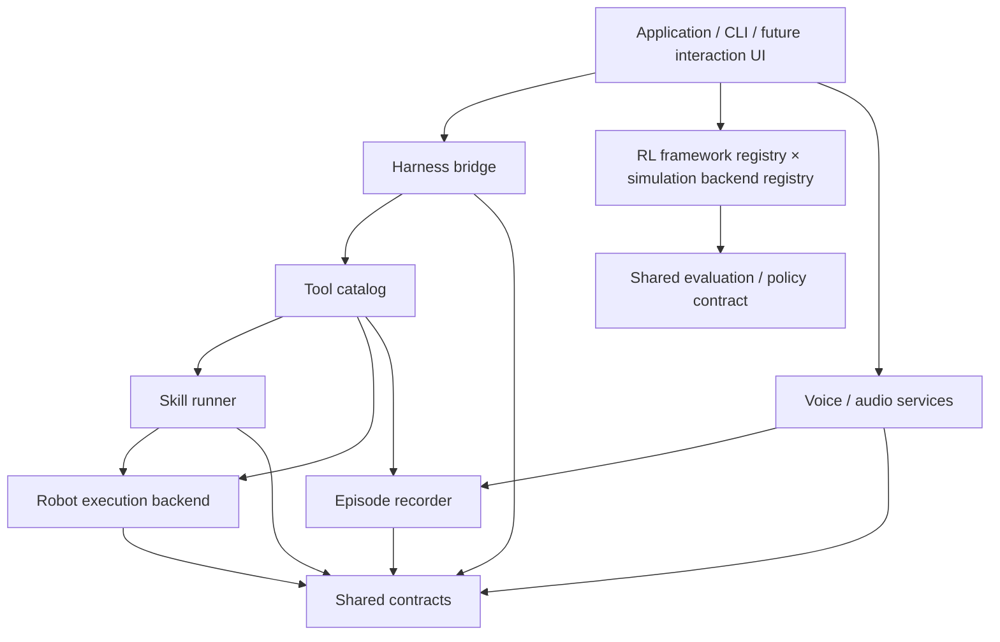

# Architecture and extension guide

The implementation covers the full Project Design. The source map lists module responsibilities, public entry points and extension boundaries.

## Dependency direction

Only concrete adapters import MuJoCo, Isaac, model SDKs or transport libraries. The application framework uses the standard library and imports no simulator at startup. The external harness owns reasoning, general scheduling and long-term memory. A skill may have a local feedback loop, but that is not another agent scheduler.

## Source organization

Application, robot, training, shared acceptance and replay modules live in `src/oh_my_duck/`:

| Capability | Source directory | Starting point |
| --- | --- | --- |
| Public commands | `cli/` | `cli/__init__.py`, `cli/validation.py` |
| Native EDH physical session | `integrations/edh/` | `environment.py`, `device.py`, `session.py`, `worker.py` |
| Tools and skills | `agentic/` | `agentic/tools/`, `agentic/skills/` |
| Shared types and configuration | `core/` | `core/paths.py` |
| Online robot execution | `robotics/backends/` | `simulation.py`, `isaac_official.py` |
| Official robot assets and policies | `robotics/microduck/` | `official_policies.py` |
| Task families | `rl/tasks/<family>/` | `environment.py`, `ppo.py` |
| Shared task variants | `rl/tasks/shared/` | Symmetry and terrain definitions |
| MDP and actor/critic | `rl/mdp/`, `rl/models/` | Observations, rewards, commands and curricula |
| Batched training simulators | `rl/backends/` | `mujoco/`, `isaac_newton/` |
| Newton asset preparation | `rl/backends/isaac_newton/` | `assets.py`, `asset_reuse.py`, `paths.py` |
| USD collision geometry and materials | `rl/backends/isaac_newton/task_binding/` | `collision_assets.py` |
| Native PPO | `rl/learners/` | `rsl_rl/`, `sb3/` |
| Training registration and dispatch | `rl/training/`, `rl/experiments/` | `tasks.py`, `frameworks.py`, `campaign.py` |
| Export and deployment rehearsal | `rl/artifacts/`, `rl/evaluation/` | Export, schema-2 packaging and metrics |
| Active perception | `perception/` | `client.py`, `service.py`, `rgbd.py`, `validation.py` |
| Voice interaction | `voice/` | Qwen services, WAV processing and confirmed profiles |
| Experience and replay export | `experience/` | `harness_replay.py` |
| Measured policy acceptance | `validation/metric/` | `plans.py`, `case.py`, `campaign.py`, `verify.py`, `policy.py` |
| Native task and navigation acceptance | `validation/harness/` | `control.py`, `motion_guard.py`, `replay.py`, `navigation.py` |
| Release preparation and package checks | `validation/release/` | `plans.py`, `worker.py`, `campaign.py`, `package.py` |
| CPU Newton asset audit | `validation/release/` | `assets.py` / `omd validate model-assets` |
| Setup and process ownership | `infrastructure/` | `bootstrap_isaac.py`, `usd_runtime.py`, `owned_process.py`, `acceptance_supervisor.py` |

`omd validate` selects an acceptance implementation through a lazy dispatcher.
`omd replay` manages native sessions and exports terminal run evidence. Metric and
release configuration schemas depend only on the validation plan modules; they
can be checked without loading a policy, simulator or native Harness. Existing
acceptance script paths are compatibility entry points for recorded invocations.
Metric provenance schema 2 records both the implementation source hash and the
entry-point hash; independent verification compares both with the recorded Git
revision. Schema 1 records retain their original source verification.

The [native worker source map](../src/oh_my_duck/integrations/edh/README.md)
separates simulation and sensors, device ownership, session and tool control,
and process transport. `integrations/edh_native.py` exports the public classes and
remains the executable module used by the native server and SSH workers.

The [Newton backend source map](../src/oh_my_duck/rl/backends/isaac_newton/README.md)
locates task binding, simulator physics, BAM and asset preparation. Explicit asset
reuse checks clean ancestor source, complete conversion inputs and resolved
dependencies before copying SHA256-verified generated files into a new directory.
Conversion provenance and physical-validation status are preserved. Standard
source-fingerprint verification remains required at runtime.

`environments/` contains dependency manifests and locks only. MuJoCo, Isaac/Newton,
and asset conversion keep separate environments because their native libraries have
incompatible pins. `tests/rl/` separates dependency-specific tests from the lightweight
core suite. Robot source assets are package data; generated assets and experiment
outputs are ignored. Upstream ancestry and licenses live in `third_party/`.

The Linux x86_64 Newton environment selects `usd-exchange==3.0.0`, supplying
OpenUSD 26.08 as the unique `pxr` provider. Setup verifies
installed file hashes and includes the native Harness dependencies. Metadata
checks and online initialization require `infrastructure/usd_runtime.py` before
CUDA. Registered learners, native RSL workers, evaluation, diagnostics and direct
environment creation check their execution environment before GPU allocation or
native simulation launch. Actual invocation and installed dependency boundaries
are recorded in [execution preflight](reports/newton-execution-preflight-2026-10-08.md).
Perception model services use their separately locked environment; their
client and frame-validation modules belong to the simulator execution path.
See [actual dependency and import validation](reports/openusd-readiness-2026-10-08.md).

`task_binding/collision_assets.py` owns official MJCF compilation, USD instance
expansion, source geometry mapping and physics material preparation. It can be
called directly on an actual USD stage without starting the simulator.
`task_binding/collisions.py` owns scene spawning and the Newton model callback
for filters, contact parameters, geometry orientation and ground collision pairs.

RL and agentic share robot/policy contracts rather than importing each other's
implementation. `robotics/backends` implements online robot execution;
`rl/backends` supplies batched simulation. Optional runtime imports remain inside
concrete adapters. A task binding must be explicitly implemented before it becomes
trainable on another backend; no diagnostic fallback is allowed.

## Data through the system

1. The interaction layer supplies text directly or through ASR.
2. The bridge forwards it to the external harness with request/session identity.
3. The harness invokes only tools registered with actual implementations.
4. Tool handlers validate arguments and call a skill runner or robot backend.
5. Long-running actions return task handles; cancellation and actual stopped state remain separate.
6. Tools and voice emit events with episode identity, simulation/real domain, timestamps and evidence references.
7. The recorder persists evidence. The harness decides what to remember and what to say.
8. TTS consumes the confirmed active voice profile and the harness's response text.

`integrations/edh/server.mjs` 使用固定 EDH 源码的 `startServer` 与 `createNativeWorkerEnvironment`。`integrations/edh/team.yaml` 和角色文件定义原生 Planner、Verifier 以及 MicroDuck 工具。`integrations/edh/environment.py` 提供真实 CPU MuJoCo/BAM、Newton/BAM、官方 ONNX 策略和传感器数据，`device.py` 管理原生动作设备，`session.py` 管理工具与 ActionGate，`worker.py` 管理进程通信；每次 14 关节动作经过 ActionGate 后执行四个 0.005 秒物理步。普通暂停时设备先排空已接纳动作，再发布真实 `pausing` 观测，随后确认停止。`finish_policy` 在已确认暂停边界调用原生 ActionGate 的 `policy_stop`，发布新鲜 `ended` 状态；独立 Verifier 随后读取原生目标检查。模型凭证只通过私有配置或环境变量传递。

## How to add functionality

**A robot backend:** implement `RobotBackend`; report only real capabilities; return unavailable/stale sensor states explicitly; carry clock domain and frame references. Test velocity units, command expiry and physical stop confirmation.

**A skill:** declare required sensors, resources, supported backends, parameters and terminal conditions in `SkillSpec`; implement lifecycle through `SkillRunner`. Reuse external harness scheduling rather than creating a global task planner.

**A tool:** construct a `ToolDefinition` and register a callable in `ToolCatalog`. Validate arguments at the adapter boundary. Unknown tools return `unsupported`; duplicate names and mismatched request IDs are rejected.

**A voice adapter:** implement the model/audio protocol. Persist user-confirmed reference audio and immutable voice revision independently from a process-local model cache. A microphone interruption does not by itself cancel robot motion.

**A training backend:** keep simulator dependencies in its own environment. Produce commands/artifacts through the offline adapter interface, reuse the same evaluation timing/units and record versions. Isaac is specifically Newton; do not silently fall back to PhysX.

**An RL framework:** register supported backend/operation bindings in `rl/training/frameworks.py`, keep native VecEnv and checkpoint logic in isolated runtime adapters, and preserve the shared task contract. See [RL framework extension](rl-frameworks.md).

## Current framework limits

Qwen WAV transcription, voice design, confirmed voice storage and WAV synthesis have GPU validation. Mac microphone capture and playback interruption have separate validation. Native EDH 已接收真实 RGB、ToF、IMU、关节与里程计，策略动作改变了 CPU 仿真的世界位置。同一物理会话的两项 office 任务分别获得独立 Verifier 的 `goal_reached=false` 与 `goal_reached=true` 正式判定，第二项完成真实导航。单次任务成功尚未建立命令速度跟踪、重复成功率或真机传输的验收结论。Isaac/Newton 代表任务训练的结果单独记录在 implementation status。JSONL recorder 仅支持单进程线程并发。

`configs/project.json` and `omd status` describe **software maturity**, not live robot capability discovery. Keep future device-specific discovery separate.

## Development sequence

1. Establish and verify the framework, dependency boundaries, module map and entry point.
2. Fill the official training/evaluation adapter and record actual worker evidence.
3. Add Newton training and sim2sim tests.
4. Validate effective Walking and StandUp policies through the full RL gates,
   including cross-backend replay and CPU/BAM evidence.
5. 通过原生 EDH 部署注册官方策略与机器人工具，完成真实传感器、动作、停止和正式目标判定验收。
6. Add voice, perception, replay and hardware functionality by milestone.

The original Project Design and Execution Plan remain the product and milestone authorities. Update them together with this architecture document when changing boundaries.

## Validation boundary

Directory migration does not establish task parity. Existing PD diagnostics remain
labelled diagnostic. Full Newton Walking/StandUp binding, export, rehearsal and
behavior validation are tracked separately in the implementation status.
