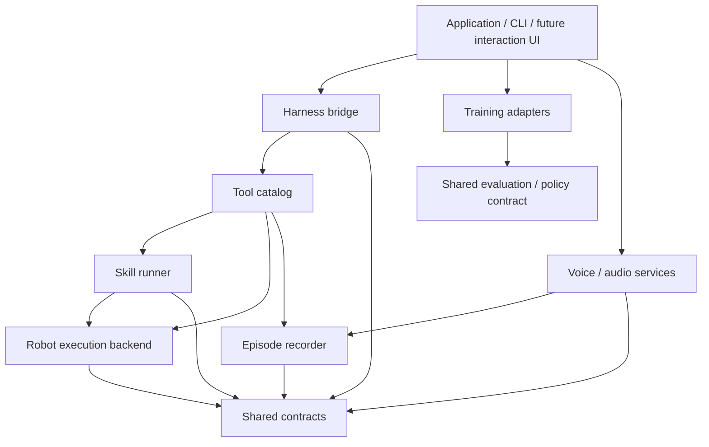

# Architecture and extension guide

This is the implementation framework for the full Project Design, not just the current locomotion experiment. The user's latest priority is **establish the module boundaries first, implement capabilities incrementally**.

## Dependency direction

Only concrete adapters import MuJoCo, Isaac, model SDKs or transport libraries. The application framework uses the standard library and imports no simulator at startup. The external harness owns reasoning, general scheduling and long-term memory. A skill may have a local feedback loop, but that is not another agent scheduler.

## Module boundaries

| Module | Public contract / implementation | Next concrete adapter |
|---|---|---|
| `application.py` | `ApplicationServices` dependency injection | Reference UI / service composition |
| `contracts/` | Identity, execution domain, task handles/results, sensor frames, episode events | Versioned serialization validation as protocols stabilize |
| `backends/` | `RobotBackend`, capabilities, measured state and stop confirmation | Simulated robot, later official runtime client |
| `skills/` | `SkillSpec`, `SkillRunner` | Bounded velocity skill and cancellation backed by measured state |
| `tools/` | Working `ToolCatalog` with explicit registration | Capability/state/skill/sensor handlers |
| `perception/` | `ActivePerception`, `LookTarget`, `TargetRecord` | Timestamped look/inspect and target tracking |
| `policies/` | `PolicySpec`, `PolicyAdapter` | Joint / velocity / action-sequence adapters |
| `harness/` | `HarnessBridge` | Deterministic protocol mock, then external harness adapter |
| `voice/` | ASR, voice profile store, TTS, audio device interfaces | Host audio, Qwen adapters, then onboard audio transport |
| `recording/` | Working append-only JSONL episode recorder | Payload storage and episode replay |
| `training/` inside package | Typed offline requests/artifacts, process protocol and extensible backend registry | Backend-specific process commands |
| Top-level `training/common/` | 14-joint contract and exact command schedule | Shared comparisons and policy compatibility checks |
| Top-level `training/mujoco/` | Initial worker probe and official BAM headless evaluator | Worker validation, training/export validation |
| Planned `training/isaac_newton/` | Reserved responsibility, not an implemented capability | Newton assets, BAM, task and export adapter |

Online `RobotBackend` and offline `TrainingBackend` are different interfaces. A simulation execution adapter exposes sensors and commands; a training adapter launches experiments and exports artifacts. Keep that distinction when adding the two simulators.

## Data through the system

1. The interaction layer supplies text directly or through ASR.
2. The bridge forwards it to the external harness with request/session identity.
3. The harness invokes only tools registered with actual implementations.
4. Tool handlers validate arguments and call a skill runner or robot backend.
5. Long-running actions return task handles; cancellation and actual stopped state remain separate.
6. Tools and voice emit events with episode identity, simulation/real domain, timestamps and evidence references.
7. The recorder persists evidence. The harness decides what to remember and what to say.
8. TTS consumes the confirmed active voice profile and the harness's response text.

Current contracts are Python interface proposals, not a frozen external wire protocol. No concrete robot backend or model is silently created by constructing a protocol.

## How to add functionality

**A robot backend:** implement `RobotBackend`; report only real capabilities; return unavailable/stale sensor states explicitly; carry clock domain and frame references. Test velocity units, command expiry and physical stop confirmation.

**A skill:** declare required sensors, resources, supported backends, parameters and terminal conditions in `SkillSpec`; implement lifecycle through `SkillRunner`. Reuse external harness scheduling rather than creating a global task planner.

**A tool:** construct a `ToolDefinition` and register a callable in `ToolCatalog`. Validate arguments at the adapter boundary. Unknown tools return `unsupported`; duplicate names and mismatched request IDs are rejected.

**A voice adapter:** implement the model/audio protocol. Persist user-confirmed reference audio and immutable voice revision independently from a process-local model cache. A microphone interruption does not by itself cancel robot motion.

**A training backend:** keep simulator dependencies in its own environment. Produce commands/artifacts through the offline adapter interface, reuse the same evaluation timing/units and record versions. Isaac is specifically Newton; do not silently fall back to PhysX.

## Current framework limits

The interfaces are intentional scaffolding. They do not claim implemented sensor acquisition, cancellation, TTS, real-robot transport, autonomous behavior or Isaac training. Tool handlers must validate their declared schemas; automatic JSON Schema validation is not yet implemented. The JSONL recorder supports a single process with threads, not cross-process locking or a database durability contract.

`configs/project.json` and `omd status` describe **software maturity**, not live robot capability discovery. Keep future device-specific discovery separate.

## Development sequence

1. Establish and verify the framework, dependency boundaries, module map and entry point.
2. Fill the official training/evaluation adapter and record actual worker evidence.
3. Add Newton training and sim2sim tests.
4. Fill robot execution, skill/tool adapters and deterministic Harness mock.
5. Add voice, perception, replay and hardware functionality by milestone.

The original Project Design and Execution Plan remain the product and milestone authorities. Update them together with this architecture document when changing boundaries.

## Isaac diagnostic implementation

The offline backend now dispatches to the independently packaged `training/isaac_newton/omd_isaac/` code. Its conversion and training dependency environments are separate; the application core imports neither. The implemented task is explicitly PD diagnostic only; BAM locomotion remains pending. See [the integration guide](isaac-newton.md) for entry points, artifact integrity and extension boundaries.
