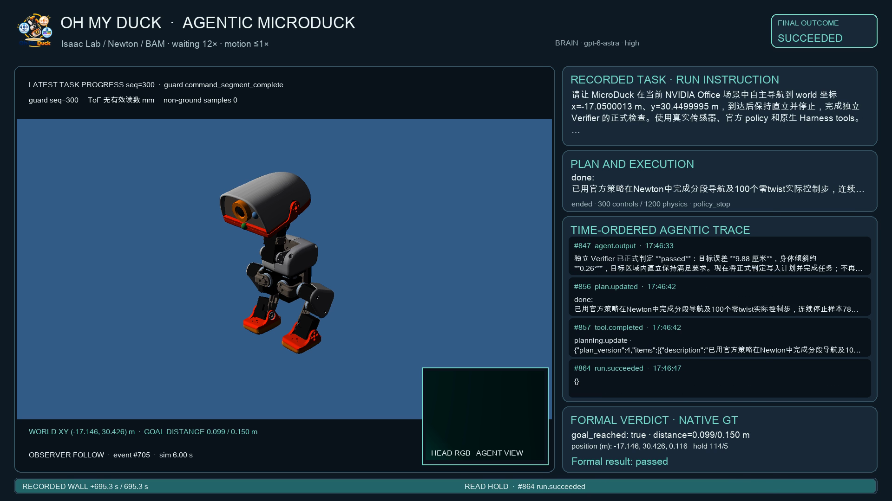

# NVIDIA Office agentic Demo — 2026-09-30

真实 `gpt-6-astra / high` 通过固定 EDH 原生 Harness 控制 NVIDIA Office 中的 Microduck，执行官方 `velstand` 与 `alpha_walking`。独立 Verifier 判定 `passed`，Planner 完成原生计划并调用 `tasks.finish`，run 终态为 `succeeded`。RL 保持停止。

## 身份与来源

| 项目 | 已核查值 |
|---|---|
| Run | `5722c637-c286-47a5-bac8-f8031ea6e066` |
| Session | `d794747f-44c1-41c3-8f8f-8b5d62e9943e` |
| Execution | `f6c14aed-1b73-4ef4-b49b-5106a1b8754d` |
| Confirmed policy_stop boundary | `7aaba59e-51ec-426f-800a-1a753594fbdf` |
| Formal verdict | `08766462-9d64-45c2-914b-2b756d96e492` |
| EDH revision | `8a5e685b22d032207f53db20454f0992a4ad60fd` |
| Official policy revision | `1b56c396825c052a4e26e95cf2b8d8298af9e9b4` |
| OMD base revision | `00e265f`，本次功能修改另有 Git 提交 |
| Immutable Python source | `jd_B300:/home/jixin/workspace/code/Oh-My-Duck/.job-sources/agentic-isaac-demo-20260930-02` |
| Worker source SHA256 | `f3bbb107e7e68343e3911c75b6120ce4b82e8683b78f8f9dc4b39e8d0848736a` |
| Environment | Isaac Lab `6.1.14`、Newton `1.2.1`、Warp `1.13.0`、MuJoCo `3.8.0`、MJWarp `3.8.0.3` |
| Physics | Newton `SolverMuJoCo`、BAM XL330 M6、`robot_allcollisions` |
| GPU | 启动前确认空闲的 host GPU 4；worker 内为 `cuda:0` |
| Scene | `nvidia-office-6.0`；2,291 个资源依赖，3,646 个环境 collider |
| Seed | `20260929` |
| Model transport | 原生 Responses adapter；配置中的 `gpt-6-astra`、`high` |

本次保持 61 个 actor observations、14 个正式命名 servos、50 Hz 控制与四个 0.005 秒物理子步。模型凭证从私有 provider TOML 读取，不保存到代码或报告。固定 EDH Git 工作目录保持清洁，Isaac 资产锁文件与用户现有修改保持相同 SHA256。

## 实际动作与检查

| 阶段 | 控制步 | 实际行为 |
|---|---:|---|
| `velstand` | 25 | 零 twist 站立，确认 18 个连续停止样本 |
| `alpha_walking` | 50 | twist `[0.2, 0, 0]`；实际前进约 7 mm |
| `alpha_walking` | 100 | 根据位移将 twist 调整为 `[0.4, 0, 0]`；实际前进约 0.305 m |
| `alpha_walking` | 25 | 缩短接近阶段；进入目标距离范围 |
| `alpha_walking` | 100 | 零 twist 控制与实际停止测量 |

实际总计 300 个控制步、1200 个物理子步、6 秒仿真时间。起点为 `(-17.5500011, 30.4499989, 0.125)` m，终点为 `(-17.1459732, 30.4264984, 0.1163957)` m，XY 位移 `0.4047108` m。非地面外部障碍接触样本和控制步均为零。

`finish_policy.stop_confirmation` 确认 100 个零命令控制步、78 个连续停止样本；末态 body twist 为 `[-0.00071589, -0.00006827, 0.01303716]`，前两个分量单位为 m/s，最后一个为 rad/s。正式 native check 返回目标距离 `0.0988074` m，阈值 `0.15` m；高度 `0.1163957` m、倾斜 `0.00454128` rad，目标区域内直立保持 `114/5` 个控制步。

最终 `plan.version=4`，唯一目标项目为 `done`，`last_verdict_ref` 引用本次正式 verdict。原生 `tasks.finish` 返回成功，正式检查、计划引用、run 终态和停止边界一致。

## 视频与原始记录

视频保存于本机 `outputs/demos/oh-my-duck-agentic-office-20260930-verified.mp4`，H.264、1920×1080、10 fps，共 941 帧、94.1 秒。画面包含实际 observer camera、已保存的头部 RGB、公开 Planner 文字、计划、实际工具反馈、目标距离、正式 verdict 与 run 终态。模型等待按 12 倍压缩，阅读停留单独计时；相邻 observer 帧的播放间隔保留对应仿真时间下限，检查得到最小比例为 1.0。

原始导出位于 `.cache/agentic-isaac-demo-04/replay/`：899 个完整事件、60 个 1280×720 observer 帧、两个 320×240 原生 `perception.capture` 头部 RGB。视频呈现到首个 `run.succeeded` 事件，共 864 个事件；之后的会话收尾记录保留在原始导出中。

| 产物 | SHA256 |
|---|---|
| MP4 | `fb77c4b7a267573611aa0c398c906c043e1a261cc77a974400750cd90d1da198` |
| Source run | `c9b8d300527013a62ccce66f240fd85df1f11a27a58b752068c5fef2550f211f` |
| Source events | `f60626eb87882f30e15926b7d70cdaea7ebc96dd036d123d29aa9ca2c8c1504a` |
| Replay manifest | `7f70c2ba95cd856ee7207e949aefde598b55fb307908ce1a749e4072906e0382` |
| Renderer | `0544410b1f11df7822f3d771c074924a1a42c226691eebc2d20f9e4bf7917eeb` |

`scripts/accept_harness_replay.py --require-stop-progress` 完成完整事件序列、模型工具调用、真实位移、ActionGate 正式终态、独立 Verifier、PNG 身份和尺寸检查，并核对七份连续停止样本进度。所有编码帧完成文字边界检查；FFmpeg 完整解码返回成功。MP4、原始记录与私有运行数据保存于忽略 Git 的目录，README 使用从该 MP4 提取的原始关键帧。

## 本次项目改进

- `omd harness` 支持本机 Node 原生 Harness 与 SSH GPU Python worker；会话控制端口通过 SSH 转发，原生通信与日志使用独立通道。
- CLI 按 provider `wire_api` 选择原生模型接口，支持显式模型与 reasoning effort；`--check-model` 使用同一原生 adapter 完成真实请求检查。
- `model-transport.jsonl` 保存 HTTP、Responses 状态、服务错误与用量，不包含认证 header、请求内容或模型文字。真实响应继续原样进入 native adapter。
- `microduck.task_progress` 返回物理控制步累计的停止样本；正式结束要求对应最新测量和确认边界。
- 录制工具支持创建会话、提交指令、读取状态、完整分页导出、SHA256 检查与关闭会话。渲染工具保留相机比例，使用实际事件同步文字、工具结果与正式判定。

## 执行记录与继续事项

此前两份启动记录分别为 `f89dd46c-7855-4399-a045-affbb73d9474` 与 `8110256e-6421-483c-8dda-70b2a41b6b6a`，模型接入阶段终止，原始产物保留。第三份 `05d2ee15-1bc9-4c7b-a634-f41c3211c0ee` 的物理导航及独立 verdict 为 passed，随后模型服务返回失败事件，run 为 failed；完整 1087 个事件与 77 个相机文件保留。本次成功 run 中有一次 `planning.update` 版本校验错误，随后真实模型读取并提交有效版本，最终计划为 done。所有运行身份分别保存。

当前验收范围为单一 seed、Office 开阔区域中的短距离 point navigation。ToF 在本次开阔位置没有量程内目标；量程内原有墙面检测与近障碍暂停见[独立近障碍验收](isaac-proximity-2026-09-30.md)。Verifier 指出终态头部 RGB 较暗、缺少可辨认地标，当前成功依据为已授权 native pose/hold 检查。需要继续验证相机坐标、可见几何与成像质量，以及更长路线、跨房间通行、多个场景和各 policy 的物体效果。自训练 RL 策略仍需行为门禁，语音与原生 Harness 的完整连接仍开放。

录制后的原生关闭返回 `state=closed`、`resources=released`。检查确认本次 GPU 4 回到 1 MiB、无本项目 native worker 或 RL 训练/预览进程。本机本次 Harness 服务也已关闭。

复现入口、远程 worker 参数与录制命令见[原生 Harness 部署](../harness-native-integration.md)。
