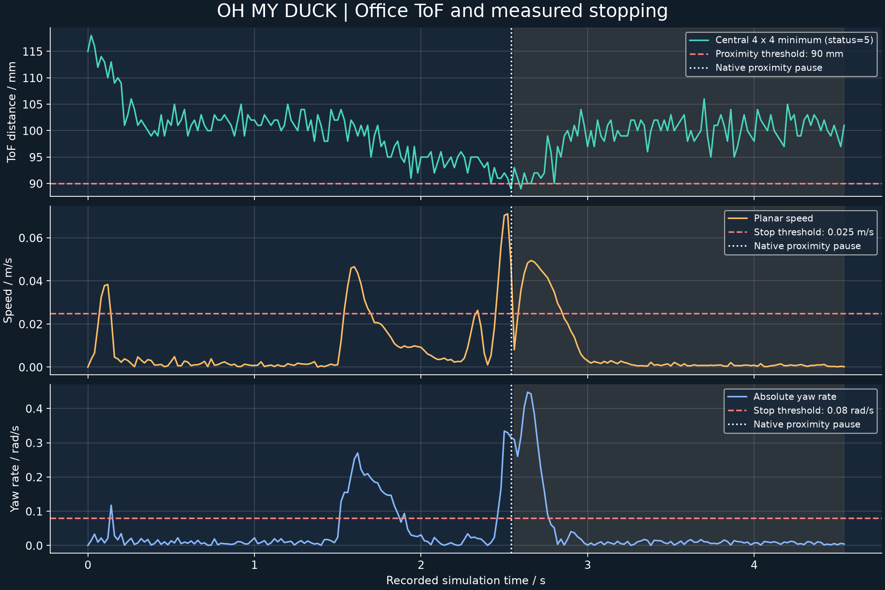
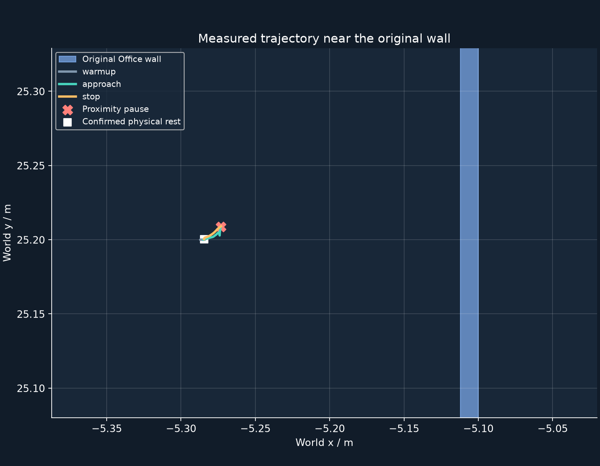
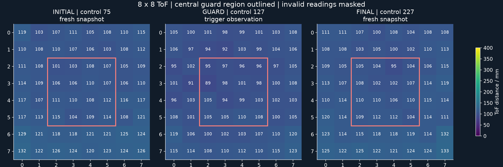

# Office 近障碍停止与可视化

本次最小目标已完成，GPU 验证进程已关闭，RL 保持停止。

## 验证环境

使用 NVIDIA Office 6.0 的原有墙面 `/Root/SM_Wall_3m47/SM_Wall_3m`，场景配置为 `configs/simulation-demo/office-proximity.json`。物理执行使用 Isaac Lab、Newton `SolverMuJoCo`、官方 BAM M6，以及固定版本的官方 `velstand` 与 `alpha_walking`。场景包含 3,646 个环境 collider 和 70 个机器人 collider。通过 SSH 使用 `jd_B300` 的 GPU 1，进程内部设备名称为 `cuda:0`。

Harness 使用 EDH `8a5e685b22d032207f53db20454f0992a4ad60fd` 的 native worker、ActionGate 和 policy transport。测量、命令、暂停、恢复与 `finish_policy` 均经过实际执行路径。本次验证范围为传感器、控制边界与物理停止；Isaac VLM 导航和独立 Verifier 的正式任务判定仍待验收。

## 测量结果

| 项目 | 实际结果 |
|---|---|
| run task ID | `isaac-proximity-aab50bdc06ec4c59832c43b938eb5afa` |
| 总控制步 / 物理子步 | 227 / 908 |
| `velstand` 站立控制步 | 75 |
| `alpha_walking` 接近控制步 | 52 |
| 零命令控制步 | 100 |
| 初始 central ToF 最近距离 | 101 mm |
| 暂停观察中的 central ToF 最近距离 | 89 mm |
| 距离阈值 | 90 mm |
| 自动暂停原因 | `forward_proximity` |
| 自动暂停控制序号 / 仿真时间 | 127 / 2.54 s |
| 连续停止样本 | 85 |
| 最终 body twist | `[-0.000081, -0.000187, -0.004330]` |
| 外部障碍接触累计 | 0 |
| 最终执行状态 | `ended`，`device_confirmed=true` |
| 原生相机帧 / 状态样本 | 45 / 228 |

初始、暂停后和最终三次传感器快照的全部 64 条射线均命中指定原有墙面。产物检查核对了 192 个几何交点，它们均位于该墙面的原始边界内。机器人保持 upright，最终高度约 0.116 m。接近阶段的位移约 0.015 m；长距离指令响应与跨房间通行仍待验收。

## 可视化

视频包含真实 1280×720 observer 相机画面、native execution trace、逐步 ToF 热图和实际速度。编码尺寸为 1920×1080、10 fps，共 66 帧、6.6 s；相机原始采样频率为 10 Hz，最后状态保留约两秒以便阅读。视频使用记录的仿真时间，状态之间保留最近一次实际相机帧。



[打开可放大的曲线 SVG](../assets/office-proximity/distance-speed.svg)。距离曲线使用 native observation 中 central 4×4 区域的最小有效距离，白色竖线标记实际暂停时间，橙色区域标记零命令阶段。



[打开可放大的轨迹 SVG](../assets/office-proximity/trajectory.svg)。轨迹来自实际 body position，包含站立、接近和停止三个阶段。



[打开可放大的 ToF SVG](../assets/office-proximity/tof-heatmaps.svg)。暂停热图使用触发 MotionGuard 的原始 observation，初始和最终热图使用各自的独立传感器快照。快照与控制观察保留各自的噪声采样来源。

## 来源与检查

- 官方 policy revision：`1b56c396825c052a4e26e95cf2b8d8298af9e9b4`。
- `alpha_walking` SHA-256：`e36332d383997d51401897734cd3e79cf5038406feddb18b4d57ecfb141daa6c`。
- 验证入口 SHA-256：`c52c299318be21ffe1965c8e95e332886893bf2fd0829efd5e8a6e8d49743b8b`。
- `result.json` SHA-256：`4944c2c4f32452dd75423eacd91ea868dd1212e1d1e936124a855323b53de165`。
- MP4 SHA-256：`acc14dae97b640b61fc414ff56ecf4da3fcf742cd62e699b4bb6d816a6a7e0af`。
- EDH runtime/schema 来源归档 SHA-256：`93693c14b6fedfbc10dabe85bbd5451ce7005e8481683ef6aac0048de552cac2`。

远程源码副本为 `/home/jixin/workspace/code/Oh-My-Duck/.job-sources/isaac-tof-proximity-20260930-03`，实际证据为其 `outputs/isaac-proximity/attempt-03`，可视化为 `outputs/isaac-proximity/visuals-04`。证据包含 `result.json`、`samples.json`、`tools.json`、`frames.json`、原始相机 PNG、三份完整 sensor snapshot。各次验证来源与输出分别保存。

`scripts/audit_isaac_proximity_artifacts.py` 检查了完整连续控制序号、四倍物理子步计数、全部样本的有限值和外部接触、最终五个样本的停止速度、192 条墙面射线、视频 SHA-256、全部 66 帧视频解码及三份图表尺寸。检查通过。完成后的 GPU 1 占用为 1 MiB，没有本次验证进程。

## 运行入口

在远程项目根目录准备场景、官方 policy 和固定 EDH 来源后，使用已锁定的 Isaac 环境。`native-harness` extra 固定 `jsonschema==4.25.1` 与 `websockets==17.0.1`。Viser 使用相同 `websockets` 版本的实际服务连接和二进制传输检查通过，原有 SB3 extra 保持安装。

```bash
TMPDIR="$PWD/.cache/tmp" UV_PROJECT_ENVIRONMENT="$PWD/.envs/isaac-newton" uv sync --frozen --project environments/isaac-newton --extra native-harness --extra sb3
TMPDIR="$PWD/.cache/tmp" CUDA_VISIBLE_DEVICES=1 PYTHONPATH="src:$PWD/.cache/edh/8a5e685b22d032207f53db20454f0992a4ad60fd/harness/physical-runtime/src" .envs/isaac-newton/bin/python scripts/accept_isaac_proximity.py --scene-config configs/simulation-demo/office-proximity.json --catalog .cache/official-policies-runtime/1b56c396825c052a4e26e95cf2b8d8298af9e9b4 --output outputs/isaac-proximity/new-run
TMPDIR="$PWD/.cache/tmp" .envs/isaac-newton/bin/python scripts/render_isaac_proximity.py --input outputs/isaac-proximity/new-run --output outputs/isaac-proximity/new-visuals --font /usr/share/fonts/truetype/dejavu/DejaVuSans.ttf
TMPDIR="$PWD/.cache/tmp" .envs/isaac-newton/bin/python scripts/audit_isaac_proximity_artifacts.py --evidence outputs/isaac-proximity/new-run --visuals outputs/isaac-proximity/new-visuals
```

每次运行使用新的输出目录。启动前确认所选 GPU 的实时使用情况。

## 当前未完成事项

Isaac 的真实 VLM 与独立 Verifier 导航闭环、长距离 policy 指令响应、多房间通行、多场景泛化和多 policy 的物体效果仍待验收。本次最小目标完成后停止，RL 保持停止。
