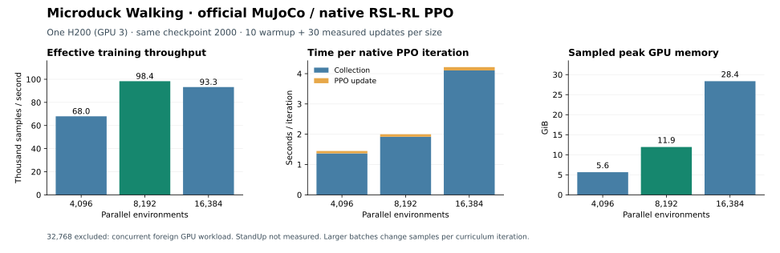

# Official training resource and progress review — 2026-09-08

The user reopened idle GPUs and asked to continue promising learning while stopping
unpromising runs for diagnosis. Only two unmodified official MuJoCo/RSL-RL learners
are active: Flat Walking and Flat StandUp, each with 4096 environments and seed 42.
No new reward experiment or Newton/SB3 learner is being started.

## Learning evidence before splitting GPUs

Completed log windows show Walking mean reward increasing from 105.01 at iterations
500–749 to 116.14 over 1943–2042; training yaw error decreases from 2.51 to 1.16.
This is task-related progress, but deployment remains unsuccessful. At checkpoint
2000, original and owned CPU forward means are −0.000156/−0.000163 m/s for a
0.1 m/s command, and yaw means 0.01929/0.01677 rad/s for 0.5 rad/s. Both fail the
unchanged full Walking battery. Continued training is justified by training-task
improvement and the still-early checkpoint, not by a claim of learned walking.

StandUp mean reward drops from 42.68 at 500–749 to 37.76 over 1878–1977. These
windows have different reset and head-command curricula. At iteration 1500 the
official ground-state curriculum raises supine probability from 10% to 25%; at
2500 it becomes 35%. Therefore mean reward is not a fixed-distribution comparison.
The original checkpoint-1500 paired CPU battery passes standing 16/16 and sitting
13/16, but prone/supine 0/16 each. Checkpoint 2000 passes standing 16/16 and sitting 15/16 on the same reset
seeds; prone/supine remain 0/16. Sitting improvement supports continued observation
rather than stopping solely on the mixed-distribution reward decrease. One training seed does not establish seed-robust convergence.

Keep checking native behavior as well as corrected CPU transfer. Sustained loss
of already acquired abilities or stagnation of the main task on comparable
checkpoints triggers a stop and diagnosis; a harder curriculum or one noisy point
alone does not. Do not continue to the numerical budget solely because a process
is alive. Official guidance expects approximately 4000–6000 iterations for gaits
and curriculum-heavy recovery; this is context, not an unconditional runtime cap
or a guarantee of success.

## Resource allocation and native resume

GPU 7 was at 99% utilization with the two active learners; GPU 0 had no compute
process. Preserve Walking's uninterrupted process on GPU 7. StandUp has resumed
on GPU 0 from complete checkpoint 2000. The migration audit passed: environment
configuration is identical and the first resumed checkpoint has curriculum counter
48048, exactly one 24-step rollout after the source counter 48024. The old learner
was paused at logged iteration 2001 and terminated after verified resume; work
beyond checkpoint 2000 was discarded and is recorded, not silently preserved. Each remains a native
single-GPU learner; this does not introduce distributed PPO or increase the
4096-environment count. Evaluation uses GPU 1, with offline W&B and headless video.

Migration verifies the original PID/start time and target GPU occupancy, pauses
only the original StandUp learner after checkpoint completion, then launches
native official resume in a new output directory. It checks serialized environment
configuration, allowed runner bookkeeping changes and the restored curriculum
counter before terminating the old learner. A failed migration retains the old
paused process and both attempts for review; no automatic training retry occurs.

Native resume restores model, optimizer, normalizer and curriculum counter.
It creates fresh physics/RNG state and repeats the saved iteration label; it is
not bitwise continuation. The native additional-iteration argument is 13000,
keeping the original final label 14999 instead of adding another 15000 updates.
This operational difference must be considered in comparisons with the owned run.

Migration status is recorded in
`outputs/baselines/official-standup-gpu0-0908-01/result.json`; no verified-resume
claim is made until `resume_audit.status` is `passed`. Pre-migration log-window
summaries and input byte hashes are in `pre-migration-trends.json` beside it.

## Assessments and preserved evidence

The segment-aware observer `official-growth-0908-03` follows the initial StandUp
run through checkpoint 2000 and the native resumed run afterward. It verifies live
process identities, assesses original milestones independently, and includes
available owned counterparts. The previous observer was stopped between
assessments and retains its completed 1500 results and operator-stop record.

`outputs/baselines/official-progress-2000-0908-01` records the original StandUp
1500/2000 paired 16-reset comparisons and original checkpoint-2000 CPU/native
videos for both tasks. Execution completion, video review and learned behavior
remain distinct states. This review does not promote either task as reproduced.

## Post-allocation sharing and larger-environment benchmark

A foreign user's process entered GPU 0 after allocation. We identified it from
`nvidia-smi` and process ownership without changing that process. StandUp initially
ran at about 1.5 seconds/iteration, then developed large shared-GPU timing spikes;
those samples cannot establish exclusive-GPU throughput. Walking on GPU 7 was
about 1.35–1.45 seconds/iteration after separation, versus about 3.23 before.
These are preliminary timing observations, not a controlled hardware benchmark.

Per the user's request to exploit larger memory, a separate native official
benchmark runs sequentially on GPU 3 at 4096, 8192, 16384 and 32768 environments,
for both representative tasks. Each resumes the same original checkpoint 2000
with 40 native PPO updates, discarding 10 warmup updates from timing and measuring
30. It records collection/update time, effective samples per second, sampled peak
GPU memory and foreign-process interference. A case failure preserves outputs and
stops the sweep without an automatic retry. This is a bounded capacity benchmark,
not a duration cap on learning.

Native PPO retains 24 rollout steps, 5 learning epochs and 4 minibatches. Batch
sizes therefore range from 98,304 to 786,432 samples per iteration. Increasing
environments changes training sample exposure per curriculum iteration; it is not
a claim of exactly the same training recipe in sample space. Long learners retain
4096 until measured throughput and task-learning implications have been reviewed.
No benchmark checkpoint is promoted as a learned policy.

Evidence: `outputs/baselines/official-env-scaling-0908-01/{plan,result,launch}.json`.

The clean Walking measurements are now:

| Environments | Samples/s | Mean iteration time | Sampled peak memory |
|---|---:|---:|---:|
| 4096 | 67,968 | 1.446 s | 5.6 GiB |
| 8192 | 98,353 | 1.999 s | 11.9 GiB |
| 16384 | 93,275 | 4.216 s | 28.4 GiB |

8192 gives approximately 45% more throughput than 4096 in this measurement.
16384 does not improve it and uses more memory. Each is one short benchmark;
these do not measure time to a learned gait. Serialized config audit confirms only
scene/derived terrain environment counts and native resume/logging/benchmark-budget
fields differ. Native PPO minibatches and epochs remain unchanged.

The 32768 case completed 40 updates, but another user's eight-GPU distributed job
entered during it. Its timing and total-GPU-memory samples are **confounded**, so
neither is used to select a size or plotted as an exclusive-GPU measurement. The
initial plot assertion correctly rejected that case; its failed attempt is kept.
The sweep then stopped before StandUp because the GPU remained occupied. All eight
GPUs were observed occupied by that foreign workload; no foreign process was
changed and no automatic retry was launched on another shared GPU. StandUp scaling
remains unmeasured. Existing original long learners continue under shared load.
Evidence remains under `official-env-scaling-0908-01`; clean configuration audit is
`walking-clean-config-audit.json`, figure inputs `walking-plot-provenance.json`.

## Latest behavior and videos

Original StandUp checkpoint 2500 passes standing 16/16 and sitting 15/16 on the
same reset seeds, retaining the improvement seen at 2000. Prone/supine remain
0/16 each. The corresponding single-seed original/owned batteries pass standing
and sitting only. Evidence: `official-standup-paired-2500-0908-01/result.json` and
`official-growth-0908-03/standup-2500/result.json` under `outputs/baselines`.

Original Walking checkpoint 2500 still fails corrected CPU tracking: forward mean
−0.000167 m/s and yaw mean 0.03415 rad/s at commands 0.1 m/s and 0.5 rad/s. The owned
counterpart also fails. Improvements in training metrics have not yet produced
accepted nominal deployment behavior.

All eight original checkpoint-2000 StandUp CPU/native videos have been checked:
1280×720, 25 FPS, 200 frames each, with finite 400×61 observations and 400×14 actions.
Selected 0.2/7-second frames show standing/sitting recovery, persistent forward
lean from prone, and remaining down from supine. The native playback uses the
owned evaluation adapter with the frozen original ONNX, not an additional trained
policy. Original Walking videos are still being rendered separately.

Review gallery: `outputs/previews/official-review-0908-01/index.html`, with original
training successes/failures and a clearly identified published reference. No
published reference or early checkpoint is promoted as our complete reproduction.
