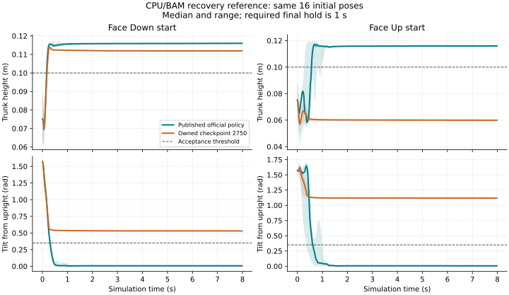

# Published policy behavior reference — 2026-09-08

The published official `alpha_stand` policy successfully executes the unchanged
StandUp recovery battery in the project's corrected CPU/BAM environment. All
**16 reset samples × four starting poses (64 trajectories)** pass. Native MuJoCo and Isaac/Newton
each also pass all four scenarios at seed 42. These results establish a working
behavior reference; **our own training reproduction remains unverified**.

The figure uses medians and min/max ranges without smoothing. Initial qpos arrays
match exactly for the 16 paired prone/supine starts. Both use the same owned CPU
controller and task protocol. A height-only check would incorrectly accept the
owned face-down behavior; its remaining tilt fails the full criterion.

## Source and limits

The official set is pinned at
[`088524a64e2557dc453256b6071dbb9d23888802`](https://huggingface.co/pollen-robotics/microduck-policies/tree/088524a64e2557dc453256b6071dbb9d23888802).
The additional `alpha_stand.onnx` download has SHA-256
`1569268713e40deea795dd2922dba50d3621e15a872855408b6b1b125b1c094b`.
Its provenance is recorded beside the artifact in
`artifacts/policies/official/088524a64e2557dc453256b6071dbb9d23888802/stand-reference-provenance.json`;
the original Walking download record remains unchanged. The bootstrap inventory
in `configs/upstream.json` now includes `alpha_stand.onnx` at the same pinned
revision, so a fresh checkout can obtain this successful reference. Both ONNX
files match the pinned Hub LFS hashes; the pinned inventory contains one Walking
policy. Evidence: `reference-inventory.json` in the validation directory.

The pinned microduck runtime's policy-channel design maps this file to
`BEST_alpha_stand_body_control.onnx` from its earlier runtime repository and labels
it standing/body-pose control. The ONNX has the canonical 61-input/14-output joint
and command layout, action-scale metadata 1.0, but `run_path: None`. The source
mapping identifies the published file's ancestry, **not the exact training task,
commit, checkpoint or hyperparameters**. Successful replay cannot prove that the
current pinned recipe has already been reproduced from scratch.

The robot runtime's walking-mode action-scale default is 0.9, whereas the official
RL rehearsal and these policies' metadata use 1.0. A separate diagnostic tried
both without changing project training or acceptance defaults. Stand recovery
passed the single-seed battery at both scales. Published Walking failed at both:
forward mean only 0.000106/0.000165 m/s for a 0.1 m/s command. Scaling does not fix
that observed gait response. Evidence: `outputs/baselines/published-runtime-reference-0908-01`.

## CPU execution and visible recovery

All four poses pass at base seeds 100–115, using the existing scenario-index seed
offset, eight-second episodes and the original final one-second height/tilt gate.
These are reset samples of **one published policy**, not independent trained runs.
Source `0792f99`, headless execution, GPU visibility 7 and offline W&B are recorded
in `outputs/baselines/published-stand-validation-0908-01/launch.json`.

The seed-42 CPU video replay also passes all four cases. All four videos are
1280×720, 25 FPS, 200 frames, matching 400 control ticks. Selected frames at
0/0.4/0.8/2 seconds show actual prone/supine recovery followed by upright standing.
For the entire final second, geometry reconstructed from saved qpos/qvel shows
only left/right foot collisions contacting the ground, with both present at each
sample. This is a geometric contact check, not contact-force or hardware evidence.

- Paired samples: `cpu-seeds/result.json` and per-seed traces.
- Videos: `cpu-video/{standing,sitting,face_down,face_up}.mp4`.
- Video/contact checks: `cpu-video-audit.json`.
- Figure sources and exact initial-state check: `plot-provenance.json`.

All paths above are under `outputs/baselines/published-stand-validation-0908-01`.
Native MuJoCo/Newton comparison uses the same published bytes and task battery;
both native backends pass all four cases. All eight native videos pass 720p/25 FPS,
200-frame and finite 61/14-trace checks. Selected 0/0.4/0.8/2-second supine frames
show recovery and standing in both backends. The native task keeps its configured
play-time perturbations. Evidence: `sim2sim/result.json` and `sim2sim-video-audit.json`.

The Newton task runtime requires an actual `newton.solvers.SolverMuJoCo` instance
with a nonempty Warp model when its simulation bridge is constructed, otherwise
it raises. The successful run uses that guarded Newton path. This is Newton's
MuJoCo solver integration, not evidence for another Newton solver or PhysX. The
plain Newton background and different camera make ground contacts less visible;
the precise geometric-contact audit above applies to the CPU replay.

## What this changes in the diagnosis

The CPU environment is demonstrably able to execute recovery with a learned
policy. The owned checkpoint's failures therefore do not establish that recovery
is impossible under the current CPU model or interface. The remaining training
investigation should use the successful policy as a reference, without assuming
its unpublished training settings match today's pinned recipe.

The actual official-derived motion-penalty functions were also evaluated on saved
trajectories. At the current −0.05 body-angular-velocity weight, the published
policy's mean integrated eight-second supine penalty is −1.387, versus −0.204 for
the failed owned policy. Corresponding action-rate penalties at weight −1 are
−0.753/−0.030. The successful policy's average peak angular speed is 11.71 rad/s.
These are counterfactual reward terms on nominal CPU traces, **not complete
training returns or proof of causality**. They support measuring the official
recipe's recommended motion-penalty ablation, which is already running.
Evidence: `outputs/baselines/standup-motion-cost-0908-01/result.json`.

Own-policy learned recovery, Walking reproduction, and equivalent Newton/SB3
training outcomes remain required by the active goal.

## Subsequent official-history and checkpoint audit

See [official source history](official-source-history-2026-09-08.md) for verified
recipe configuration continuity, exact published-byte runtime commits, CAD/contact
geometry comparison and the failed full-task checkpoint-1500 batteries. The
replacement milestone observer uses the correct resume directories and advances
original tasks independently. Only the original learners continue; the angular
penalty diagnostic has finished without prone/supine recovery, and further tuning
is deferred. Earlier active-run/observer statements above are historical.
