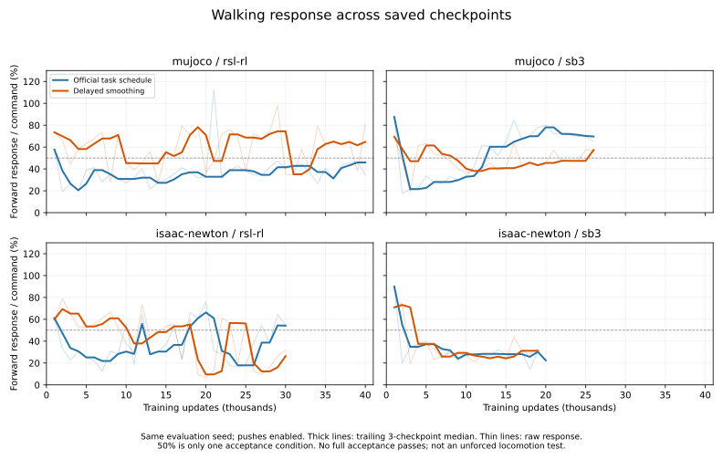

# Walking policy assessment — 2026-09-14

This review uses existing saved trajectories and videos from the suspended `omd-walk-pacing-0913-01` campaign. No learner, simulator evaluation or new job was started. All eight runs stopped short of their 50000-update budgets; final unforced/transfer/CPU-BAM acceptance has not run.

**231 completed checkpoint previews, zero complete acceptance passes.** These are repeated checkpoint evaluations at one seed, not 231 independent robustness trials. The latest five checkpoints per run are summarized below to avoid choosing a favorable single checkpoint. All have the same final smoothing weight by these late windows. Different frameworks reached different update counts, so this is not an equal-budget ranking across frameworks.

The commanded forward velocity is 0.1 m/s and yaw rate 0.5 rad/s. Percentages below are observed segment-average velocity divided by the command, then the median across five checkpoints. Play-time external pushes remain enabled, so these are not confirmed self-driven response rates.

| Backend / framework / schedule | Checkpoints | Forward response | Yaw response | Full-duration batteries | Lateral instantaneous RMSE |
|---|---|---:|---:|---:|---:|
| mujoco-rsl-rl-walking-official | 36000–40000 | 43% | 59% | 4/5 | 0.138 m/s |
| mujoco-rsl-rl-walking-delayed | 36000–40000 | 65% | 79% | 5/5 | 0.142 m/s |
| mujoco-sb3-walking-official | 22000–26000 | 70% | 89% | 5/5 | 0.125 m/s |
| mujoco-sb3-walking-delayed | 22000–26000 | 47% | 97% | 5/5 | 0.117 m/s |
| isaac-newton-rsl-rl-walking-official | 26000–30000 | 54% | 99% | 5/5 | 0.125 m/s |
| isaac-newton-rsl-rl-walking-delayed | 26000–30000 | 16% | 87% | 5/5 | 0.115 m/s |
| isaac-newton-sb3-walking-official | 16000–20000 | 26% | 95% | 5/5 | 0.111 m/s |
| isaac-newton-sb3-walking-delayed | 15000–19000 | 31% | 87% | 5/5 | 0.119 m/s |

“Full-duration” means the entire 14-second protocol ran; it does not mean stable gait or acceptance. The MuJoCo RSL original 40000 checkpoint terminates after 316 ticks (6.32 seconds), with minimum trunk height 0.0625 m and maximum tilt 1.124 rad. Thus its latest checkpoint is worse than several earlier saves and cannot represent reliable recovery from disturbance.

## What has improved and what has not

- **MuJoCo SB3, official task schedule:** the clearest relatively consistent forward-response improvement in these saved play conditions. Forward response rises from approximately 34% at 10000 updates to 65% at 15000 and 80% at 20000; the latest-five median is 70%, with yaw 89%. Later forward response fluctuates around a plateau rather than steadily increasing. This is a strong candidate for unforced validation, not a learned-gait acceptance claim.
- **MuJoCo RSL, delayed smoothing:** stronger late forward response than its paired original schedule (65% versus 43% median), and all five late batteries complete. Lateral and yaw variability remain; the 40000 checkpoint responds forward at 81% but has lateral RMSE 0.142 m/s. Improvement is specific to this pairing, not evidence that delaying smoothing fixes all learners.
- **MuJoCo RSL, original schedule:** partial response with instability. Four of five late batteries complete, and the 40000 checkpoint falls/terminates before the turning segment. A missing yaw measurement must not be treated as zero or included as a successful turn.
- **MuJoCo SB3, delayed smoothing:** turning response is relatively strong, but late forward response is weaker than the original schedule (47% versus 70% median). No consistent benefit from the intervention.
- **Newton RSL, original schedule:** partial forward response and relatively strong turning; median forward 54%, yaw 99%. Forward response is variable across checkpoints. Remains a candidate for unforced/transfer checks.
- **Newton RSL, delayed smoothing:** late forward response regresses: median approximately 46% across updates 10000–15000 versus 16% across 26000–30000. Yaw remains around 87%. The same final smoothing weight applies to both periods, so a late curriculum weight change is not an explanation established by these data. This branch is not a promising blind continuation.
- **Newton SB3, both schedules:** mostly upright during the sampled batteries, with weak forward response (26% original, 31% delayed median) and much stronger apparent turning. There is no convincing late forward-learning trend. Prior causal tests showed pushes can create apparent motion in older SB3 policies; the current policies still need their own no-push evaluation.

## Interpreting the lateral failure correctly

All late five-checkpoint median whole-battery instantaneous lateral RMSE values are approximately 0.111–0.142 m/s, above the current 0.1 m/s criterion. However, the same saved forward segments have one-second-window mean lateral RMSE medians of approximately 0.009–0.052 m/s. These are different temporal statistics and intervals: do not present their difference as a precise decomposition into sway versus drift. The reduction indicates substantial fast fluctuations; instantaneous lateral error alone should not be called persistent sideways drift.

Acceptance remains unchanged. The standing/slow-forward plateaus, command-response shortfalls, occasional termination and unresolved unforced/transfer behavior remain meaningful failures independent of how lateral oscillation should eventually be scored.

Four saved-video frame sequences (3, 5 and 6 seconds) were inspected alongside trajectories: MuJoCo RSL original/delayed, MuJoCo SB3 original and Newton SB3 original. Their camera tracking means image displacement alone cannot establish walking speed. Raw numeric series, temporal summaries and extracted frames are in `outputs/diagnostics/walking-policy-review-0914-01/`.

## Next decision supported by the evidence

Preserve all original controls and failed artifacts. Before resuming a whole suspended matrix unchanged, prioritize unforced evaluation of MuJoCo SB3 original, MuJoCo RSL delayed and Newton RSL original; compare late checkpoints with earlier candidates, since latest is not necessarily best. Diagnose the Newton RSL delayed regression and Newton SB3 forward plateau before spending another full continuation budget on them. This is a recommendation based on saved behavior, not an automatic launch/stop decision.

This campaign trains Walking only. The earlier Newton RSL StandUp result remains the demonstrated partial success: seed-42 four-pose native passes in both backends, and 14/17 full CPU/BAM pose batteries, with prone robustness unresolved. No new StandUp result is claimed.
