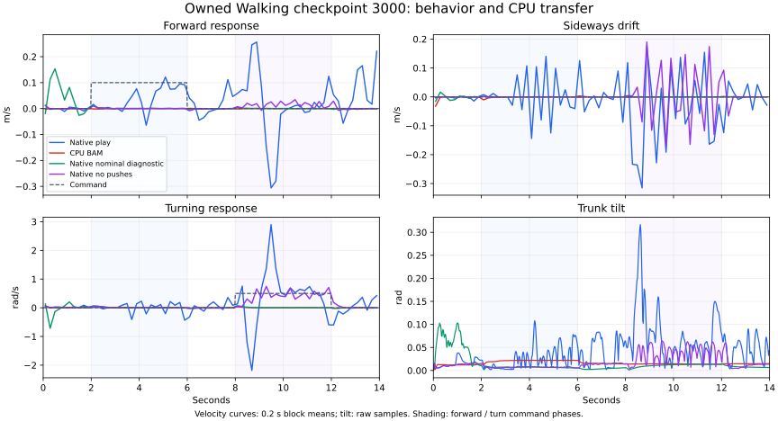

# Walking behavior and deployment diagnosis — 2026-09-08

The owned checkpoint 3000 still fails Walking acceptance. Its normal native play
has more forward response than checkpoints 2250–2750, but lateral drift and turn
error remain excessive. The same exported bytes in corrected CPU/BAM remain
almost stationary. A nominal native diagnostic also nearly stops, so this is not
evidence of a broken ONNX conversion or a CPU-only failure.

Velocity curves display nonoverlapping 0.2-second means; metrics use every raw
50 Hz sample. Tilt is unsmoothed. All runs retain the same 14-second command
battery and scoring v2. Neither the plot nor a growing aggregate reward changes
the behavior acceptance criteria.

## Observed response

| Checkpoint / replay | Forward mean, requested 0.1 m/s | Turn mean, requested 0.5 rad/s | Complete task |
|---|---:|---:|---|
| 2250, native play | 0.02065 | 0.41463 | Fail |
| 2500, native play | 0.02057 | 0.49907 | Fail |
| 2750, native play | 0.02419 | 0.54648 | Fail |
| 3000, native play | 0.03644 | 0.39364 | Fail |
| 3000, CPU/BAM | −0.000193 | 0.00501 | Fail |
| 3000, native with zero pushes | 0.000976 | 0.41684 | Fail |
| 3000, nominal native diagnostic | 0.000927 | 0.00902 | Fail |

The native 3000 lateral/yaw RMSE values are 0.12273 m/s and 0.68111 rad/s, above
the existing 0.1/0.5 limits. Its forward response is only 36.4% of the command.
The nominal native diagnostic has no DR, pushes, observation corruption, IMU
misalignment or delay; it fixes voltage/sag to 7.4 V/0.1 and begins at canonical
HOME joints and root [0,0,0.125,1,0,0,0]. This deliberately changes several
conditions to localize the issue, **not to prove which individual factor causes
it**. Standard training, play and CPU acceptance defaults remain unchanged.
The published Walking policy also nearly stops in this nominal native test.

Native and CPU standard 3000 videos are each 1280×720, 25 FPS, 350 frames.
All 700×61 observations, 700×14 actions and saved trace arrays are finite. Selected
3/5/10-second frames corroborate weak forward motion and native turning versus
near-stationary CPU behavior. The nominal diagnostic did not render video.

Evidence: `outputs/baselines/walking-3000-transfer-0908-01/{result,video-audit,plot-provenance}.json`,
`outputs/baselines/walking-nominal-native-0908-01/result.json`, and preserved
`outputs/previews/shared-gpu7-0908-02` checkpoint previews. All use observer source
`0792f99`; the checked policy SHA is
`14e33be4e469dcc5ca8be6989a68f0b302141088f2d503add3e517fbe697ebb2`.

## Checks that did not explain the difference

The nominal CPU and native compiled models differ in integration and solver
options: Euler versus implicitfast, 100 versus 10 solver iterations, 50 versus 20
line-search iterations, and 35 versus 50 CCD iterations. Ten CPU trials across
published/owned policies tested the original options, integrator alone, iteration
count alone, their combination, and all native options. None restored command
response. The CPU model also has different scene geometry and a 7.4 V force
ceiling versus the native DR maximum 8.2 V ceiling; these comparisons do not
establish full physics equivalence. No product option was changed.

The actual corrected CPU controller and actual native BAM `compute()` were then
fed equal target positions, joint states, preceding motor torques, external-force
and DOF-friction constraint arrays at 40 samples along the CPU rollout. Native
voltage, sag and gain/friction scales were fixed to the CPU values. Maximum
absolute errors were 2.16e-8 Nm in motor torque, 1.56e-7 Nm in friction budget and
1.01e-11 in viscous damping. This validates their calculations at those sampled
inputs; it does not compare different solvers' resulting forces or entire motion.

Eight additional CPU trials delayed target commands by each fixed 3/4/5/6 physics
steps (15/20/25/30 ms), with first-target history initialization matching the
native buffer. They also did not restore Walking. This is a diagnostic fixed-lag
sweep, not a recreation of every native observation-delay or random-lag condition.

Evidence directories under `outputs/baselines/`:

- `walking-physics-parity-0908-01`: compiled options and array inventories.
- `walking-integrator-ablation-0908-01`: ten solver-option trials.
- `walking-bam-parity-0908-01`: actual compute outputs at forty matched samples.
- `walking-physics-delay-0908-01`: eight fixed target-delay trials.

A further native trial sets only push magnitudes to zero while retaining event
sampling, timing and all other native settings. Its first attempt
`walking-zero-push-0908-01` failed before replay because the diagnostic patch
accessed a missing push event in another registered task. That attempt is retained;
`walking-zero-push-0908-02` is the separate corrected attempt. It completes the
battery: forward response falls from 36.4% to 0.98%, while turning remains 83.4%.
Initial 61-D observations match exactly and command traces match. Subsequent
trajectories differ; this is one reset/seed, not a multi-seed causal estimate.
It shows that the standard preview does not demonstrate autonomous forward
walking; it does retain turn response under these native conditions. The core
CPU battery remains necessary and already rejects this policy.

The owned default Walking process group was SIGSTOP-paused at iteration 3299,
with checkpoint 3250 preserved, following the user instruction to pause
unpromising training. Existing default StandUp and Newton suspensions remain;
both original controls continue. The exact process identities and checkpoint
hash are in `outputs/experiments/shared-gpu7-0908-01/mujoco-rsl-rl-walking/operator-pause.json`.
Do not restart a replacement learner while the suspended process exists.

## Original control milestone 1000

The fixed original and owned implementations both still fail the complete CPU
Walking battery. Original/owned forward means are −0.01068/0.00195 m/s and turn
means 0.36133/0.28428 rad/s. Original StandUp passes standing only at seed 42;
owned StandUp additionally passes sitting. Neither recovers from prone or supine.
These are single-training-seed, single-reset observations with normalized export
checks, not proof of long-run equivalence or superiority. The original controls
continue toward the official training horizon. Evidence:
`outputs/baselines/matched-growth-0908-01/iteration-1000/result.json`.
