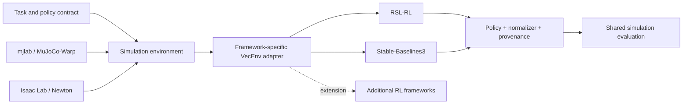

# RL framework integration

Simulation backends and RL frameworks are independent choices. The current focus is RL: the simulation environment owns physics, task dynamics, observation/action semantics and episode boundaries; the framework adapter owns the vector-environment interface, algorithm configuration, learning loop and native checkpoints. Shared evaluation consumes compatible policies without depending on the training framework.



## Selection and current boundaries

Run `python omd.py frameworks` for the registered compatibility matrix. `--backend` selects simulation; `--rl-framework` selects RL and applies to `train`/`export`. Omitted framework means `rsl-rl` for compatibility. Put framework/backend selectors before `--`, and framework-native arguments after it. Unsupported combinations fail before launch; there is no automatic change of framework or physics.

| Combination | Implemented entry points | Validation / remaining work |
|---|---|---|
| MuJoCo + RSL-RL | Official train/export | Official flat walking 64-env / 5-iteration train and official ONNX export passed; gait quality not validated |
| Isaac/Newton + RSL-RL | PD diagnostic train/export | 5-iteration GPU train, native checkpoint inspection and normalized ONNX numerical export passed |
| Isaac/Newton + SB3 | PD diagnostic PPO train | 5-rollout GPU train passed, including 192 timeout snapshots; checkpoint + normalizer saved |
| MuJoCo + SB3 | Official-task PPO train / native resume / export | 64-env / 5-rollout training and FP32 checkpoint reload passed; native continuation / 768 timeouts and normalized ONNX export passed |

The pinned upstream SB3 wrapper is subclassed locally to substitute exact pre-reset observations for automatic-reset terminal states. The same diagnostic environment supplies snapshots; no upstream files are modified. See [validation evidence](reports/isaac-rl-validation.md).

Isaac SB3 does not yet implement native checkpoint resume or ONNX export. Its resume is explicitly rejected until matching normalization state is restored and verified. MuJoCo SB3 implements paired model/VecNormalize save and resume; its official-runner ONNX export has passed 32-input numerical parity (max error 9.54e-7). Training saves the upstream native `model.zip` and `model_vecnormalize.pkl`; retain both. A checkpoint from one framework cannot be resumed by another; a shared ONNX inference contract is a separate compatibility milestone. SB3 currently uses its upstream CPU NumPy VecEnv boundary around GPU simulation; do not assume the throughput or distributed capabilities of RSL-RL.

## Isaac diagnostic commands

```bash
python omd.py setup --backend isaac-newton --rl-framework sb3
python omd.py train --backend isaac-newton --rl-framework sb3 -- \
  --task Omd-Microduck-PD-Diagnostic-v0 --help

python omd.py submit --name omd-sb3-smoke-001 --gpus 1 -- \
  python omd.py train --backend isaac-newton --rl-framework sb3 -- \
  --task Omd-Microduck-PD-Diagnostic-v0 --num_envs 16 --max_iterations 5

python omd.py submit --name omd-rsl-smoke-001 --gpus 1 -- \
  python omd.py train --backend isaac-newton --rl-framework rsl-rl -- \
  --task Omd-Microduck-PD-Diagnostic-v0 --num_envs 16 --max_iterations 5
```

SB3 is an optional locked extra (`stable-baselines3==2.7.1`); it is not a dependency of the root application or asset converter. Setup with `--rl-framework sb3` retains RSL-RL too. A later setup without the SB3 option synchronizes only default dependencies and may remove optional packages; rerun with the option to retain them.

Both diagnostics use the same Newton task, 61 observations, 14 canonical joint actions, HOME offsets and 50 Hz control. Framework-specific hyperparameters live in `agent.py` and `sb3_agent.py`. PPO smoke runs validate integration, not learning quality, BAM locomotion equivalence or framework performance rankings.

## Adding another framework

1. Register a `FrameworkBinding` factory per supported simulation backend in `src/oh_my_duck/training/frameworks.py`. Declare supported operations and validation state. New names do not require editing the CLI parser.
2. Keep imports and optional dependencies inside isolated runtime packages. Reuse a maintained upstream adapter where its semantics match; do not copy a trainer into the application core.
3. Verify observation/action order, shapes, units, device conversion, action clipping, rewards, seeds and reset behavior. In particular, distinguish termination from truncation and preserve the terminal observation when the simulator automatically resets.
4. Save native optimizer/checkpoint state, normalization statistics, framework identity, task/physics/source versions and policy contract. Implement explicit export with normalization and numerical output checks.
5. Validate short headless learning, save/load continuation, inference parity and video before marking a combination supported for production experiments. Add framework-native algorithms incrementally; selecting SB3 currently selects its pinned PPO integration only.

The [SB3 VecEnv contract](https://stable-baselines3.readthedocs.io/en/master/guide/vec_envs.html) differs from Gymnasium's reset/step API. Adapter boundary tests are required; matching method names alone is insufficient. The pinned Isaac Lab implementation is in `scripts/reinforcement_learning/sb3/train_sb3.py` and `source/isaaclab_rl/isaaclab_rl/sb3.py`.

## MuJoCo SB3 commands

The optional environment `.envs/mujoco-sb3` keeps every version in the pinned official lock, adding SB3 and its dependencies. The official RSL-RL environment stays separate. Tasks are loaded from the official registry, including their BAM, commands, DR, observation delays and reward curricula.

```bash
python omd.py setup --backend mujoco --rl-framework sb3
python omd.py submit --name omd-mj-sb3-smoke --gpus 1 -- \
  python omd.py train --backend mujoco --rl-framework sb3 -- \
  Mjlab-Velocity-Flat-MicroDuck --num-envs 64 --iterations 5 --output outputs/my-sb3-run
```

Resume adds `--resume outputs/my-sb3-run` and uses a new output directory. PPO remains framework-specific: SB3 uses actor observations for its critic, VecNormalize statistics, and constant learning rate with target-KL stopping. These differences are saved in `run.json`; do not call the algorithm identical to official RSL-RL. Both native files are required (`model.zip`, `vecnormalize.pkl`). The pre-reset recorder copies delay/history state and preserves the Torch RNG so collecting terminal observations does not advance the live sensor history. CPU regression tests exercise the actual pinned mjlab observation manager.

Local policy packaging for an official RSL-RL walking export uses `training/mujoco/package_policy.py`. It invokes the official publisher dry-run and validates schema 2, records project/upstream provenance, and labels smoke artifacts unvalidated. It has no upload mode.

SB3 export uses a registered inference runner extension with the original native SB3 policy and VecNormalize statistics. It inherits `OnPolicyRunner.export_policy_to_onnx` and calls official `mjlab_microduck.export.run_export`; task construction and metadata remain official. Run `python omd.py export --backend mujoco --rl-framework sb3 -- --run outputs/my-sb3-run --output outputs/my-sb3-export` inside a submitted job. `export.json` records graph parity including normalization-clipping outliers. No tensor remapping into an RSL-RL checkpoint is performed.


Current acceptance scope and native parallelism: [representative reproduction](rl-reproduction.md). W&B is now the default training logger, strictly offline; online account credentials are not used for training uploads. MuJoCo SB3 export accepts any registered official task and applies its numerical gate per export; acceptance evidence currently remains limited to the previously verified walking task.
