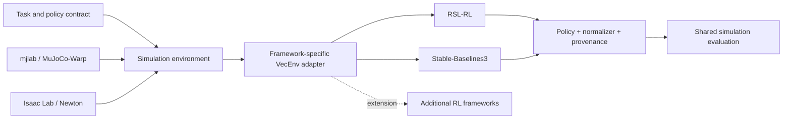

# RL framework integration

Simulation backends and RL frameworks are independent choices. The simulation environment owns physics, task dynamics, observation/action semantics and episode boundaries; the framework adapter owns the vector-environment interface, algorithm configuration, learning loop and native checkpoints. Shared evaluation consumes compatible policies without depending on the training framework. GPU acceptance and RL training are currently stopped.



## Selection and current boundaries

Run `python omd.py frameworks` for the registered compatibility matrix. `--backend` selects simulation; `--rl-framework` selects RL and applies to `train`/`export`. Omitted framework means `rsl-rl` for compatibility. Put framework/backend selectors before `--`, and framework-native arguments after it. Unsupported combinations fail before launch; there is no automatic change of framework or physics.

| Combination | Implemented entry points | Validation / remaining work |
|---|---|---|
| MuJoCo + RSL-RL | Registered BAM tasks, native train/resume/export | Representative Walking and StandUp execution gates passed; learned behavior remains separately evaluated |
| Isaac/Newton + RSL-RL | Registered BAM tasks, native train/resume/export | Representative execution gates passed; Newton physics and task-specific behavior retain independent evidence |
| Isaac/Newton + SB3 | Registered BAM tasks, native PPO/resume/export | Representative execution gates and normalized export passed; official MuJoCo task metadata is used for export |
| MuJoCo + SB3 | Registered BAM tasks, native PPO/resume/export | Representative execution gates, curriculum continuation and normalized export passed |

Registered tasks use the owned shared SB3 adapter, including actual pre-reset observations, termination/truncation handling, observation history and curriculum progress. Both backends train through native SB3 PPO. The explicit PD diagnostic remains available for simulator diagnostics. See the [representative execution matrix](reports/rl-pipeline-acceptance.md) and [curriculum restoration](reports/resume-validation.md).

SB3 saves `model.zip`, `vecnormalize.pkl` and `run.json` for either backend. Resume validates file hashes and restores the native model, optimizer, normalization and saved curriculum counter. Export retains the native actor and normalization, then verifies 32 numerical samples including normalization-clipping outliers. RSL-RL retains its native checkpoints and distributed learner. SB3 uses native vector environments and independent parallel learners; its NumPy boundary and PPO update semantics remain framework-specific.

## Native task commands

```bash
python omd.py setup --backend isaac-newton --rl-framework sb3
python omd.py train --backend isaac-newton --rl-framework sb3 -- \
  Mjlab-StandUp-Flat-MicroDuck --help

python omd.py train --backend isaac-newton --rl-framework sb3 -- \
  Mjlab-StandUp-Flat-MicroDuck --num-envs 64 --iterations 5 --output outputs/sb3-newton-smoke-NEW

python omd.py train --backend isaac-newton --rl-framework rsl-rl -- \
  Mjlab-Velocity-Flat-MicroDuck --env.scene.num-envs 64 --agent.max-iterations 5
```

SB3 is an optional locked extra (`stable-baselines3==2.7.1`); it is not a dependency of the root application or asset converter. Setup with `--rl-framework sb3` retains RSL-RL too. A later setup without the SB3 option synchronizes only default dependencies and may remove optional packages; rerun with the option to retain them.

These commands require a separately authorized idle GPU. Current tasks preserve 61 actor observations, 14 canonical joint actions, HOME offsets, BAM M6 and 50 Hz control. Task and policy configuration is under `rl/tasks/`; framework implementations are under `rl/learners/`. Smoke execution and learned behavior have separate acceptance results.

## Adding another framework

1. Register a `FrameworkBinding` factory per supported simulation backend in `src/oh_my_duck/rl/training/frameworks.py`. Declare supported operations and validation state. New names do not require editing the CLI parser.
2. Keep imports and optional dependencies inside isolated runtime packages. Reuse a maintained upstream adapter where its semantics match; do not copy a trainer into the application core.
3. Verify observation/action order, shapes, units, device conversion, action clipping, rewards, seeds and reset behavior. In particular, distinguish termination from truncation and preserve the terminal observation when the simulator automatically resets.
4. Save native optimizer/checkpoint state, normalization statistics, framework identity, task/physics/source versions and policy contract. Implement explicit export with normalization and numerical output checks.
5. Validate short headless learning, save/load continuation, inference parity and video before marking a combination supported for production experiments. Add framework-native algorithms incrementally; selecting SB3 currently selects its pinned PPO integration only.

The owned `rl/learners/sb3/environment.py` implements the native SB3 vector-environment boundary. Adapter validation checks terminal observations, reset history and normalization alongside physical execution evidence.

## MuJoCo SB3 commands

The optional environment `.envs/mujoco-sb3` keeps every version in the pinned official lock, adding SB3 and its dependencies. The official RSL-RL environment stays separate. Tasks are loaded from the official registry, including their BAM, commands, DR, observation delays and reward curricula.

```bash
python omd.py setup --backend mujoco --rl-framework sb3
python omd.py submit --name omd-mj-sb3-smoke --gpus 1 -- \
  python omd.py train --backend mujoco --rl-framework sb3 -- \
  Mjlab-Velocity-Flat-MicroDuck --num-envs 64 --iterations 5 --output outputs/my-sb3-run
```

Resume adds `--resume outputs/my-sb3-run` and uses a new output directory. Fresh SB3 runs default to the separate official critic observation group and previous-rollout KL feedback for the learning rate. Resume preserves the saved critic layout and learning-rate mode. `--critic-observations actor` and `--learning-rate-mode constant` are explicit experiment settings. Configuration and native PPO differences are saved in `run.json`. The pre-reset recorder copies delay/history state and preserves the Torch RNG so collecting terminal observations does not advance live sensor history.

Local policy packaging for an official RSL-RL walking export uses `src/oh_my_duck/rl/artifacts/package_policy.py`. It invokes the official publisher dry-run and validates schema 2, records project/upstream provenance, and labels smoke artifacts unvalidated. It has no upload mode.

SB3 export uses a registered inference runner extension with the native SB3 policy and VecNormalize statistics. It inherits `OnPolicyRunner.export_policy_to_onnx` and calls `oh_my_duck.rl.artifacts.export.run_export`, the owned official export implementation. Task construction and metadata use the official MuJoCo reference for both training backends. Run `python omd.py export --backend mujoco --rl-framework sb3 -- --run outputs/my-sb3-run --output outputs/my-sb3-export`. `export.json` records the training backend, metadata reference and graph parity. Newton SB3 export uses `.envs/mujoco-sb3`; its training uses `.envs/isaac-newton`.


Current acceptance scope and native parallelism: [representative reproduction](rl-reproduction.md). Training reads the W&B project and mode from `configs/training.json`; the configured mode is `online`, with an explicit `WANDB_MODE` override. Diagnostic execution can select `offline`. All workers receive the selected mode and preserve local artifacts. Registered-task export applies its numerical gate per policy; task-specific behavior requires independent evaluation.

SB3 checkpoints include an environment-progress companion in `run.json`, alongside
the native model and VecNormalize files. It preserves the official task curriculum
counter on resume, following the native mjlab/RSL convention. See
[resume validation](reports/resume-validation.md) for legacy-run handling and evidence.
